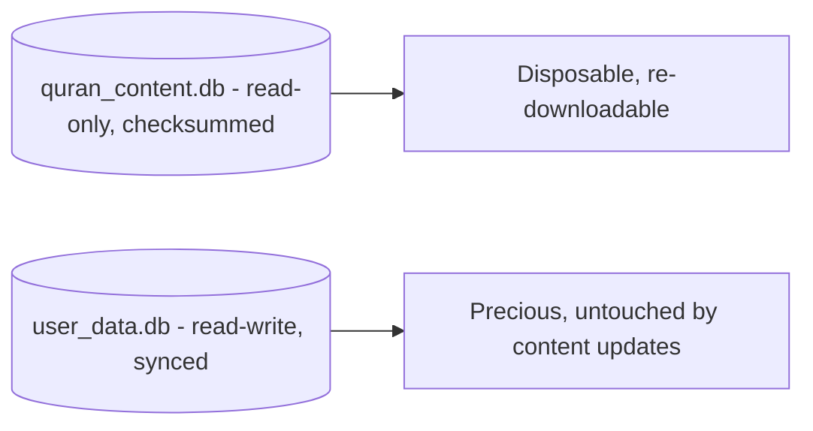
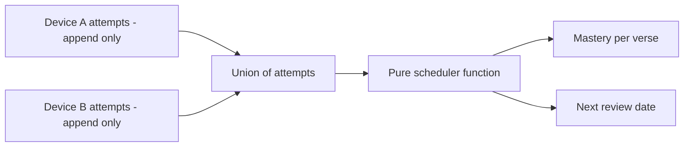
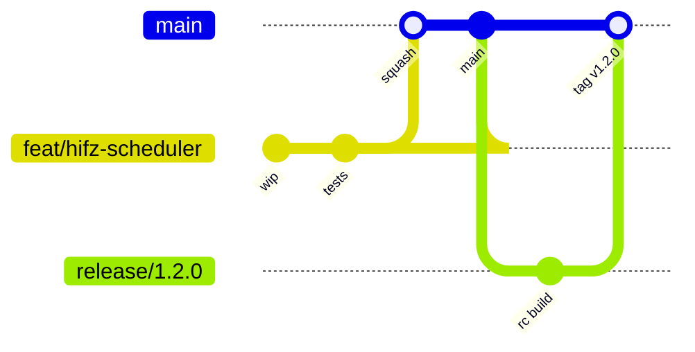
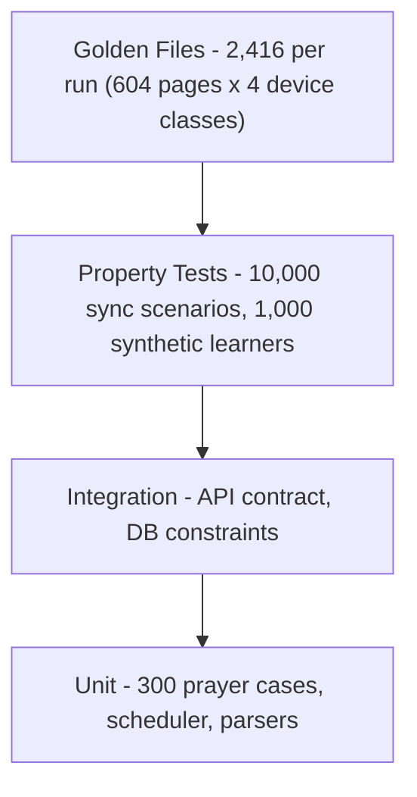

# Quran One - Master Project Blueprint

**Version 1.0 | 2 August 2026 | Owner: CTO | Status: Approved for execution**

> Canonical reference for Quran One. Binds together the documents in `docs/` and resolves tensions between them. Where this document and a subordinate document conflict, this one wins until the subordinate is updated.

Source documents: PRD.md, COMPETITOR_ANALYSIS.md, UX_PERSONAS.md, USER_STORIES.md, FEATURE_MATRIX.md, TECHNICAL_ARCHITECTURE.md, DATABASE_DESIGN.md, API_SPECIFICATION.md, ROADMAP.md

---

## 0. Thesis

Every major Islamic app has made the same trade: monetise attention, or monetise guilt. The opportunity is not a feature gap. It is a trust gap.

Quran One's bet is that a meaningful minority of the world's Muslims will pay a fair price for an app that treats worship as sacred rather than as inventory, and that the way to prove it is architecturally rather than rhetorically. Anyone can write "we respect your privacy" on a landing page. We make it a foreign key constraint, a revoked database grant, and a CI gate that fails the build.

The differentiator is the Hifz engine. Nobody has built a genuinely good memorisation system. That is where the defensible product value sits, and it is why the roadmap protects it above everything else.

---

# PART I - STRATEGY

## 1. Product strategy

### 1.1 Positioning

> Pillars' integrity, Ayah's craftsmanship, Quran Majeed's depth, Athan's reliability, and Quranly's habit intelligence - unified in one product, funded without advertising, and differentiated by the best Hifz engine ever built.

### 1.2 The three product promises

| Promise | Enforcement |
| --- | --- |
| Worship is never gated, degraded, or monetised | CI test walks every OpenAPI route with entitlement stubbed to `none`; any payment rejection under `/quran`, `/prayer`, `/qibla`, `/azkar` fails the build |
| The app never shames you | `exempt` and `paused` are first-class enum values; achievements are append-only with `CHECK (category <> 'punitive')`; copy doctrine lint across 12 locales |
| Your memorisation history cannot be destroyed | `REVOKE UPDATE, DELETE ON learning.review_attempt`; derived mastery recomputable from an immutable append-only log |

### 1.3 Persona priority

| Tier | Personas | Rule |
| --- | --- | --- |
| Primary | Sara (Beginner), Bilal (Hafiz), Amina (Busy Professional) | Win all design conflicts |
| Secondary | Yusuf (New Muslim), Khadija (Parent), Ibrahim (Student) | Accommodated, never at primary cost |
| Tertiary | Zayd (Child), Musa (Imam) | Scoped to later phases |

Sara and Bilal pull in opposite directions. Resolved by `profile.learning_level` driving progressive disclosure, not by averaging the two into a product that serves neither.

### 1.4 What we are deliberately not building

| Not building | Why |
| --- | --- |
| Social feed, followers, public streaks | Worship performed for an audience is a different act. Also the primary vector for guilt. |
| Ads, of any kind, at any tier | Non-negotiable. Blocklist-scanned in CI. |
| AI that issues religious rulings | Refused at the API layer with `refusal_reason: fatwa_request`. |
| Server-computed prayer times | A location-tracking system wearing a different name. |
| Server-side note search | Notes are encrypted. The capability loss is accepted. |

---

## 2. Technical strategy

### 2.1 The seven binding principles

| # | Principle |
| --- | --- |
| P1 | Offline is the default, not a degraded mode |
| P2 | Sacred content is immutable and cryptographically verified |
| P3 | User religious data is private by default |
| P4 | Worship paths never carry commerce |
| P5 | The server is stateless and disposable |
| P6 | Client-authoritative for worship, server-authoritative for money |
| P7 | Content changes must not require an app release |

### 2.2 Stack

| Layer | Choice |
| --- | --- |
| Client | Flutter 3.x, Riverpod (sole DI), GoRouter, Drift/SQLite + FTS5, Dio, just_audio + audio_service |
| Backend | Django 5, DRF, Gunicorn, Celery 5 + Beat |
| Data | PostgreSQL 16 (primary + read replica), Redis 7 |
| Infra | Docker, Kubernetes, Terraform |
| Platform | Firebase (Auth, FCM, Remote Config, Crashlytics), APNs, GCS + CDN |
| Payments | StoreKit 2, Play Billing 6, Stripe |

### 2.3 The four decisions everything else follows from

**1. Monorepo of packages, not folders.** `domain` cannot import Flutter, Riverpod, Dio or Drift because its `pubspec.yaml` does not declare them. The compiler enforces layering so code review does not have to.

**2. Two databases on device.**



A corrupt content pack is discarded without risking one memorisation record.

**3. Derive, never sync, anything that can be computed.**



Two devices with the same attempts compute identical mastery. There is nothing to conflict over.

**4. Worship features never call the server.** With the API entirely down, everything except sync, teacher features and AI keeps working. The user may not notice.

### 2.4 Load characteristics

Traffic is globally synchronised to prayer times and 3-5x in Ramadan. Because worship is local, the five daily worship spikes never become five daily API spikes.

---

## 3. Design strategy

| # | Principle | Consequence |
| --- | --- | --- |
| D1 | The mushaf is sacred typography, not UI | 604-page fidelity is golden-file tested. No product decision overrides page-break accuracy. |
| D2 | Progressive disclosure by declared level | Sara sees 4 options; Bilal sees 40. Same screen, different `learning_level`. |
| D3 | Never interrupt worship | No modals, upsells or rating prompts inside the reader or prayer surfaces. |
| D4 | Arabic-first, RTL-native | Arabic is designed first; LTR adapts. |
| D5 | Accessible by default | 200% text scaling, screen reader, WCAG AA. Launch gates. |

### Copy doctrine (CI-linted across 12 locales)

| Banned | Use instead |
| --- | --- |
| "You missed 3 days" | "You've read 27 of the last 30 days" |
| "Don't break your streak!" | nothing - no loss-aversion messaging |
| "You're falling behind" | "Your plan has been adjusted" |
| Fire emoji on streaks | Neutral progress indicators |

See DESIGN_SYSTEM.md and COLOR_SYSTEM.md for the full visual language.

---

## 4. Business strategy

~1.9 billion Muslims; roughly 400M smartphone users engaged with Islamic apps. Muslim Pro alone has ~190M downloads and a Trustpilot page dominated by 1-star reviews. The incumbents are large and widely disliked, which is the rarest and best market condition there is.

| Phase | Motion |
| --- | --- |
| Beta (Jan-Mar 2027) | 500 to 3,000 invited users, recruited through mosques and Islamic schools. Zero paid marketing. |
| GA (May-Jul 2027) | Organic, ASO, Muslim tech and scholarly community outreach |
| Ramadan 1450 (Jan 2028) | The real launch, with 9 months of stability behind it |

### Honest assessment

At 1M MAU and 3.5% conversion this is roughly $1.0-1.3M ARR. A real, sustainable business. It is not a venture-scale outcome on a typical fund's timeline, and the strategy should not pretend otherwise. Taking growth-stage venture money against this model creates pressure that is eventually resolved by putting ads in a prayer app, which is precisely the failure mode we exist to avoid.

---

## 5. Monetization

| Tier | Contents |
| --- | --- |
| Free, permanently | Complete Quran, all launch translations, prayer times, Athan, Qibla, azkar, bookmarks, highlights, notes, basic Hifz, reading plans, 3 reciters |
| Ihsan (premium) | Unlimited offline downloads, all reciters, full tafsir library, advanced Hifz analytics, extended AI, family profiles, teacher features |
| Waqf (sponsored) | Full Ihsan, granted free. No income verification, no visibility to sponsors. |

| Region tier | Monthly | Annual | Lifetime |
| --- | --- | --- | --- |
| Tier 1 (US, EU, GCC, AU) | $4.99 | $39.99 | $99.99 |
| Tier 2 (mid-income) | $2.99 | $24.99 | $69.99 |
| Tier 3 (low-income) | $1.49 | $12.99 | $34.99 |

One lifetime price per market, enforced by a GiST exclusion constraint.

### Monetization invariants

1. No feature ever moves from free to paid. `grandfathered_features` enforces it for existing users; the free-tier reachability test enforces it for everyone.
2. Offline grace is 30 days.
3. Cancellation is never obstructed. One tap, no retention interstitial.
4. Waqf recipients are structurally anonymous. No `sponsor_visible` column exists.

---

# PART II - EXECUTION

## 6. Development phases

| Phase | Weeks | Exit gate |
| --- | --- | --- |
| M0 Foundations | 1-6 | CI green, guard rails proven by deliberate violation |
| M1 Mushaf and Reading | 6-16 | 604/604 goldens on 4 device classes, 60fps on 4GB Android |
| M2 Prayer and Athan | 12-21 | 99.5% delivery on a 10-device OEM rig over 14 days |
| M3 Identity and Sync | 18-28 | Two devices, 72h offline, zero data loss |
| M4 Closed Beta | 24-30 | 500 users, 40 persona interviews complete |
| M5 Ramadan Stress Test | 28-32 | Real Ramadan load survived, defect list prioritised |
| M6 Hifz Engine | 30-41 | Full juz across two devices, scheduler scholar-reviewed |
| M7 Premium and Billing | 36-43 | All three stores, invariant suite green |
| M8 Launch Hardening | 41-47 | All 12 release gates green simultaneously |
| M9 GA and Stabilisation | 46-52 | Public launch, 99.7% crash-free |

The critical path is M3 to M6. Everything else has absorption; this has none. Full detail in ROADMAP.md.

---

## 7. Team structure

| Role | Count | Primary ownership |
| --- | --- | --- |
| Flutter engineer | 3 | Mushaf renderer, reading, Hifz UI, design system |
| Mobile platform specialist | 1 | Athan scheduling, OEM hardening, audio, sensors |
| Django engineer | 2 | Sync engine, billing, API |
| Data/content engineer | 1 | Content pipeline, packs, ingestion, checksums |
| Platform/DevOps | 1 | Terraform, k8s, CI/CD, observability, on-call |
| QA automation | 1 | Golden files, property tests, device farm |
| Product Manager | 1 | Backlog, personas, research |
| Designer | 1 | Design system, flows, Arabic typography |
| Scholarly reviewer | 0.4 | Content verification, Hifz methodology, copy doctrine |

The scholarly reviewer is not optional. A product handling scripture without standing religious review is one mistranslation away from a crisis it cannot apologise its way out of.

### Working agreements

- Two-week iterations, demo on the last Thursday.
- On-call rotation starts week 25, one week per engineer, escalation to the CTO.
- Eid weeks are protected leave for the entire team, scheduled not requested.
- No solo ownership of critical paths. Sync, the renderer and the Athan scheduler each have a named second.

---

## 8. Estimated budget

12 months, August 2026 to July 2027. Distributed team, mid-to-senior blended rates.

| Category | Detail | USD |
| --- | --- | --- |
| Engineering payroll | 9 engineers, blended $112k | 1,008,000 |
| Product, design, scholarly | PM $130k, designer $110k, reviewer 0.4 FTE $40k | 280,000 |
| Employer burden | ~20% | 257,600 |
| **Subtotal - people** | | **1,545,600** |
| Cloud infrastructure | Compute, Postgres, Redis, k8s, staging + prod | 40,000 |
| CDN and storage | Audio egress is the dominant cost | 60,000 |
| SaaS and tooling | Firebase, Sentry, CI minutes, design tools | 30,000 |
| Content licensing | Translations, tafsir, recitations | 150,000 |
| Device farm | 10 physical OEM handsets + cloud farm | 15,000 |
| Security | External penetration test + remediation | 35,000 |
| Legal | Entity, privacy, GDPR, store agreements, licensing counsel | 50,000 |
| Scholarly board | 3 huffaz consultation on Hifz methodology | 45,000 |
| Pre-launch marketing | Community outreach only | 40,000 |
| **Subtotal - non-payroll** | | **465,000** |
| Contingency | 15% | 301,600 |
| **TOTAL** | | **~$2.31M** |

### Commentary

Content licensing at $150k is the line most likely to be wrong and the one to over-reserve. It has an existential failure mode (AR-4) and slow-moving counterparties.

CDN at $60k assumes beta-scale traffic for most of the year. Post-GA at 1M MAU this line alone runs $25-40k/month.

Not in this budget: paid user acquisition (deliberate), office space (distributed), any 2028 scope.

---

## 9. Development timeline

| Date | Event |
| --- | --- |
| 8 Feb 2027 | Ramadan 1449 - closed beta stress test, no public launch |
| ~May 2027 | GA on App Store, Play, web |
| ~29 Jan 2028 | Ramadan 1450 - the launch that counts |

Capacity truth: 374 realistic dev-weeks against 713 scoped. Must-Have alone is 69% of capacity. Roughly 12 weeks of true buffer exists across the year.

---

## 10. Future expansion

| Horizon | Initiative | Est. | Trigger |
| --- | --- | --- | --- |
| 2028 H1 | Flutter web client (F-122) | 14 wks | Post-GA stability |
| 2028 H1 | Tajweed colouring, Indo-Pak and Warsh scripts | 12 wks | Content licensing secured |
| 2028 H2 | On-device recitation error detection (F-304) | 24 wks | Hifz retention proven |
| 2028 H2 | Institution / madrasah platform | 30 wks | 20+ inbound institutions |
| 2029 | Full AI companion beyond P2 baseline | 20 wks | Citation validation proven at scale |
| Opportunistic | Wearables, CarPlay, Android Auto | 8 wks | User demand signal |

Expansion gate: nothing starts while a Must-Have item is unshipped or a release gate is red.

---

# PART III - ENGINEERING STANDARDS

## 11. Coding standards

### Dart / Flutter

```dart
@riverpod
PrayerEngine prayerEngine(PrayerEngineRef ref) => PrayerEngine(
      clock: ref.watch(clockProvider),
      config: ref.watch(prayerConfigProvider),
    );
```

| Rule | Detail |
| --- | --- |
| Lints | `very_good_analysis`, warnings are errors in CI |
| DI | Riverpod only. No GetIt, no service locator, no singletons. |
| Nullability | Sound null safety; `!` requires a justifying comment |
| Time | Never `DateTime.now()` in business logic - inject `clockProvider` |
| Layering | `domain` declares no Flutter/Riverpod/Dio/Drift in `pubspec.yaml` |
| Widgets | A `build()` over 60 lines needs extraction |
| Strings | No hardcoded user-facing text; all strings via `l10n` |

### Python / Django

| Rule | Detail |
| --- | --- |
| Format and lint | `ruff` + `black`, pre-commit and CI |
| Types | `mypy --strict` on `apps/*/services/` and `apps/*/models.py` |
| Services | Business logic in `services.py`, never in views or serializers |
| Queries | No ORM calls in serializers; `select_related`/`prefetch_related` mandatory on list endpoints |
| Migrations | Reversible or explicitly documented as irreversible with sign-off |
| Money | `BIGINT` minor units + `CHAR(3)` currency. `FLOAT` for money fails review automatically. |

### SQL

Every table and property column double-quoted. No `SELECT *` in application code. Every new index arrives with the `EXPLAIN ANALYZE` that justifies it, in the PR description.

### Universal

- Functions do one thing. If the docstring needs "and", split it.
- Comments explain why, never what.
- No TODO without a linked issue number. CI rejects bare TODOs.
- Feature flags are removed within 2 sprints of full rollout.

---

## 12. Git workflow

### Branching - trunk-based



| Rule | Detail |
| --- | --- |
| Trunk | `main` is always releasable |
| Branches | `feat/`, `fix/`, `chore/`, `docs/`, `refactor/` - max 3 days alive |
| No `develop` | Long-lived integration branches are banned |
| Release | `release/x.y.z` cut for store builds, hotfixes cherry-picked back |
| Merge | Squash only. One feature, one commit on `main`. |

### Commits - Conventional Commits

```
feat(hifz): add append-only attempt batch endpoint

Accepts up to 500 attempts with per-item validation. Partial
success returns accepted + rejected so one malformed row cannot
discard an entire offline review session.

Refs: F-100
```

### Protection and review

| Gate on `main` | Requirement |
| --- | --- |
| Reviews | 1 approval; 2 for `sync/`, `billing/`, `learning/`, migrations |
| Status checks | All CI green, no admin bypass |
| Linear history | Enforced |
| Signed commits | Required |
| Force push | Disabled |

### PR expectations

Under 400 lines changed. Description states what, why, and how it was verified. Screenshots for UI, `EXPLAIN ANALYZE` for queries, golden diffs attached for renderer changes. A PR that touches the mushaf renderer without a golden-file run is closed, not reviewed.

---

## 13. Documentation strategy

| Layer | Lives in | Owner | Cadence |
| --- | --- | --- | --- |
| Strategy | BLUEPRINT.md | CTO | Quarterly |
| Product | PRD.md, USER_STORIES.md, FEATURE_MATRIX.md | PM | Per milestone |
| Research | UX_PERSONAS.md, COMPETITOR_ANALYSIS.md | PM | Semi-annually |
| Architecture | TECHNICAL_ARCHITECTURE.md, DATABASE_DESIGN.md | CTO | Per milestone |
| Interface | API_SPECIFICATION.md, generated OpenAPI | Backend lead | Per release |
| Design | DESIGN_SYSTEM.md, COLOR_SYSTEM.md | Designer | Per milestone |
| Decisions | `docs/adr/NNNN-title.md` | Author | Immutable once accepted |
| Runbooks | `docs/runbooks/` | Platform | After every incident |

1. ADRs are immutable. A reversed decision gets a new ADR that supersedes the old one.
2. The OpenAPI spec is generated from code. Drift is a build failure.
3. Every incident produces a runbook entry within 48 hours.
4. `PRINCIPLES.md` is read in onboarding, week one, before any code.
5. Docs live in the repo, versioned with the code. No wiki.

---

## 14. Testing strategy



We invert the usual pyramid weighting deliberately. The most expensive failures in this product are visual (page breaks) and temporal (sync, scheduling), neither of which unit tests catch.

| Suite | Scale | Frequency | Blocks |
| --- | --- | --- | --- |
| Unit | ~3,000 tests, under 60s | Every PR | Merge |
| Prayer calculation | 300 cases across latitudes, solstices, DST | Every PR | Merge |
| Golden files | 2,416 comparisons | Every renderer PR + nightly | Merge, release |
| Sync property | 10,000 concurrent-mutation scenarios | Nightly | Release |
| Hifz simulation | 1,000 learners x 180 days | Weekly | M6 exit |
| API contract | Full OpenAPI surface | Every PR | Merge |
| Premium invariant | Every route, entitlement stubbed `none` | Every PR | Merge |
| Ad SDK scan | Transitive dependency blocklist | Every PR | Merge |
| Copy doctrine lint | 12 locales | Every PR | Merge |
| OEM soak | 10 physical devices, 14 days | Continuous | Release |
| Load | 5x baseline | Pre-release | Release |
| Chaos | Kill mid-push, mid-pull, mid-migration | Weekly | Release |

### Non-negotiable test invariants

1. Replaying any attempt log twice yields byte-identical derived state.
2. UPDATE and DELETE on `review_attempt` fail at the database level.
3. No sync scenario loses an attempt row.
4. Every worship feature works with entitlement stubbed to `none`.
5. Seven days airplane mode delivers all 35 prayer notifications.
6. Any page-break diff fails the build until scholar-approved.

### Coverage

We do not gate on a global line-coverage number. We gate on branch coverage above 90% in `domain/`, `sync/`, `billing/` and `learning/` - the four places where a bug is unrecoverable.

---

## 15. Security checklist

### Pre-merge (automated)

- [ ] Dependency vulnerability scan - no high or critical
- [ ] Ad SDK transitive blocklist - zero matches
- [ ] Secret scanning - no credentials, keys or tokens in the diff
- [ ] SAST on Python and Dart
- [ ] No new endpoint without an explicit auth requirement declared
- [ ] No new user-data table without an RLS policy
- [ ] No raw SQL string interpolation of user input

### Pre-release

- [ ] External penetration test, no high or critical open
- [ ] Certificate pinning verified on both platforms
- [ ] TLS 1.3 minimum; HSTS with preload
- [ ] Firebase token validation includes audience and issuer checks
- [ ] Rate limits verified on every auth and billing endpoint
- [ ] Idempotency verified on every money-moving endpoint
- [ ] Webhook signature verification on all three payment providers
- [ ] Note and AI ciphertext confirmed unreadable in a database dump
- [ ] Key rotation exercised end to end
- [ ] RLS verified by attempting cross-profile access
- [ ] Data export contains everything; deletion removes everything
- [ ] Break-glass DB access is time-boxed, audited, second-person approved
- [ ] Privacy nutrition labels match actual data collection
- [ ] Analytics registry contains no verse content, note text, AI messages, precise location, or prayer log data

### Standing

- [ ] No human has standing production database access
- [ ] Secrets in a managed vault, never in environment files in the repo
- [ ] Quarterly access review across all systems
- [ ] Incident response runbook rehearsed twice a year

---

## 16. Performance checklist

| Target | Threshold | Measured on | Gate |
| --- | --- | --- | --- |
| Mushaf render | 60fps, under 1% dropped frames | 4GB Android (Pixel 4a, Galaxy A14) | Release |
| Cold start to first paint | under 2.0s | Same devices | Release |
| Local search | under 300ms for a 3-char Arabic query | Same devices | Release |
| Page turn | under 16ms frame budget | Same devices | Release |
| Athan delivery | at least 99.5% within 30s | 10-device OEM rig, 14-day soak | Release |
| API p95 latency | under 200ms | Production, excluding AI | Continuous |
| API p99 latency | under 800ms | Production | Continuous |
| Sync delta pull | under 1.5s for 200 changes | Staging at production volume | Release |
| Hifz recompute | under 5 min for 2M attempts | Synthetic profile | M6 exit |
| Memory ceiling | under 350MB steady state | 3GB device | Release |
| App size | under 80MB base download | Both stores | Release |
| Audio start | under 1.5s to first sample on 3G | Throttled network | Release |
| Battery | under 2% per hour of active reading | Physical device | Release |

Performance regressions fail the build. The budget is enforced in CI on physical hardware from M1 week 8.

---

## 17. Deployment checklist

### Every deploy

- [ ] All CI suites green on the exact commit
- [ ] Migrations reviewed, reversible or signed off
- [ ] Migration dry-run against a production-sized snapshot
- [ ] Feature flags default off for anything user-visible
- [ ] Observability dashboards updated for new surfaces
- [ ] Rollback path documented in the PR

### Store release (mobile)

- [ ] All 12 release gates green simultaneously on the same RC
- [ ] Full regression: goldens + prayer cases + sync scenarios + invariant suite + 14-day OEM soak
- [ ] Store listings, screenshots, privacy labels current in all 12 locales
- [ ] Phased rollout configured: 1% to 5% to 25% to 100% over three weeks
- [ ] Crash-free threshold set as an automatic rollout halt
- [ ] Remote Config kill switches verified for every non-worship feature
- [ ] Previous version's content packs still resolve (no forced upgrade)
- [ ] Support runbook updated; on-call briefed

### Backend release

- [ ] Blue/green or rolling with health gates
- [ ] Read replica lag monitored during migration
- [ ] Redis cache keys versioned if the shape changed
- [ ] Celery workers drained before restart
- [ ] API contract backwards compatible, or a new major version
- [ ] Load test at 5x current baseline passed

### Post-deploy

- [ ] Error rate, p95 latency and Athan delivery watched for 60 minutes
- [ ] Rollback rehearsed and demonstrably under 10 minutes
- [ ] Incident channel staffed during the rollout window

### The 12 release gates

| # | Gate | Blocks on |
| --- | --- | --- |
| 1 | Mushaf golden diff, 604 pages x 4 device classes | Any pixel diff |
| 2 | Ad SDK transitive scan | Any match |
| 3 | Paywall containment under worship paths | Any violation |
| 4 | Free-tier reachability, entitlement stubbed `none` | Any gating |
| 5 | Copy doctrine lint, 12 locales | Any guilt phrasing |
| 6 | Sync property tests | Any lost attempt row |
| 7 | Prayer calculation, 300 cases | Any failure |
| 8 | Athan OEM soak, 14 days | Below 99.5% |
| 9 | Performance budget on physical devices | Any regression |
| 10 | Security scan + pen test findings | Any high or critical |
| 11 | Accessibility: screen reader, 200% scaling, AA contrast | Any failure |
| 12 | Data export/deletion verification | Any incompleteness |

---

## 18. Risk register - top 8

| ID | Risk | Sev | Mitigation |
| --- | --- | --- | --- |
| AR-1 | Mushaf page-break drift | Critical | Golden harness built before the renderer; scholar sign-off on any intentional diff |
| AR-3 | Sync conflict corrupting Hifz history | Critical | Append-only log, derived mastery, REVOKE UPDATE/DELETE, 10,000-scenario property tests |
| AR-2 | Android OEM notification suppression | Critical | 10-device physical rig from week 14; self-diagnostic with real fleet data |
| AR-4 | Content licence withdrawal | High | Downloaded content keeps working offline; public-domain fallbacks per language |
| - | M3 sync slips, cascading to M6 and GA | High | The only zero-slack dependency; 2-week buffer immediately before M6 |
| - | Revenue pressure erodes the free tier | High | Invariant suite makes it a build failure, not a policy debate |
| AR-8 | Ad SDK via transitive dependency | High | Blocklist scan on every PR |
| AR-7 | AI hallucinating a hadith reference | High | Citations are foreign keys; unresolvable references cannot be stored or streamed |

---

## 19. Definition of Done

A feature is done when:

1. Code merged to `main` behind a flag, squashed, conventionally committed
2. Unit and integration tests written by the author, not retrofitted
3. Relevant golden, property or invariant suites extended
4. Accessibility verified: screen reader, 200% scaling, contrast
5. Localised into all 12 locales, RTL verified
6. Performance measured against the budget on physical hardware
7. Observability instrumented - logs, traces, dashboard panel
8. Documentation updated in the same PR
9. An ADR filed if an architectural decision was made
10. Demoed and accepted by PM

---

## 20. Five things the CTO is putting their name to

1. **We are skipping the first Ramadan.** It will look like a missed quarter around December when the core features are demoable. A rushed Ramadan launch buys one month of installs and mortgages the four Ramadans after it.
2. **The premium invariant suite is three dev-weeks and we would not ship without it.** It is the only mechanism that survives leadership change or a quarter where revenue is behind plan. Every other guarantee in this document is a promise; that one is a build failure.
3. **M3 to M6 has no slack.** If sync slips two weeks, GA slips two weeks. Better to cut scope from the Hifz engine than start it on unstable sync foundations - a corrupted memorisation history is the one failure this product does not recover from.
4. **This is a ~$1M ARR business at 1M MAU, not a venture rocket.** Funding it as though it were creates precisely the pressure that produces ads in a prayer app.
5. **Content licensing at $150k is the least confident number in the budget.** It has an existential failure mode and should be started in week one.
