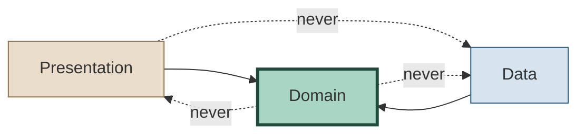
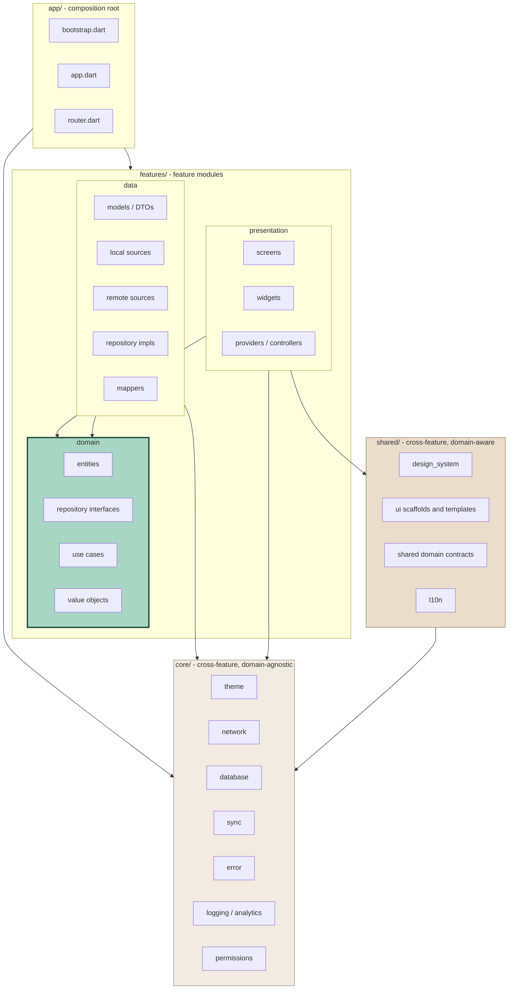
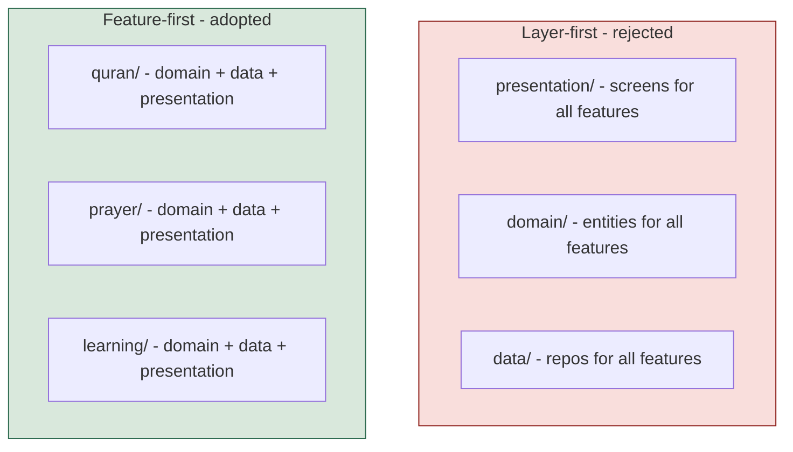
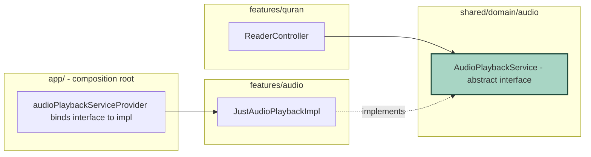
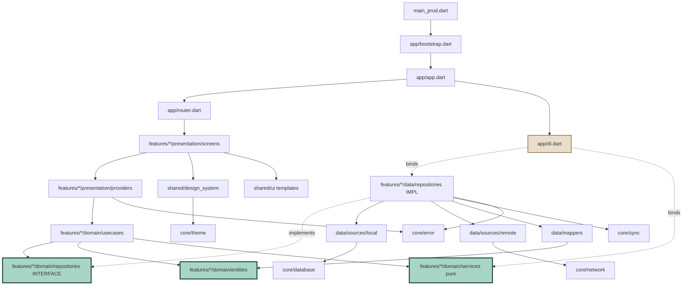
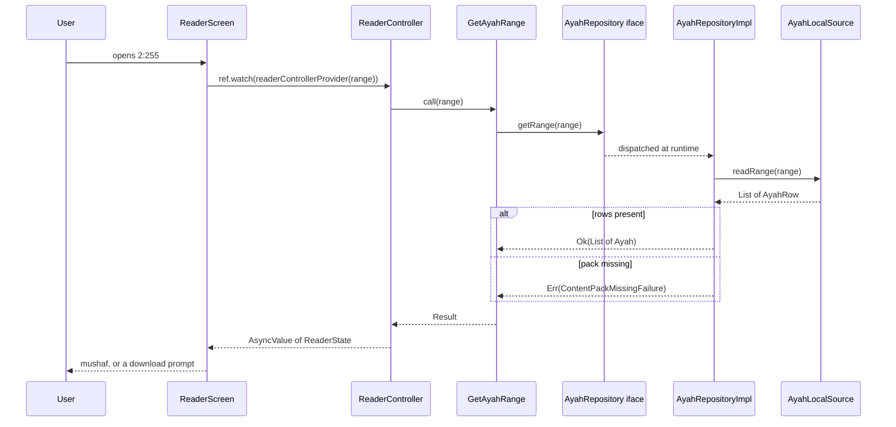

# Quran One - Clean Architecture

Five layers - feature-first - mechanically enforced dependency rules
Depends on: TECHNICAL_ARCHITECTURE.md, PROJECT_SETUP.md, FLUTTER_THEME_ARCHITECTURE.md

---

## 0. The one rule everything else serves



**Domain depends on nothing.** Not Flutter, not Dio, not Drift, not Firebase. Every arrow points inward.

The test of whether the rule is real: `lib/features/quran/domain/` should compile as a plain Dart package with `dart test` and no Flutter SDK present. If it cannot, the rule has already been broken somewhere and nobody noticed.

---

## 1. The five layers



Note what is **not** in that graph: no arrow from `core` to `features`, and none from `domain` to anything.

---

## 2. Responsibilities

### 2.1 Domain - the layer that will still compile in five years

| Contains | Never contains |
| --- | --- |
| Entities (`Ayah`, `PrayerTime`, `HifzCard`) | JSON serialisation |
| Value objects (`AyahRef`, `Coordinates`, `HijriDate`) | Drift annotations |
| Repository **interfaces** | `BuildContext`, widgets |
| Use cases | HTTP, Dio, endpoints |
| Domain services (prayer calculation, SRS scheduler) | Riverpod providers |
| Domain failures | async I/O primitives |

```dart
// features/quran/domain/entities/ayah.dart
// Pure Dart. No imports beyond dart:core and other domain files.
@immutable
class Ayah {
  const Ayah({
    required this.ref,
    required this.arabic,
    required this.sajdah,
    required this.juz,
    required this.page,
  });

  final AyahRef ref;          // value object: surah + number
  final String arabic;        // Uthmani text
  final SajdahKind sajdah;
  final int juz;
  final int page;

  bool get requiresSajdah => sajdah != SajdahKind.none;
}
```

The two most valuable things in this layer are the ones people skip.

**Value objects.** `AyahRef(2, 255)` instead of two loose ints. It makes `getAyah(255, 2)` a compile error rather than a bug report from Jakarta.

```dart
@immutable
class AyahRef implements Comparable<AyahRef> {
  AyahRef(this.surah, this.number) {
    if (surah < 1 || surah > 114) throw ArgumentError('surah $surah');
    if (number < 1) throw ArgumentError('ayah $number');
  }

  final int surah;
  final int number;

  /// "2:255" - the canonical share form.
  @override
  String toString() => '$surah:$number';

  static AyahRef? tryParse(String s) { /* ... */ }

  @override
  int compareTo(AyahRef o) =>
      surah != o.surah ? surah.compareTo(o.surah) : number.compareTo(o.number);
}
```

**Domain services.** Prayer time calculation and the Hifz SRS scheduler are pure functions over pure inputs. They belong in `domain/services/`, not in a repository and certainly not on the server.

```dart
// features/prayer/domain/services/prayer_calculator.dart
// Pure. Deterministic. No I/O. Testable against 300 reference cases
// with no mocks and no plugins.
abstract interface class PrayerCalculator {
  DailyPrayerTimes compute({
    required Coordinates at,
    required DateTime localDate,
    required CalculationMethod method,
    required AsrJuristicMethod asr,
    required HighLatitudeRule highLat,
  });
}
```

This is why the Prayer screen structurally cannot show a network error: there is no request. The layer boundary makes the product guarantee enforceable rather than aspirational.

### 2.2 Data - the layer that knows the outside world is messy

| Responsibility | Detail |
| --- | --- |
| DTOs | `freezed` + `json_serializable`, shaped like the wire, not the domain |
| Mappers | DTO to entity, both directions, round-trip tested |
| Local sources | Drift DAOs, FTS5, secure storage |
| Remote sources | Dio clients, one per API surface |
| Repository impls | Offline-first orchestration, cache policy, delta sync |
| Failure translation | `DioException` to `NetworkFailure`, RFC 9457 to `ServerFailure` |

```dart
class AyahRepositoryImpl implements AyahRepository {
  AyahRepositoryImpl(this._local, this._remote, this._connectivity);

  final AyahLocalSource _local;
  final AyahRemoteSource _remote;
  final ConnectivityService _connectivity;

  /// Offline-first (P1). The local store is the source of truth for reads.
  /// The network is an update mechanism, never a read path.
  @override
  Future<Result<List<Ayah>, QFailure>> getRange(AyahRange range) async {
    try {
      final rows = await _local.readRange(range);
      if (rows.isNotEmpty) return Ok(rows.map(AyahMapper.fromRow).toList());

      // Empty means the content pack is not installed, not that we should
      // silently fetch scripture over the network.
      return const Err(ContentPackMissingFailure());
    } on DriftRemoteException catch (e, st) {
      _log.severe('ayah range read failed', e, st);
      return Err(CacheFailure(e.message));
    }
  }
}
```

Two things worth arguing over in that snippet:

- **A missing content pack is not a network error.** It is a distinct failure with a distinct UI: "Download the mushaf" with a button, not "Something went wrong."
- **We never fall back to a network fetch for scripture.** Sacred content is immutable and verified (P2). It arrives via a signed content pack or it does not arrive.

### 2.3 Presentation - thin by construction

```dart
@riverpod
class ReaderController extends _$ReaderController {
  @override
  Future<ReaderState> build(AyahRange range) async {
    final result = await ref.watch(getAyahRangeProvider)(range);
    return switch (result) {
      Ok(:final value) => ReaderState.loaded(value),
      Err(:final error) => throw error,   // surfaced as AsyncValue.error
    };
  }

  Future<void> bookmark(AyahRef ref_) async { /* ... */ }
}
```

The screen never sees a `DioException`, never parses JSON, never knows Drift exists. If it does, review rejects the PR.

### 2.4 Core - infrastructure with no opinion about Islam

`core/` is the layer you could lift into a completely different app. Theme, HTTP client, database engine, sync machinery, error base types, logging, analytics, permissions. It knows nothing about ayahs, prayers or memorisation.

Test: if a file in `core/` mentions a domain concept, it is in the wrong layer.

The one interesting inhabitant is `core/sync/`. It is generic - it moves opaque change records between a local outbox and the server, resolving conflicts by a supplied strategy - and each feature registers its own syncable types. Which is what makes AR-3 (sync corrupting Hifz history) testable in one place with 10,000 generated scenarios rather than eleven times over.

### 2.5 Shared - the layer most projects get wrong

| | `core/` | `shared/` |
| --- | --- | --- |
| Knows about Islam | No | Yes |
| Example | `QFailure`, Dio setup | `QAyahCard`, `AudioPlaybackService` |
| Extractable to a generic package | Yes | No |
| Depends on | Flutter, packages | `core/`, domain contracts |

```
shared/
  design_system/        # Q* components - COMPONENT_LIBRARY.md
  ui/                   # scaffolds, templates, states - UI_KIT.md
  domain/               # cross-feature contracts, no implementations
    audio/        AudioPlaybackService, PlaybackState
    content/      ContentPackService, PackManifest
    entitlement/  EntitlementService, Tier
  l10n/
  formatting/           # Hijri dates, ayah references, durations
```

`shared/domain/` is the mechanism that keeps features from importing each other.

---

## 3. Feature-first, and why not layer-first



At 9 engineers and 713 dev-weeks of scope, layer-first produces a `presentation/screens/` folder with 60 files and a merge conflict every sprint. Feature-first means the Hifz engineer touches `features/learning/` and nothing else.

The cost is real: Qibla will have three files in `domain/` that feel like paperwork for what is essentially one calculation. We pay it for uniformity.

### 3.1 Cross-feature dependency, resolved



```dart
// shared/domain/audio/audio_playback_service.dart
abstract interface class AudioPlaybackService {
  Stream<PlaybackState> get state;
  Future<void> playAyah(AyahRef ref, {required ReciterId reciter});
  Future<void> pause();
  Future<void> seekBy(Duration delta);
}

// app/di.dart - the ONLY place the binding exists
@riverpod
AudioPlaybackService audioPlaybackService(Ref ref) =>
    JustAudioPlaybackImpl(ref.watch(audioHandlerProvider));
```

The reader's tests now run with `FakeAudioPlaybackService` - no plugin channel, no platform, sub-second.

---

## 4. Full dependency graph



`app/di.dart` is the only file where an interface meets its implementation.

---

## 5. A request, end to end



The remote source is never on the read path for scripture. Content arrives via signed packs.

---

## 6. Folder organisation

```
lib/
  main_dev.dart  main_staging.dart  main_prod.dart

  app/
    bootstrap.dart          # runZonedGuarded, Sentry, DB warm-up, timezone init
    app.dart                # QuranOneApp, MaterialApp.router
    router.dart
    di.dart                 # THE composition root - all interface bindings

  core/                     # domain-agnostic infrastructure
    theme/  network/  database/  storage/  sync/
    error/  logging/  analytics/  permissions/  utils/

  shared/                   # domain-aware, cross-feature
    design_system/  ui/  domain/  l10n/  formatting/

  features/
    quran/
      domain/
        entities/       ayah.dart  surah.dart  juz.dart  mushaf_page.dart
        value_objects/  ayah_ref.dart  ayah_range.dart
        repositories/   ayah_repository.dart  surah_repository.dart
        usecases/       get_ayah_range.dart  get_surah_index.dart
        failures/       content_pack_missing_failure.dart
      data/
        models/  mappers/  sources/local/  sources/remote/  repositories/
      presentation/
        providers/  screens/  widgets/

    prayer/  qibla/  hadith/  azkar/  learning/
    audio/   auth/   premium/  settings/  search/  bookmarks/
```

### 6.1 Where things go when it is ambiguous

| Thing | Layer | Why |
| --- | --- | --- |
| Hijri date conversion | `shared/formatting` | Domain-aware, used by five features |
| Prayer calculation | `features/prayer/domain/services` | Owned by one feature, pure |
| SRS interval algorithm | `features/learning/domain/services` | Pure, heavily tested |
| Contrast checker | `core/theme` | Domain-agnostic |
| `AyahRef` parsing | `features/quran/domain/value_objects` | Owned by Quran |
| Deep link parsing | `app/router.dart` | Composition concern |
| Entitlement check | `shared/domain/entitlement` | Premium + audio + learning |
| Analytics event names | `core/analytics` | Infrastructure |
| Copy doctrine strings | `shared/l10n` | Domain-aware, linted |

---

## 7. Dependency rules, mechanically enforced

```yaml
custom_lint:
  rules:
    - forbidden_imports:
        - path: "lib/features/*/domain/**"
          forbidden:
            - "package:flutter/**"
            - "package:dio/**"
            - "package:drift/**"
            - "package:riverpod/**"
            - "package:firebase_**"
            - "lib/features/*/data/**"
            - "lib/features/*/presentation/**"
            - "lib/core/**"
        - path: "lib/features/*/data/**"
          forbidden: ["lib/features/*/presentation/**"]
        - path: "lib/features/*/presentation/**"
          forbidden: ["lib/features/*/data/**"]
        - path: "lib/core/**"
          forbidden: ["lib/features/**", "lib/shared/**"]
        - path: "lib/shared/**"
          forbidden: ["lib/features/*/data/**", "lib/features/*/presentation/**"]
        - path: "lib/features/**"
          forbidden: ["lib/core/theme/color/q_ref_colors.dart"]
```

Plus architecture tests in CI:

```dart
test('domain layers import nothing forbidden', () {
  final violations = <String>[];
  for (final file in Glob('lib/features/*/domain/**.dart').listSync()) {
    final src = File(file.path).readAsStringSync();
    for (final banned in const ['package:flutter/', 'package:dio/',
                                'package:drift/', 'package:riverpod/']) {
      if (src.contains("import '$banned")) {
        violations.add('${file.path} imports $banned');
      }
    }
  }
  expect(violations, isEmpty, reason: violations.join('\n'));
});

test('no feature imports another feature', () { /* ... */ });
test('every repository interface has exactly one binding in di.dart', () { /* ... */ });
```

The third is the sleeper. It catches the case where someone adds a second implementation and wires it up in a feature file instead of the composition root - which is how a codebase quietly grows two service locators.

---

## 8. The dependency rule and testability

```mermaid
graph LR
    subgraph FAST["Fast - no Flutter, no plugins, milliseconds"]
        T1[Domain entity tests]
        T2[Use case tests with fakes]
        T3[Prayer calculator - 300 cases]
        T4[SRS - 1000 learners x 180 days]
        T5[Mapper round-trip tests]
    end
    subgraph MED["Medium - flutter_test"]
        T6[Repository impl with fake sources]
        T7[Controller tests]
        T8[Widget tests]
        T9[Goldens - 2416 comparisons]
    end
    subgraph SLOW["Slow - real devices"]
        T10[Patrol - 5 critical journeys]
    end

    FAST --> MED --> SLOW
    style FAST fill:#D9E8DC,stroke:#2D6A4F
    style SLOW fill:#F5E6C3,stroke:#8A5A00
```



The coverage targets - 100% on domain use cases, above 90% branch coverage in `domain/`, `sync/`, `billing/`, `learning/` - are only reachable because those layers have no I/O.

The 1,000-synthetic-learners x 180-days simulation runs in about four seconds precisely because the SRS scheduler is a pure function in `domain/services/`. Put it behind a repository and that test becomes a nightly job nobody reads.

---

## 9. Where Clean Architecture is deliberately relaxed

**1. No use case class for trivial pass-throughs.** A use case exists when it orchestrates more than one repository, applies domain logic, or encodes a policy. Otherwise the controller calls the repository interface directly.

**2. Entities and DTOs are the same class for immutable scripture.** `Surah` has 114 instances that never change and arrive from a signed content pack. Three classes plus a mapper for frozen, verified data is pure overhead.

**3. Settings has no domain layer.** It reads and writes preferences. There is no domain logic to protect.

---

## 10. Four positions worth arguing about

**1. Banning feature-to-feature imports outright will produce interfaces in `shared/domain/` that have exactly one consumer.** `ContentPackService` may only ever be called by `quran`. That is an abstraction with no second implementation, usually a smell. It is justified because the third consumer arrives at M6, by which point the codebase is 100k lines and retrofitting a boundary costs ten times what declaring one now does.

**2. Value objects everywhere is real friction.** Roughly 40 extra lines per type. The payoff is that the entire class of transposed surah/ayah arguments cannot compile - and in a product where 2:255 and 255:2 are the difference between Ayat al-Kursi and a crash, that class of bug is not hypothetical.

**3. `shared/` is the layer that will rot.** Every large Flutter codebase grows a `shared/` folder that becomes a dumping ground within eighteen months. The domain-agnostic versus domain-aware distinction is defensible on paper and will be argued about in every review. The honest mitigation is a size cap: if `shared/domain/` exceeds about 15 interfaces, the boundary has failed and needs redrawing rather than extending.

**4. Relaxing the use case rule invites drift.** A reviewer must make a judgement call on every PR, and judgement calls diverge across nine people. The strict alternative - a use case for everything - is mechanical and lintable, just noisier. We have chosen the judgement call, and it will produce inconsistency by M4. Worth revisiting then with real data.
