# Quran One - PostgreSQL Database Design

Postgres 16. Six logical schemas, separated by lifecycle and sensitivity.

| Schema | Contents | Lifecycle | Backup policy |
| --- | --- | --- | --- |
| `content` | Quran, translations, tafsir, recitations, duas, hadith | Immutable, versioned | Rebuildable from packs |
| `identity` | Users, profiles, devices | Precious | PITR, 30-day |
| `engagement` | Bookmarks, highlights, notes, prayer logs, sessions | Precious | PITR, 30-day |
| `learning` | Hifz, lessons, plans, achievements | Sacred | PITR + daily logical export |
| `billing` | Plans, subscriptions, payments, entitlements | Financial, audited | PITR + immutable ledger archive |
| `comms` | Tokens, preferences, delivery logs | Operational | 7-day |
| `ai` | Conversations, messages, citations | Sensitive, opt-in | PITR, purgeable |

## 0. Global conventions

```sql
CREATE EXTENSION IF NOT EXISTS pg_trgm;
CREATE EXTENSION IF NOT EXISTS btree_gin;
CREATE EXTENSION IF NOT EXISTS pgcrypto;
CREATE EXTENSION IF NOT EXISTS unaccent;

-- UUIDv7 for all client-generated IDs: time-ordered, so B-tree inserts stay
-- at the right edge instead of scattering like UUIDv4.
CREATE DOMAIN uuid_v7 AS uuid;

CREATE TYPE sync_state AS ENUM ('active','tombstoned');
```

Every synced row carries `revision BIGINT`, `updated_at TIMESTAMPTZ`, `origin_device_id UUID`, and a tombstone rather than a hard delete.

---

## 1. Content schema (immutable, read-only at runtime)

### 1.1 content.surah

| Column | Type | Constraints | Notes |
| --- | --- | --- | --- |
| `surah_id` | SMALLINT | PK, CHECK BETWEEN 1 AND 114 | Natural key |
| `name_arabic` | TEXT | NOT NULL | |
| `name_transliterated` | TEXT | NOT NULL | |
| `name_translated` | JSONB | NOT NULL DEFAULT '{}' | Localised map |
| `revelation_place` | enum | NOT NULL | makkah / madinah |
| `revelation_order` | SMALLINT | NOT NULL UNIQUE 1-114 | |
| `ayah_count` | SMALLINT | NOT NULL CHECK > 0 | Denormalised, immutable |
| `first_ayah_id` | SMALLINT | NOT NULL FK | Range-scan anchor |
| `last_ayah_id` | SMALLINT | NOT NULL FK | |
| `has_bismillah` | BOOLEAN | NOT NULL DEFAULT true | False for At-Tawbah |

Indexes: PK, UNIQUE(revelation_order). 114 rows, permanently in shared buffers.

Normalization: 3NF. `ayah_count`, `first_ayah_id`, `last_ayah_id` are deliberate denormalisation of immutable derived facts.

### 1.2 content.ayah - the spine of the database

```sql
CREATE TABLE content.ayah (
  ayah_id        SMALLINT PRIMARY KEY CHECK (ayah_id BETWEEN 1 AND 6236),
  surah_id       SMALLINT NOT NULL REFERENCES content.surah,
  ayah_number    SMALLINT NOT NULL CHECK (ayah_number > 0),
  juz_id         SMALLINT NOT NULL REFERENCES content.juz,
  hizb_quarter   SMALLINT NOT NULL CHECK (hizb_quarter BETWEEN 1 AND 240),
  ruku_number    SMALLINT NOT NULL,
  manzil_number  SMALLINT NOT NULL CHECK (manzil_number BETWEEN 1 AND 7),
  page_number    SMALLINT NOT NULL CHECK (page_number BETWEEN 1 AND 604),
  text_uthmani   TEXT NOT NULL,
  text_imlaei    TEXT NOT NULL,
  text_simple    TEXT NOT NULL,   -- diacritics stripped, for search
  sajdah_type    sajdah_enum,     -- NULL | recommended | obligatory
  word_count     SMALLINT NOT NULL,
  letter_count   SMALLINT NOT NULL,
  content_hash   BYTEA NOT NULL,  -- SHA-256 of text_uthmani
  CONSTRAINT ayah_natural_key UNIQUE (surah_id, ayah_number)
);
```

| Index | Type | Purpose |
| --- | --- | --- |
| `ayah_pkey` | B-tree | Range scans by global index, the hot path |
| `ayah_natural_key` | B-tree UNIQUE | Lookup by 2:255 |
| `ix_ayah_page` | B-tree (page_number, ayah_id) | Mushaf page fetch |
| `ix_ayah_juz` | B-tree (juz_id, ayah_id) | Juz reading, Hifz assignment |
| `ix_ayah_simple_trgm` | GIN trigram | Fuzzy Arabic search |
| `ix_ayah_sajdah` | Partial, WHERE sajdah_type IS NOT NULL | 15 rows of 6236 |

Why `ayah_id` 1-6236 rather than a UUID: every downstream table references it. A SMALLINT FK costs 2 bytes where a UUID costs 16. Across 50 translation editions that is roughly 4 GB of heap and index difference, and it makes `ayah_id BETWEEN x AND y` a range scan for every page or juz query.

### 1.3 content.juz and mushaf pagination

`content.juz`: `juz_id` PK 1-30, `first_ayah_id`, `last_ayah_id`, `ayah_count`, `page_range int4range` with `EXCLUDE USING gist (page_range WITH &&)`. Overlapping juz page ranges are impossible to insert.

`content.mushaf_page`: PK `(mushaf_id, page_number)`, `line_count`, `first_ayah_id`, `last_ayah_id`, `juz_id`, `layout_hash BYTEA NOT NULL`. The layout hash feeds the CI golden-file gate.

`content.page_line`: PK `(mushaf_id, page_number, line_number)`, `line_type` (ayah / surah_header / bismillah), `first_word_id`, `last_word_id`, `is_centered`. Line composition is data, checked by constraint, not layout logic reimplemented per platform.

### 1.4 content.word

| Column | Type | Notes |
| --- | --- | --- |
| `word_id` | INTEGER PK | ~77,430 rows |
| `ayah_id` | SMALLINT NOT NULL FK | |
| `position` | SMALLINT NOT NULL | UNIQUE(ayah_id, position) |
| `text_uthmani`, `text_simple` | TEXT NOT NULL | |
| `root_id` | INTEGER FK | Nullable, particles have no root |
| `lemma_id` | INTEGER FK | |
| `pos_tag` | TEXT | |
| `grammar` | JSONB | Case, mood, person, voice |
| `translation` | JSONB NOT NULL | Localised |
| `char_type` | enum NOT NULL | word / pause_mark / end_marker |

Indexes: UNIQUE(ayah_id, position), `ix_word_root (root_id, ayah_id)` for concordance, `ix_word_lemma`, GIN trigram on text_simple.

`root` and `lemma` are separate tables so the concordance query is an index scan rather than string matching. `grammar` is JSONB because it is genuinely variable by part of speech and never filtered server-side.

### 1.5 Translations

`content.translator`: `translator_id`, `name`, `full_name`, `death_year`, `bio JSONB`.

`content.translation_edition`: `translation_id` PK, `slug UNIQUE`, `translator_id` FK, `language_code CHAR(2)`, `name`, `direction`, `licence_type`, `licence_expires_at`, `is_abridged`, `is_published`, `pack_version`, `content_hash`.

```sql
CREATE TABLE content.translation_text (
  translation_id SMALLINT NOT NULL REFERENCES content.translation_edition,
  ayah_id        SMALLINT NOT NULL REFERENCES content.ayah,
  body           TEXT NOT NULL,
  footnotes      JSONB,
  PRIMARY KEY (translation_id, ayah_id)
) WITH (fillfactor = 100);
```

No surrogate key, deliberately. The composite PK is the identity and the only access pattern, and it gives a clustered-like layout where all 6,236 verses of one edition sit contiguously. A BIGSERIAL would cost 8 bytes of heap plus a second index for no query benefit. `fillfactor = 100` because the table is append-only.

Second index: `ix_tt_ayah (ayah_id) INCLUDE (translation_id, body)` for side-by-side comparison.

### 1.6 Tafsir

`content.tafsir_work`: `tafsir_id` PK, `slug UNIQUE`, `author_name`, `death_year`, `language_code`, `madhhab`, `is_abridged`, `licence_type`, `pack_version`, `scholar_reviewed_at`.

`content.tafsir_text`: `tafsir_text_id BIGINT PK`, `tafsir_id` FK, `ayah_range int4range NOT NULL`, `body`, `body_format`, plus:

```sql
EXCLUDE USING gist (tafsir_id WITH =, ayah_range WITH &&)
```

This is the one place a surrogate key is correct: tafsir maps one commentary block to many verses, so there is no (work, ayah) natural key. The GiST exclusion constraint prevents overlapping commentary and makes containment lookup a single index scan.

```sql
CREATE INDEX ix_tafsir_range ON content.tafsir_text USING gist (tafsir_id, ayah_range);
-- SELECT body FROM content.tafsir_text WHERE tafsir_id = 3 AND ayah_range @> 255;
```

### 1.7 Recitations

`content.reciter`: `reciter_id`, `name_arabic`, `name_transliterated`, `country_code`, `bio JSONB`.

`content.recitation_edition`: `recitation_id` PK, `reciter_id` FK, `style` (murattal / mujawwad / muallim), `riwayah`, `bitrate_kbps`, `codec`, `has_verse_timings`, `total_bytes`, `licence_type`, `licence_expires_at`, UNIQUE(reciter_id, style, riwayah, bitrate_kbps).

```sql
CREATE TABLE content.recitation_segment (
  recitation_id SMALLINT NOT NULL REFERENCES content.recitation_edition,
  ayah_id       SMALLINT NOT NULL REFERENCES content.ayah,
  audio_file_id INTEGER  NOT NULL REFERENCES content.audio_file,
  start_ms      INTEGER  NOT NULL CHECK (start_ms >= 0),
  end_ms        INTEGER  NOT NULL,
  word_timings  JSONB,
  PRIMARY KEY (recitation_id, ayah_id),
  CONSTRAINT seg_valid_span CHECK (end_ms > start_ms)
);
```

`word_timings` is JSONB rather than a table with ~3 million rows per edition. It is always read as a whole verse, never queried by word, never joined.

`content.audio_file`: `audio_file_id`, `recitation_id`, `scope` (ayah/surah/juz/full), `surah_id`, `storage_key`, `byte_size`, `sha256`, `duration_ms`.

### 1.8 Content packaging

`content.content_pack`: `pack_id`, `pack_type`, `slug`, `version`, `manifest_sha256 NOT NULL`, `signature NOT NULL`, `total_bytes`, `min_app_version`, `published_at`, `superseded_by`, UNIQUE(slug, version).

`content.pack_asset`: PK `(pack_id, storage_key)`, `byte_size`, `sha256`, `content_type`.

This pair makes principle P7 safe: content corrections ship as a new signed pack version, with the previous version retained until the next successful launch.

---

## 2. Identity schema

```sql
CREATE TABLE identity.user (
  user_id           uuid PRIMARY KEY DEFAULT gen_random_uuid(),
  firebase_uid      TEXT UNIQUE,
  email             CITEXT UNIQUE,
  email_verified_at TIMESTAMPTZ,
  auth_providers    TEXT[] NOT NULL DEFAULT '{}',
  locale            TEXT NOT NULL DEFAULT 'en',
  timezone          TEXT NOT NULL DEFAULT 'UTC',
  country_code      CHAR(2),
  status            user_status_enum NOT NULL DEFAULT 'active',
  analytics_opt_in  BOOLEAN NOT NULL DEFAULT false,
  ai_training_opt_in BOOLEAN NOT NULL DEFAULT false,
  created_at        TIMESTAMPTZ NOT NULL DEFAULT now(),
  updated_at        TIMESTAMPTZ NOT NULL DEFAULT now(),
  last_active_at    TIMESTAMPTZ,
  deletion_requested_at TIMESTAMPTZ,
  purge_after       TIMESTAMPTZ GENERATED ALWAYS AS
                      (deletion_requested_at + INTERVAL '30 days') STORED,
  CONSTRAINT user_deletion_consistent
    CHECK ((status = 'pending_deletion') = (deletion_requested_at IS NOT NULL))
);

CREATE INDEX ix_user_purge ON identity.user (purge_after)
  WHERE status = 'pending_deletion';
```

Both opt-ins default false: privacy is the schema default, not a settings screen. `country_code` exists solely for the PPP pricing tier. `purge_after` is a generated stored column with a partial index, so the nightly purge job is an index scan over a handful of rows.

### identity.profile

| Column | Type | Notes |
| --- | --- | --- |
| `profile_id` | uuid PK | Client-generated UUIDv7 |
| `user_id` | uuid NOT NULL FK CASCADE | |
| `display_name` | TEXT NOT NULL | |
| `profile_type` | enum NOT NULL | primary / child |
| `birth_year` | SMALLINT | Year only, age band without a birthdate |
| `is_child_mode` | BOOLEAN NOT NULL | |
| `parent_pin_hash` | TEXT | Argon2id, primary only |
| `learning_level` | enum NOT NULL | Drives progressive disclosure |
| `default_translation_id`, `default_recitation_id` | SMALLINT FK | |
| `revision` | BIGINT NOT NULL | Sync |

```sql
CREATE UNIQUE INDEX ux_profile_one_primary ON identity.profile (user_id)
  WHERE profile_type = 'primary' AND deleted_at IS NULL;
```

Every piece of engagement and learning data hangs off `profile_id`, not `user_id`. A parent's four children each get isolated Hifz state under one billing relationship, and the schema needed no change to support the family plan. Profile cap of 6 enforced by trigger.

`identity.device`: `device_id` PK, `user_id` FK, `platform`, `os_version`, `app_version`, `device_model`, `push_token`, `push_provider`, `last_seen_at`, `revoked_at`, `trusted`.

---

## 3. Engagement schema

```sql
CREATE TABLE engagement.bookmark (
  bookmark_id   uuid PRIMARY KEY,
  profile_id    uuid NOT NULL REFERENCES identity.profile ON DELETE CASCADE,
  ayah_id       SMALLINT NOT NULL REFERENCES content.ayah,
  folder_id     uuid REFERENCES engagement.bookmark_folder,
  label         TEXT,
  state         sync_state NOT NULL DEFAULT 'active',
  revision      BIGINT NOT NULL,
  origin_device_id uuid,
  created_at    TIMESTAMPTZ NOT NULL DEFAULT now(),
  updated_at    TIMESTAMPTZ NOT NULL DEFAULT now()
);

CREATE UNIQUE INDEX ux_bookmark_natural ON engagement.bookmark (profile_id, ayah_id)
  WHERE state = 'active';
CREATE INDEX ix_bookmark_sync ON engagement.bookmark (profile_id, revision);
```

The partial unique index is the trick: bookmarking 2:255 twice from two offline devices converges to one row, but a tombstoned bookmark does not block re-bookmarking. `(profile_id, revision)` is the sync index used by every delta pull in the system.

`engagement.highlight`: same shape, plus `colour` enum and `word_range int4range`, UNIQUE(profile_id, ayah_id, colour) WHERE active.

### engagement.note

| Column | Type | Notes |
| --- | --- | --- |
| `note_id` | uuid PK | |
| `profile_id` | uuid NOT NULL FK CASCADE | |
| `ayah_id` | SMALLINT FK | Nullable, free notes exist |
| `ayah_range` | int4range | Passage notes |
| `body_ciphertext` | BYTEA NOT NULL | Column-level encryption |
| `body_nonce` | BYTEA NOT NULL | |
| `key_version` | SMALLINT NOT NULL | Enables rotation |
| `body_length` | INTEGER NOT NULL | UI preview sizing without decrypting |
| `conflict_of` | uuid FK self | Conflict copy, never silent overwrite |

Notes are the most personal data in the product. They are encrypted with a per-user key, which means no server-side full-text search on notes is possible, by design. Search happens client-side against local plaintext in SQLite. That is a real capability sacrifice, made knowingly.

### engagement.reading_session

```sql
CREATE TABLE engagement.reading_session (
  session_id    uuid NOT NULL,
  profile_id    uuid NOT NULL,
  started_at    TIMESTAMPTZ NOT NULL,
  ended_at      TIMESTAMPTZ NOT NULL,
  first_ayah_id SMALLINT NOT NULL,
  last_ayah_id  SMALLINT NOT NULL,
  pages_read    SMALLINT NOT NULL DEFAULT 0,
  ayah_count    SMALLINT NOT NULL DEFAULT 0,
  duration_ms   INTEGER NOT NULL,
  mode          reading_mode_enum NOT NULL,
  local_date    DATE NOT NULL,
  PRIMARY KEY (profile_id, started_at, session_id)
) PARTITION BY RANGE (started_at);

CREATE INDEX ix_session_streak ON engagement.reading_session (profile_id, local_date);
CREATE INDEX ix_session_brin ON engagement.reading_session USING brin (started_at);
```

`local_date` is stored, not computed. A streak is a human-local concept: a session at 23:50 in Karachi belongs to that Karachi day regardless of UTC. Deriving it at query time is how competitors ship spurious streak resets across travel and DST.

The streak itself is never stored as a value. It is derived from DISTINCT local_date, which makes a spurious reset structurally impossible.

### Prayer: config, log, and a deliberate omission

`engagement.prayer_config` (one row per profile): `method_id` FK, `asr_juristic`, `high_latitude_rule`, `fajr_angle`, `isha_angle`, `isha_interval_min`, `offset_*` SMALLINT CHECK -60..60, `hijri_offset_days`, `latitude`/`longitude NUMERIC(9,6)` rounded to ~1 km before storage, `city_id`, `revision`.

**There is no per-user prayer_times table, and there must not be one.**

Prayer times are a pure function of (latitude, longitude, date, method, asr_juristic, high_latitude_rule, offsets). Materialising them per user per day would generate ~1.8 billion rows per year at 1 million users, for data the client computes locally in under a millisecond, that must work in airplane mode, and that becomes wrong the moment the user crosses a time zone. It would also convert a zero-cost local computation into five daily global write spikes, and create a precise location history of every user's movements.

What is stored instead:

- `prayer.calculation_method` - reference data, 13+ rows.
- `prayer.city` - `ix_city_trgm GIN` and `ix_city_geo GIST` for nearest-city lookup.
- `prayer.mosque` and `prayer.iqamah_time` - genuinely server-side, because iqamah is a human decision published by a mosque. `(mosque_id, prayer, effective_from)` PK with an EXCLUDE constraint preventing overlapping ranges.
- `prayer.timetable_cache` - materialised monthly timetable for PDF export and web only. Never the source of truth for a notification.

`engagement.prayer_log`: PK `(profile_id, local_date, prayer)` so logging twice is idempotent by construction. `status` in (prayed, prayed_late, qada, missed, **exempt**, **paused**).

`exempt` and `paused` are first-class enum values, not the absence of a row. That is what allows the menstruation pause and travel exemption to preserve a streak without the user explaining themselves. A schema that only knew prayed and missed would force the UI to shame people. Any migration collapsing those values is a P0 defect. The table is also empty by default and only populates on explicit opt-in.

`engagement.dhikr_counter`: PK `(profile_id, dhikr_id, origin_device_id)`, `count BIGINT`. The device in the primary key is intentional - this is a grow-only counter CRDT and the display value is SUM(count). Two devices counting tasbih offline add rather than overwrite.

---

## 4. Learning schema - the most protected data in the system

```sql
CREATE TABLE learning.hifz_unit (
  hifz_unit_id  uuid PRIMARY KEY,
  profile_id    uuid NOT NULL REFERENCES identity.profile ON DELETE CASCADE,
  ayah_id       SMALLINT NOT NULL REFERENCES content.ayah,
  stage         hifz_stage_enum NOT NULL DEFAULT 'new',
  added_at      TIMESTAMPTZ NOT NULL DEFAULT now(),
  state         sync_state NOT NULL DEFAULT 'active',
  revision      BIGINT NOT NULL,

  -- DERIVED CACHE ONLY. Recomputable from review_attempt at any time.
  mastery_score NUMERIC(4,3) CHECK (mastery_score BETWEEN 0 AND 1),
  next_review_at TIMESTAMPTZ,
  interval_days NUMERIC(6,2),
  ease_factor   NUMERIC(4,3),
  attempt_count INTEGER NOT NULL DEFAULT 0,
  last_attempt_at TIMESTAMPTZ,
  derived_at    TIMESTAMPTZ,
  derived_model_version SMALLINT,

  CONSTRAINT hifz_unit_natural UNIQUE (profile_id, ayah_id)
);

CREATE INDEX ix_hifz_due ON learning.hifz_unit (profile_id, next_review_at)
  WHERE state = 'active' AND stage <> 'mastered';
CREATE INDEX ix_hifz_weak ON learning.hifz_unit (profile_id, mastery_score)
  WHERE state = 'active' AND mastery_score < 0.7;
```

### learning.review_attempt - append-only, immutable, partitioned

```sql
CREATE TABLE learning.review_attempt (
  attempt_id    uuid NOT NULL,
  profile_id    uuid NOT NULL,
  ayah_id       SMALLINT NOT NULL,
  occurred_at   TIMESTAMPTZ NOT NULL,
  session_id    uuid,
  stage_at_time hifz_stage_enum NOT NULL,
  grade         SMALLINT NOT NULL CHECK (grade BETWEEN 0 AND 5),
  error_count   SMALLINT NOT NULL DEFAULT 0,
  hesitation_ms INTEGER,
  prompt_type   prompt_type_enum NOT NULL,
  duration_ms   INTEGER,
  origin_device_id uuid,
  PRIMARY KEY (profile_id, occurred_at, attempt_id)
) PARTITION BY RANGE (occurred_at);

CREATE INDEX ix_attempt_replay ON learning.review_attempt (profile_id, ayah_id, occurred_at);
CREATE INDEX ix_attempt_brin ON learning.review_attempt USING brin (occurred_at);

-- Immutability enforced in the database, not in application code
CREATE RULE no_update_attempt AS ON UPDATE TO learning.review_attempt DO INSTEAD NOTHING;
CREATE RULE no_delete_attempt AS ON DELETE TO learning.review_attempt DO INSTEAD NOTHING;
REVOKE UPDATE, DELETE ON learning.review_attempt FROM app_user;
```

This is the most important table in the database. Everything in `hifz_unit` above - mastery, next review, interval, ease factor - is a derived cache, recomputable by replaying this log through a pure scheduler function.

1. Sync conflicts are impossible on derived state. Two devices with the same attempts compute identical mastery. There is nothing to merge.
2. The scheduling model can be improved retroactively. Ship a better decay curve, bump `derived_model_version`, recompute. No migration, no data loss.
3. The worst possible sync bug is a duplicate row, not a destroyed history. `attempt_id` deduplication makes even that unreachable.
4. UPDATE and DELETE are revoked and ruled away. A years-long record of someone's worship cannot be damaged by an application bug, an ORM cascade, or a careless migration.

At 500K active memorisers averaging 50 attempts/day this grows ~9 billion rows/year: monthly range partitions plus BRIN. Old partitions detach to cold storage but are never dropped.

### Plans, lessons, achievements

- `learning.hifz_plan`: `scope_type` (juz/surah/range/full), `ayah_range`, `new_ayahs_per_day`, `revision_load_target`, `status`, `paused_at`.
- `learning.reading_plan_progress`: PK `(profile_id, plan_id, local_date)`, `status` in (pending, partial, complete, **redistributed**). That last value is why a missed day redistributes instead of breaking the plan.
- `learning.lesson_progress`: PK `(profile_id, lesson_id)`, `status`, `completion_pct`, `best_score`, `last_position JSONB`.
- `learning.achievement_definition`: `slug UNIQUE`, `category` (reading/memorisation/learning/consistency), `title`/`description` JSONB, `criteria` JSONB, `tier`, `is_active`, CHECK (category <> 'punitive').
- `learning.achievement_award`: PK `(profile_id, achievement_id)`, `awarded_at`, `evidence JSONB`, `seen_at`.

One deliberate omission: there is no `achievement_revoked` table and no negative achievement type. Awards are append-only and permanent. An achievement earned during a devout month is not taken back during a difficult one. The criteria JSONB is validated against a schema that cannot express a streak-loss condition. This is the schema-level expression of the no-guilt doctrine - not a copy decision a future PM can quietly reverse.

---

## 5. Billing schema

`billing.plan`: `plan_id`, `slug UNIQUE`, `interval` (month/year/lifetime), `features JSONB`, `max_profiles`.

`billing.price`: `plan_id`, `region_tier` 1-3 (PPP), `currency CHAR(3)`, `amount_minor BIGINT`, `store_product_id`, `effective_from`/`effective_to`, plus:

```sql
EXCLUDE USING gist (plan_id WITH =, region_tier WITH =, currency WITH =,
                    tstzrange(effective_from, effective_to) WITH &&)
```

`amount_minor BIGINT` plus `currency`, never FLOAT and never a bare NUMERIC without currency. Money in floating point is a defect waiting for an audit. The exclusion constraint makes the "two concurrent lifetime prices in one market" failure - which one competitor actually shipped - impossible to insert.

`billing.subscription`: `provider` (apple/google/stripe/**waqf**/institution), `provider_subscription_id` UNIQUE per provider, `status` (trialing/active/grace/on_hold/paused/cancelled/expired), `active_period tstzrange`, `auto_renew`, `grandfathered_features JSONB`, plus:

```sql
EXCLUDE USING gist (user_id WITH =, active_period WITH &&)
  WHERE (status IN ('trialing','active','grace'))
```

```sql
CREATE TABLE billing.payment (
  payment_id     uuid PRIMARY KEY,
  user_id        uuid NOT NULL REFERENCES identity.user,
  subscription_id uuid REFERENCES billing.subscription,
  provider       provider_enum NOT NULL,
  provider_txn_id TEXT NOT NULL,
  kind           payment_kind_enum NOT NULL,
  amount_minor   BIGINT NOT NULL,
  currency       CHAR(3) NOT NULL,
  tax_minor      BIGINT NOT NULL DEFAULT 0,
  fx_rate_to_usd NUMERIC(18,8),
  status         payment_status_enum NOT NULL,
  occurred_at    TIMESTAMPTZ NOT NULL,
  recorded_at    TIMESTAMPTZ NOT NULL DEFAULT now(),
  raw_receipt_id BIGINT REFERENCES billing.receipt_event,
  CONSTRAINT payment_provider_unique UNIQUE (provider, provider_txn_id),
  CONSTRAINT refund_is_negative CHECK (
    (kind IN ('refund','chargeback') AND amount_minor <= 0) OR
    (kind NOT IN ('refund','chargeback') AND amount_minor >= 0))
);

CREATE RULE no_update_payment AS ON UPDATE TO billing.payment DO INSTEAD NOTHING;
CREATE RULE no_delete_payment AS ON DELETE TO billing.payment DO INSTEAD NOTHING;
```

Append-only, like the attempt log. A refund is a new negative row, never a mutation. UNIQUE(provider, provider_txn_id) makes webhook replay idempotent at the database level rather than in application logic.

`billing.receipt_event` stores raw immutable webhook payloads with `signature_verified`, so a parsing bug is replayable rather than a permanent loss.

`billing.entitlement`: derived current state - `tier`, `source`, `valid_until`, `offline_grace_until`, `computed_at`.

`billing.waqf_grant`: `recipient_user_id`, `sponsor_user_id` nullable, `granted_period`, `pool_id`. No income verification column and no public-visibility flag: recipients are structurally unidentifiable to sponsors.

---

## 6. Comms schema

`comms.notification_preference`: PK `(profile_id, channel)` where channel is athan / pre_prayer / iqamah / hifz_due / reading / adhkar / ramadan / assignment / announcement. Columns `enabled`, `sound_mode`, `sound_id`, `lead_minutes`, `quiet_hours_start`/`end`, `per_prayer JSONB`. Disabling athan requires an explicit `athan_disable_confirmed_at`.

`comms.notification_delivery`: partitioned monthly, 7-day retention. `scheduled_for`, `delivered_at`, `status`, `failure_reason`, `platform`, `os_version`, `oem`.

```sql
CREATE MATERIALIZED VIEW comms.athan_reliability_by_oem AS
SELECT oem, platform, os_version,
       count(*) AS scheduled,
       count(delivered_at) AS delivered,
       round(100.0 * count(delivered_at) / count(*), 3) AS pct
FROM comms.notification_delivery
WHERE channel = 'athan' AND scheduled_for > now() - INTERVAL '7 days'
GROUP BY 1,2,3;
```

This turns the 99.5% Athan target into a measurable fleet metric.

`comms.athan_diagnostic_result`: anonymised probe results with `oem` and `remediation_shown TEXT[]`. Deliberately carries no `profile_id` - OEM-level aggregate only.

---

## 7. AI schema (opt-in, purgeable)

`ai.conversation`: `profile_id` FK CASCADE, `title_ciphertext`, `context_ayah_id`, `message_count`, `purge_after`.

`ai.message`: `role` (user/assistant/system), `body_ciphertext`/`body_nonce`/`key_version`, `refusal_reason` (**fatwa_request** / insufficient_sources / out_of_scope), `model_version`, `latency_ms`, `citation_validated BOOLEAN NOT NULL` (no default), `sequence` UNIQUE per conversation.

`ai.citation`: PK `(message_id, ordinal)`, `source_type`, `ayah_id` FK, `hadith_id` FK, `tafsir_text_id` FK, `quoted_span int4range`, `validated_at NOT NULL`.

```sql
ALTER TABLE ai.message ADD CONSTRAINT assistant_must_cite CHECK (
  role <> 'assistant'
  OR refusal_reason IS NOT NULL
  OR citation_validated = true
);
```

Every citation FK points at a real row in the content schema. A hallucinated hadith reference cannot be stored, because the foreign key will not resolve. That converts the highest-severity AI risk from a monitoring problem into a referential-integrity problem, which Postgres solves for free.

---

## 8. Sync infrastructure

```sql
CREATE TABLE sync.change_log (
  revision    BIGINT NOT NULL,
  profile_id  uuid NOT NULL,
  entity_type TEXT NOT NULL,
  entity_id   uuid NOT NULL,
  operation   CHAR(1) NOT NULL CHECK (operation IN ('I','U','D')),
  changed_at  TIMESTAMPTZ NOT NULL DEFAULT now(),
  origin_device_id uuid,
  PRIMARY KEY (profile_id, revision)
) PARTITION BY RANGE (changed_at);
```

`sync.cursor`: PK `(profile_id, device_id)`, `last_revision`, `last_synced_at`, `pending_push_count`.

`sync.idempotency_key`: `key` PK, `user_id`, `endpoint`, `response_hash`, `created_at`, 24-hour cleanup.

---

## 9. Entity-relationship diagram

```mermaid
erDiagram
  USER ||--o{ PROFILE : owns
  USER ||--o{ DEVICE : registers
  USER ||--o{ SUBSCRIPTION : holds
  USER ||--o{ PAYMENT : makes
  USER ||--o| ENTITLEMENT : has
  USER ||--o{ WAQF_GRANT : receives
  SUBSCRIPTION }o--|| PLAN : instantiates
  PLAN ||--o{ PRICE : priced_by
  SUBSCRIPTION ||--o{ PAYMENT : billed_by
  PAYMENT }o--o| RECEIPT_EVENT : evidenced_by

  SURAH ||--o{ AYAH : contains
  JUZ ||--o{ AYAH : groups
  MUSHAF_PAGE ||--o{ AYAH : lays_out
  MUSHAF_PAGE ||--o{ PAGE_LINE : composed_of
  AYAH ||--o{ WORD : tokenised_into
  WORD }o--o| ROOT : derives_from
  WORD }o--o| LEMMA : normalises_to

  TRANSLATOR ||--o{ TRANSLATION_EDITION : authors
  TRANSLATION_EDITION ||--o{ TRANSLATION_TEXT : contains
  AYAH ||--o{ TRANSLATION_TEXT : rendered_as
  TAFSIR_WORK ||--o{ TAFSIR_TEXT : contains
  AYAH ||--o{ TAFSIR_TEXT : commented_on
  RECITER ||--o{ RECITATION_EDITION : records
  RECITATION_EDITION ||--o{ RECITATION_SEGMENT : timed_by
  RECITATION_EDITION ||--o{ AUDIO_FILE : stored_as
  AYAH ||--o{ RECITATION_SEGMENT : voiced_in
  CONTENT_PACK ||--o{ PACK_ASSET : bundles

  PROFILE ||--o{ BOOKMARK : creates
  PROFILE ||--o{ HIGHLIGHT : marks
  PROFILE ||--o{ NOTE : writes
  PROFILE ||--o{ READING_SESSION : accumulates
  PROFILE ||--o{ DHIKR_COUNTER : counts
  AYAH ||--o{ BOOKMARK : targets
  AYAH ||--o{ HIGHLIGHT : targets
  AYAH ||--o{ NOTE : annotates
  NOTE ||--o| NOTE : conflict_copy_of

  PROFILE ||--o| PRAYER_CONFIG : configures
  PROFILE ||--o{ PRAYER_LOG : records
  PRAYER_CONFIG }o--|| CALCULATION_METHOD : uses
  PRAYER_CONFIG }o--o| CITY : located_in
  MOSQUE ||--o{ IQAMAH_TIME : publishes
  CITY ||--o{ TIMETABLE_CACHE : precomputed_for

  PROFILE ||--o{ HIFZ_UNIT : memorises
  HIFZ_UNIT ||--o{ REVIEW_ATTEMPT : evidenced_by
  AYAH ||--o{ HIFZ_UNIT : memorised_as
  PROFILE ||--o{ HIFZ_PLAN : follows
  PROFILE ||--o{ READING_PLAN_PROGRESS : tracks
  PROFILE ||--o{ LESSON_PROGRESS : advances
  LESSON ||--o{ LESSON_PROGRESS : measured_by
  PROFILE ||--o{ ACHIEVEMENT_AWARD : earns
  ACHIEVEMENT_DEFINITION ||--o{ ACHIEVEMENT_AWARD : awarded_as

  PROFILE ||--o{ NOTIFICATION_PREFERENCE : configures
  PROFILE ||--o{ NOTIFICATION_DELIVERY : receives
  DEVICE ||--o{ NOTIFICATION_DELIVERY : delivered_to

  PROFILE ||--o{ AI_CONVERSATION : starts
  AI_CONVERSATION ||--o{ AI_MESSAGE : contains
  AI_MESSAGE ||--o{ AI_CITATION : cites
  AYAH ||--o{ AI_CITATION : cited_as

  PROFILE ||--o{ CHANGE_LOG : emits
  PROFILE ||--o{ SYNC_CURSOR : tracked_by
  DEVICE ||--o{ SYNC_CURSOR : owns
```



---

## 10. Normalization posture

| Schema | Form | Deliberate deviations |
| --- | --- | --- |
| `content` | 3NF | `ayah.juz_id`, `page_number`, `word_count`, `surah.ayah_count`. Immutable, on the hottest read paths. Denormalising immutable reference data is a correct trade, not a failure. |
| `identity` | Strict 3NF | None. `purge_after` is generated, not redundant. |
| `engagement` | Strict 3NF | `reading_session.local_date` stored because it depends on device-local context not recoverable at query time. |
| `learning` | 3NF facts, derived cache labelled | `hifz_unit` derived fields, labelled with `derived_at` and `derived_model_version` so staleness is detectable. |
| `billing` | 3NF, append-only ledger | `entitlement` is a refreshable materialisation. |
| `comms` | 2NF acceptable | `notification_delivery` denormalises platform/os/oem for single-table OEM analysis. 7-day retention. |
| `ai` | 3NF | None. |
| Reporting | Materialised views only | No base table is denormalised for reporting convenience. |

The rule: normalise user data strictly because it changes and correctness matters more than speed. Denormalise immutable content freely because it cannot drift. Label every derived value with what derived it and when, so nobody mistakes a cache for a fact.

---

## 11. Partitioning and volume

| Table | Strategy | Retention | Projected at 1M MAU |
| --- | --- | --- | --- |
| `learning.review_attempt` | RANGE monthly | Hot 12 mo, then cold. Never deleted. | ~9 B rows/yr |
| `engagement.reading_session` | RANGE monthly | Hot 24 mo | ~1.1 B rows/yr |
| `sync.change_log` | RANGE monthly | 90 days | ~4 B rows/yr |
| `comms.notification_delivery` | RANGE monthly | 7 days | ~1.8 B rows/yr |
| `billing.payment` | Unpartitioned | Permanent, legal | ~12 M rows/yr |
| `content.translation_text` | Unpartitioned | Permanent | ~312 K rows |

Managed with pg_partman, partitions pre-created 3 months ahead.

## 12. Index strategy

| Pattern | Applied to | Rationale |
| --- | --- | --- |
| `(profile_id, revision)` | 11 synced tables | The sync access path. Without it every delta pull is a seq scan. |
| Partial unique WHERE state='active' | bookmark, highlight, profile | Idempotent convergence with resurrectable tombstones |
| BRIN on append-only timestamps | review_attempt, reading_session, change_log | ~1000x smaller than B-tree for correlated time-series |
| GIN trigram | ayah, word, city | Fuzzy search without diacritics |
| GiST on ranges | tafsir_text, price, iqamah_time, subscription | Containment queries and overlap prevention |
| Covering INCLUDE | translation_text, hifz_unit | Index-only scans on hottest reads |
| Partial on rare states | user purge, sajdah, weak hifz | Index 15 rows instead of 6,236 |

## 13. Security at the data layer

- Row-level security on all `engagement`, `learning`, `ai` tables keyed to `current_setting('app.profile_id')`. Institution tables RLS-scoped by `institution_id`.
- Column encryption on note bodies and AI messages with `key_version` for rotation.
- Separate roles: `app_readonly`, `app_user` (no DELETE on ledgers or attempt logs), `migrator`, `analyst` (materialised views only).
- No production DB access for humans. Break-glass through an audited, time-boxed role with second-person review.

---

## 14. Three points for review

1. **The absence of a per-user prayer times table is a feature.** It saves ~1.8 billion rows/year, removes five daily global write spikes, and means we never hold a precise location history of a million Muslims. A future ticket proposing server-side materialisation should be rejected on privacy grounds before performance ones.

2. **`REVOKE UPDATE, DELETE ON learning.review_attempt`** is the single line worth fighting hardest for. It makes the highest-severity risk in the system unreachable by any application bug, ORM cascade, or careless migration. Derived mastery can always be rebuilt; a destroyed memorisation history cannot.

3. **Encrypting notes means giving up server-side note search, permanently.** Someone will eventually propose decrypting for a smart-search feature. The answer has to be no.
