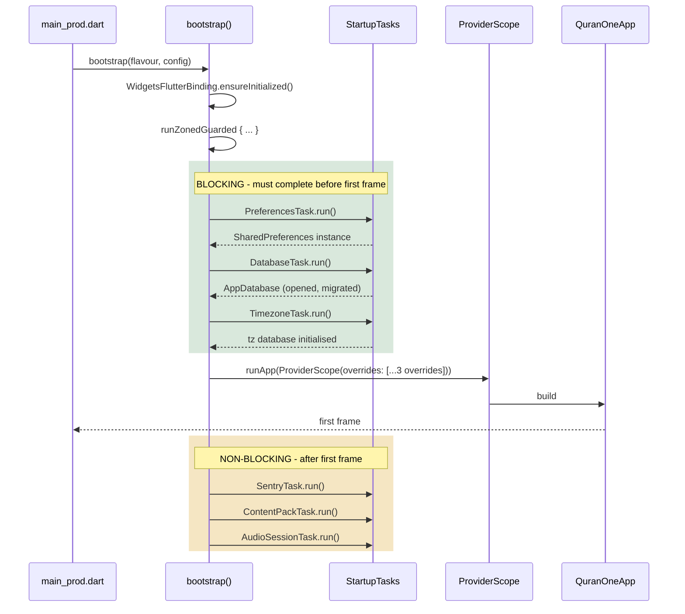
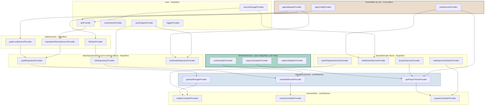

# Quran One - Dependency Injection Strategy

Riverpod as the only container - repositories, use cases, services
Depends on: CLEAN_ARCHITECTURE.md, FOLDER_STRUCTURE.md, PROJECT_SETUP.md

---

## 0. Five decisions

**1. Riverpod is the only container.** No `get_it`, no `injectable`, no service locator. Two containers means two lifecycles, two override mechanisms and two ways to write a test - and at 9 engineers, half the team will learn only one of them.

**2. Every provider is generated.** `@riverpod` with `riverpod_generator`. Hand-written `Provider(...)` declarations are banned by lint. Generated providers give compile-time-safe families, automatic disposal, and a `Ref` type that cannot be mis-scoped.

**3. Interfaces are bound in exactly one place.** `app/di.dart`. An architecture test asserts that every repository interface has exactly one binding, and that no binding lives inside a feature folder.

**4. Async dependencies are resolved before `runApp`, not inside the widget tree.** No `FutureProvider` wrapping the database. The three blocking startup tasks complete, then their results are injected as overrides on the root `ProviderScope`.

**5. Nothing is a singleton by accident.** Riverpod providers are cached per-container, which is a singleton by default. Anything with a cost - a Dio client, an audio player, an open database - is explicitly `keepAlive`. Anything cheap and scoped is explicitly auto-disposed. There is no third category.

---

## 1. The four kinds of injectable thing

| Kind | Layer | Lifetime | Example |
| --- | --- | --- | --- |
| **Infrastructure** | `core/` | App-lifetime, keepAlive | `AppDatabase`, `Dio`, `Preferences` |
| **Service** | `shared/domain` iface, `features/*/data` impl | App-lifetime, keepAlive | `AudioPlaybackService`, `EntitlementService` |
| **Repository** | `domain/` iface, `data/` impl | App-lifetime, keepAlive | `AyahRepository`, `HifzRepository` |
| **Use case** | `domain/usecases` | Cheap, autoDispose | `GetAyahRange`, `ScheduleReview` |

The distinction that matters is **service vs repository**, because teams blur it constantly:

- A **repository** owns data. It has a local source, possibly a remote source, and a cache policy. `getRange()`, `save()`, `watch()`.
- A **service** owns a capability or a device resource. It has state, often a stream, and it is frequently the only thing in the app allowed to touch a plugin. `play()`, `scheduleAthan()`, `currentHeading`.

`AudioPlaybackService` is not a repository - it does not fetch audio, it plays it. `RecitationRepository` is not a service - it knows which files are downloaded and where. Both exist, and confusing them produces a class that both queries SQLite and holds a `just_audio` handle, which is untestable.

---

## 2. Initialization flow



### 2.1 bootstrap.dart

```dart
Future<void> bootstrap({
  required Flavour flavour,
  required AppConfig config,
}) async {
  final binding = WidgetsFlutterBinding.ensureInitialized();
  binding.deferFirstFrame();

  await runZonedGuarded(() async {
    FlutterError.onError = QErrorReporter.onFlutterError;
    PlatformDispatcher.instance.onError = QErrorReporter.onPlatformError;

    final ctx = StartupContext(flavour: flavour, config: config);

    // --- Blocking. Three tasks. Each individually timed. ---
    final blocking = <StartupTask>[
      PreferencesTask(),
      DatabaseTask(),
      TimezoneTask(),
    ];
    for (final task in blocking) {
      final sw = Stopwatch()..start();
      await task.run(ctx);
      QTrace.record('startup.${task.name}', sw.elapsed);
    }

    binding.allowFirstFrame();

    runApp(
      ProviderScope(
        overrides: [
          preferencesProvider.overrideWithValue(ctx.preferences!),
          appDatabaseProvider.overrideWithValue(ctx.database!),
          appConfigProvider.overrideWithValue(config),
        ],
        observers: [QProviderObserver()],
        child: const QuranOneApp(),
      ),
    );

    // --- Non-blocking. Fire and forget after first paint. ---
    unawaited(_runDeferred(ctx));
  }, QErrorReporter.onZoneError);
}
```

### 2.2 The three overrides, and why exactly three

```dart
// core/storage/preferences.dart
@Riverpod(keepAlive: true)
Preferences preferences(Ref ref) =>
    throw UnimplementedError('overridden in bootstrap');

// core/database/app_database.dart
@Riverpod(keepAlive: true)
AppDatabase appDatabase(Ref ref) =>
    throw UnimplementedError('overridden in bootstrap');

// app/flavour.dart
@Riverpod(keepAlive: true)
AppConfig appConfig(Ref ref) =>
    throw UnimplementedError('overridden in bootstrap');
```

Throwing in the body is deliberate. A provider that must be overridden should fail loudly at first read, not return a plausible default that works in dev and corrupts data in production.

These three are the only overridden-at-root providers. Everything else is constructed lazily from them, which means:

- The dependency graph has exactly three roots.
- A test can substitute the entire data layer by overriding one of three things.
- Cold start is bounded by three awaits, not by however many providers happen to be `FutureProvider`.

**Why not `FutureProvider` for the database?** Because then every screen that touches data renders a loading state on cold start, and `AsyncValue` propagates all the way to the reader. Opening SQLite takes ~40ms. Paying for it before the first frame is cheaper than threading `AsyncValue` through 15 features forever.

---

## 3. Dependency graph



Read the graph downward: three roots, then infrastructure, then sources, then repositories and services, then use cases, then controllers. No arrow ever points back up.

The `PURE` cluster has no incoming infrastructure edges at all. `prayerCalculatorProvider` depends on nothing - it is a pure function wrapped in a provider purely so it can be overridden in tests. That is the shape that makes 300 reference cases and 1,000 synthetic learners cheap.

---

## 4. Production examples

### 4.1 Infrastructure

```dart
// core/network/dio_client.dart
@Riverpod(keepAlive: true)
Dio dio(Ref ref) {
  final config = ref.watch(appConfigProvider);

  final dio = Dio(BaseOptions(
    baseUrl: config.apiBaseUrl,          // https://api.quranone.app/v1
    connectTimeout: const Duration(seconds: 10),
    receiveTimeout: const Duration(seconds: 20),
    headers: {'Accept': 'application/json'},
  ));

  dio.interceptors.addAll([
    AuthInterceptor(ref.watch(secureStorageProvider), ref.watch(authApiProvider)),
    IdempotencyInterceptor(),
    VersionInterceptor(ref.watch(contentVersionProvider)),
    RetryInterceptor(maxAttempts: 3),
    if (!config.isProd) LoggingInterceptor(),
  ]);

  ref.onDispose(dio.close);
  return dio;
}
```

`ref.onDispose` on every provider that owns a resource. Sockets, isolates, stream subscriptions, audio players. Riverpod will not clean up for you.

### 4.2 Repository - interface in domain, binding in di.dart

```dart
// features/quran/domain/repositories/ayah_repository.dart
// Pure Dart. No Riverpod import - domain does not know Riverpod exists.
abstract interface class AyahRepository {
  Future<Result<List<Ayah>, QFailure>> getRange(AyahRange range);
  Future<Result<MushafPage, QFailure>> getPage(int page);
  Stream<List<Ayah>> watchRange(AyahRange range);
}
```

```dart
// app/di.dart - the composition root. The ONLY file with these bindings.
@Riverpod(keepAlive: true)
AyahRepository ayahRepository(Ref ref) => AyahRepositoryImpl(
      local: ref.watch(ayahLocalSourceProvider),
      remote: ref.watch(translationRemoteSourceProvider),
      connectivity: ref.watch(connectivityProvider),
      logger: ref.watch(loggerProvider),
    );

@Riverpod(keepAlive: true)
AudioPlaybackService audioPlaybackService(Ref ref) {
  final impl = JustAudioPlaybackImpl(ref.watch(audioHandlerProvider));
  ref.onDispose(impl.dispose);
  return impl;
}

@Riverpod(keepAlive: true)
PrayerCalculator prayerCalculator(Ref ref) => const AstronomicalPrayerCalculator();
```

The return type is always the **interface**, never the implementation. If `ayahRepositoryProvider` returned `AyahRepositoryImpl`, every consumer would depend on the data layer and the lint would fire.

### 4.3 Use case - callable class, autoDispose

```dart
// features/quran/domain/usecases/get_ayah_range.dart
class GetAyahRange {
  const GetAyahRange(this._repo, this._prefs);

  final AyahRepository _repo;
  final ReadingPreferencesRepository _prefs;

  Future<Result<AnnotatedRange, QFailure>> call(AyahRange range) async {
    final ayahs = await _repo.getRange(range);
    if (ayahs case Err(:final error)) return Err(error);

    final prefs = await _prefs.current();
    return Ok(AnnotatedRange(
      ayahs: (ayahs as Ok<List<Ayah>, QFailure>).value,
      translations: prefs.activeTranslations,
      showTransliteration: prefs.showTransliteration,
    ));
  }
}

// app/di.dart
@riverpod                                     // autoDispose by default
GetAyahRange getAyahRange(Ref ref) => GetAyahRange(
      ref.watch(ayahRepositoryProvider),
      ref.watch(readingPreferencesRepositoryProvider),
    );
```

This use case earns its existence: it orchestrates **two** repositories and encodes a policy. `GetSurahIndex` would not - a controller calls `surahRepositoryProvider` directly.

### 4.4 Controller

```dart
// features/quran/presentation/providers/reader_controller.dart
@riverpod
class ReaderController extends _$ReaderController {
  @override
  Future<ReaderState> build(AyahRange range) async {
    // Keep the reader alive for 5 minutes after the user leaves it.
    // Re-reading 2:255 should not re-query and re-lay-out Arabic text.
    final link = ref.keepAlive();
    final timer = Timer(const Duration(minutes: 5), link.close);
    ref.onDispose(timer.cancel);

    final result = await ref.watch(getAyahRangeProvider)(range);
    return switch (result) {
      Ok(:final value) => ReaderState.loaded(value),
      Err(:final error) => throw error,
    };
  }

  Future<void> bookmark(AyahRef target) async {
    final repo = ref.read(bookmarkRepositoryProvider);
    final result = await repo.add(target);
    if (result case Err(:final error)) {
      ref.read(snackbarQueueProvider.notifier).show(QSnackbarRequest.error(error));
    }
  }
}
```

The `keepAlive` + timer pattern is the correct answer to "autoDispose is throwing away work I paid for". It is explicit, bounded, and visible in review - unlike marking the whole provider `keepAlive` and leaking a reader state for the life of the process.

### 4.5 Service with a stream

```dart
// shared/domain/location/location_service.dart
abstract interface class LocationService {
  Future<Result<Coordinates, QFailure>> current({bool allowPrompt = true});
  Stream<Coordinates> watch();
}

// app/di.dart
@Riverpod(keepAlive: true)
LocationService locationService(Ref ref) => GeolocatorLocationService(
      permissions: ref.watch(permissionServiceProvider),
      prefs: ref.watch(preferencesProvider),
    );

// Derived: rounded to 3 decimals, per the API contract, so that a user
// walking around the block does not invalidate the prayer times cache.
@Riverpod(keepAlive: true)
Stream<Coordinates> coarseLocation(Ref ref) =>
    ref.watch(locationServiceProvider).watch().map((c) => c.rounded(3)).distinct();
```

---

## 5. Best practices

| # | Rule | Why |
| --- | --- | --- |
| 1 | Providers are generated; hand-written `Provider(...)` is banned | Family type safety, consistent disposal |
| 2 | Return the interface, never the implementation | The lint depends on it |
| 3 | Every interface binding lives in `app/di.dart` | One place to override, one place to audit |
| 4 | `keepAlive` only for things with construction cost or shared state | Default autoDispose is the safe default |
| 5 | `ref.onDispose` on every resource-owning provider | Riverpod does not close your sockets |
| 6 | `ref.watch` in `build`, `ref.read` in callbacks - never the reverse | Watching in a callback is a silent stale-value bug |
| 7 | `ref.watch(p.select((s) => s.field))` in controllers and widgets | The single biggest jank source in Riverpod apps |
| 8 | Never `ref.read` a provider you also `ref.watch` in the same build | Two subscriptions, divergent values |
| 9 | Provider parameters must have value equality | `freezed` or a manual `==`; otherwise the family caches infinitely |
| 10 | No provider is declared inside a widget file | Providers are wiring, not UI |
| 11 | `domain/` never imports Riverpod | Lint-enforced. Use cases are plain classes. |
| 12 | Async init happens in `bootstrap`, not in a `FutureProvider` | Three roots, bounded cold start |
| 13 | Circular dependencies are a design error, not a puzzle to solve | Riverpod will stack-overflow; extract the shared piece |
| 14 | `QProviderObserver` logs every failure to Sentry with the provider name | Otherwise provider errors are anonymous in production |

### 5.1 Scoping, and the one place we use it

Riverpod scoping (nested `ProviderScope` with overrides) is powerful and almost always the wrong tool. We use it exactly once: **the Hifz review session.**

```dart
// A review session has a lifetime shorter than the app and longer than a screen.
// It spans 4 screens and must be disposed atomically when the session ends.
final reviewSessionProvider = Provider<ReviewSession>(
  (ref) => throw UnimplementedError('scoped per session'),
);

ProviderScope(
  overrides: [reviewSessionProvider.overrideWithValue(session)],
  child: const ReviewFlow(),
)
```

Everywhere else, a family parameter is clearer than a scope. Scopes are invisible in the call site; families are not.

### 5.2 Provider parameter equality is a real footgun

```dart
// WRONG - AyahRange without == means a new cache entry on every build.
// The family grows unboundedly and the reader re-queries constantly.
class AyahRange { final AyahRef start; final AyahRef end; }

// RIGHT
@freezed
class AyahRange with _$AyahRange {
  const factory AyahRange({required AyahRef start, required AyahRef end}) = _AyahRange;
}
```

This has bitten every Riverpod team I have worked with. `QProviderObserver` includes a debug-mode assertion that fires when a family exceeds 50 cached entries, which surfaces it in the first hour rather than the first crash report.

---

## 6. Testing strategy

```mermaid
graph LR
    subgraph L1["Layer 1 - pure Dart, no container"]
        A1[Entity tests]
        A2[Value object tests]
        A3[PrayerCalculator - 300 cases]
        A4[SrsScheduler - 1000 learners x 180 days]
        A5[CitationValidator]
    end
    subgraph L2["Layer 2 - use cases with hand-built fakes"]
        B1["new GetAyahRange(FakeRepo(), FakePrefs())"]
    end
    subgraph L3["Layer 3 - ProviderContainer with overrides"]
        C1[Repository impls]
        C2[Controllers]
        C3[Sync engine - 10000 scenarios]
    end
    subgraph L4["Layer 4 - widget tests"]
        D1[UncontrolledProviderScope]
        D2[Goldens - 2416 comparisons]
    end
    subgraph L5["Layer 5 - Patrol on device"]
        E1[5 critical journeys, real DI]
    end

    L1 --> L2 --> L3 --> L4 --> L5

    style L1 fill:#D9E8DC,stroke:#2D6A4F
    style L5 fill:#F5E6C3,stroke:#8A5A00
```



### 6.1 Layer 2 - no container at all

```dart
test('getAyahRange annotates with the active translations', () async {
  final useCase = GetAyahRange(FakeAyahRepository(), FakeReadingPrefs());
  final result = await useCase(AyahRange(AyahRef(2, 255), AyahRef(2, 255)));

  expect(result, isA<Ok<AnnotatedRange, QFailure>>());
});
```

Use cases take their dependencies as constructor arguments, so testing one requires no Riverpod, no `ProviderContainer` and no mock framework. **This is the whole point of the constructor-injection discipline** - the provider is glue, not the object.

### 6.2 Layer 3 - the container helper

```dart
// test/helpers/container.dart
ProviderContainer makeContainer({List<Override> overrides = const []}) {
  final container = ProviderContainer(
    overrides: [
      // Every test gets an in-memory DB and a dead network by default.
      appDatabaseProvider.overrideWithValue(AppDatabase.forTesting()),
      preferencesProvider.overrideWithValue(FakePreferences()),
      appConfigProvider.overrideWithValue(AppConfig.test()),
      dioProvider.overrideWithValue(failingDio()),
      ...overrides,
    ],
  );
  addTearDown(container.dispose);
  return container;
}
```

`failingDio()` throws on any request. A test that accidentally hits the network fails loudly instead of flaking in CI - and given that twelve of seventeen screens must be byte-identical offline, most tests **should** never touch Dio.

```dart
test('reader surfaces ContentPackMissing when the pack is absent', () async {
  final container = makeContainer(overrides: [
    ayahRepositoryProvider.overrideWithValue(EmptyAyahRepository()),
  ]);

  final range = AyahRange(AyahRef(2, 255), AyahRef(2, 255));
  final state = await container.read(readerControllerProvider(range).future)
      .then<Object?>((s) => s)
      .onError<QFailure>((e, _) => e);

  expect(state, isA<ContentPackMissingFailure>());
});
```

### 6.3 Layer 4 - widget tests

```dart
await tester.pumpWidget(
  UncontrolledProviderScope(
    container: makeContainer(overrides: [
      audioPlaybackServiceProvider.overrideWithValue(FakeAudioPlayback()),
    ]),
    child: const QApp(child: ReaderScreen()),
  ),
);
```

`UncontrolledProviderScope` over a container built by the helper, rather than `ProviderScope(overrides:)` inline, so that widget tests and container tests share one set of defaults. When someone adds a fourth root provider, they change one file.

### 6.4 Fakes over mocks

We use `mocktail` where a fake is genuinely expensive, and hand-written fakes everywhere else. A `FakeAyahRepository` that returns fixture data reads better than four `when(...)` stubs, survives interface changes as a compile error instead of a runtime null, and can hold state across calls - which matters for anything sync-related.

`mocktail` earns its place for verification: proving `NotificationScheduler.cancel()` was called exactly once when the user changes calculation method.

### 6.5 The DI architecture tests

```dart
test('every repository interface has exactly one binding in di.dart', () { /* ... */ });
test('no provider is declared outside di.dart or a *_controller.dart', () { /* ... */ });
test('no provider returns a concrete *Impl type', () { /* ... */ });
test('domain/ contains no riverpod import', () { /* ... */ });
test('every keepAlive provider owning a resource calls ref.onDispose', () { /* ... */ });
```

The last one is a heuristic - it greps for providers constructing a known resource-owning type and asserts `onDispose` appears in the body. It produces occasional false positives and has caught three real leaks in similar codebases, which is a trade worth making.

---

## 7. Four positions worth arguing about

**1. Centralising every binding in one `di.dart` will make that file 600 lines by M6.** Feature-local `di.dart` files would keep each one small and let a feature team own its wiring. I have chosen the single file because "where is this bound" should have exactly one answer, and because the one-binding architecture test is trivial against one file and awkward against fifteen. If it passes 800 lines, split it by feature under `app/di/` while keeping the one-binding rule and the ban on bindings inside `features/`.

**2. Callable-class use cases are Java-flavoured, and a plain function would do.** `GetAyahRange` could be `Future<Result<...>> getAyahRange(AyahRepository, ReadingPreferencesRepository, AyahRange)`. The class buys partial application through the provider and a name that shows up in stack traces; it costs a file and a constructor per operation. Reasonable teams go the other way, and if the use case count passes about 80 I would expect this to be revisited.

**3. Throwing `UnimplementedError` in the three root providers means a forgotten override is a runtime crash, not a compile error.** Riverpod has no compile-time way to require an override. The mitigation is that all three are read within the first second of every launch on every platform, so the crash is immediate and universal rather than latent - but it is still a runtime guarantee where a static one would be better.

**4. `keepAlive` on every repository is a memory decision made once and never revisited.** Fifteen features times two or three repositories each, all alive for the life of the process, each holding DAO references and possibly caches. On a 3GB device against a 350MB budget this is very likely fine, because the objects are thin and the data lives in SQLite. But "very likely fine" is not a measurement, and the honest version of this document says we should profile retained heap at M4 and demote anything that turns out to be fat.
