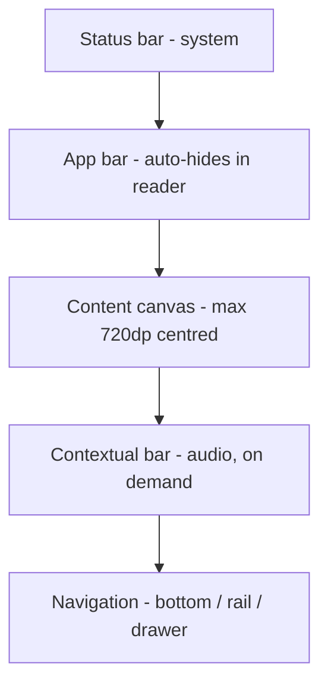

# Quran One - Design System

**Version 1.0 | Codename: Mizan | Material Design 3 | Flutter-first**
**Owner: Design | Status: Draft for engineering review**

> Companion to TECHNICAL_ARCHITECTURE.md and UX_PERSONAS.md. Colour values live in COLOR_SYSTEM.md. Every token in this document maps to a Dart constant in `packages/design_system/`. If a value appears in a widget but not in this document, that widget is wrong.

---

## 0. Why the competition looks the way it does

| App | Design character | The actual problem |
| --- | --- | --- |
| Muslim Pro | Dense, feature-forward, ad-shaped | Layout is organised around ad slots; everything else negotiates around them |
| Quran Majeed | Functional, dated chrome, excellent tajweed colouring | Content is good; the frame around it is 2014 |
| Athan | Cluttered, inconsistent, aggressive | Visual hierarchy dominated by promotional surfaces |
| Noor | Clean but generic | Indistinguishable from a meditation app with different copy |
| Pillars | Genuinely restrained, calm, well-considered | Closest competitor aesthetically, but shallow - the restraint comes partly from having less to show |

The diagnosis: none of them have failed at decoration. Three have too much of it. They have failed at hierarchy - at making the sacred text unambiguously the most important thing on the screen.

Our position: Pillars' restraint, earned across a much deeper product. Not minimal because there is little to show. Minimal because everything shown has been argued for.

### What we explicitly reject

- Gold filigree, arabesque borders, mosque-silhouette illustrations, crescent iconography
- Gradient meshes, glassmorphism, neumorphism
- Skeuomorphic paper, leather or wood textures behind the mushaf
- Decorative Arabic calligraphy used as ornament rather than as content

The reasoning is not taste. Cultural decoration ages fastest and localises worst. A Moroccan zellij motif reads as authentic in Casablanca and as costume in Jakarta. Typography, spacing and light are universal; ornament is not.

---

## 1. Design philosophy

### Mizan - the balance

The Quran is set in a typographic tradition refined over fourteen centuries. Our job is not to reinterpret it. Our job is to build a frame worthy of it and then get out of the way.

**The interface is a room, not a poster.** A room's quality is felt in proportion, light and silence, not in what hangs on the walls.

**Restraint is the luxury signal.** Premium is communicated by what has been removed.

**Reverence is expressed structurally.** The mushaf gets the largest optical area, the highest contrast, the fewest neighbours and the least chrome. Not a gold border - precedence.

### The one-sentence test

> Could this screen sit on a shelf next to a well-bound printed mushaf without embarrassing itself?

---

## 2. Design principles

| # | Principle | Operational consequence |
| --- | --- | --- |
| D1 | The mushaf is sacred typography, not UI | Page fidelity is golden-file tested at 604 pages x 4 device classes. Chrome auto-hides. |
| D2 | Progressive disclosure by declared level | Sara sees 4 controls; Bilal sees 40. Driven by `profile.learning_level`, never an "advanced" toggle in settings. |
| D3 | Never interrupt worship | No modals, upsells, tooltips, rating prompts or coach marks inside reader, prayer or dhikr surfaces. Route-level lint. |
| D4 | Arabic-first, RTL-native | Arabic is designed first at every breakpoint. LTR adapts to it. |
| D5 | Accessible by default | WCAG AA, 200% text scaling, 48dp targets, screen reader parity. Release gates. |
| D6 | Calm over engaging | No red badges, no loss-aversion, no fire emoji, no pulsing. Motion informs; it never solicits. |
| D7 | One accent, earned | A single accent carries all emphasis. If everything is emphasised, the ayah is not. |

---

## 3. Typography

### 3.1 Two scripts, two systems

| Script | Face | Use |
| --- | --- | --- |
| Quranic Arabic | KFGQPC Uthmanic Hafs | Mushaf only. Glyph-level positioning from `page_line` data. Never restyled. |
| UI Arabic | IBM Plex Sans Arabic | Interface, Arabic translations, azkar |
| Latin and Cyrillic | Inter | Interface, European translations |
| Numerals | Inter tabular | Verse numbers, times, counters |

The mushaf face is treated as content, not style. It ships in the content pack alongside the text it renders, versioned together, because a font substitution changes page breaks - which is AR-1, our highest-severity design risk.

### 3.2 UI type scale (M3 roles)

| Token | Size / Line | Weight | Tracking |
| --- | --- | --- | --- |
| `display.large` | 57 / 64 | 400 | -0.25 |
| `headline.medium` | 28 / 36 | 500 | 0 |
| `title.large` | 22 / 28 | 500 | 0 |
| `title.medium` | 16 / 24 | 600 | +0.15 |
| `body.large` | 16 / 24 | 400 | +0.5 |
| `body.medium` | 14 / 20 | 400 | +0.25 |
| `label.large` | 14 / 20 | 500 | +0.1 |
| `label.small` | 11 / 16 | 500 | +0.5 |

### 3.3 Reading type scale - independent

| Token | Default | Range | Notes |
| --- | --- | --- | --- |
| `q.type.mushaf` | 26 / 2.0em | 18-48 | Line height is a multiplier: diacritics need vertical room |
| `q.type.translation` | 17 / 1.7em | 14-32 | Independently adjustable from Arabic |
| `q.type.transliteration` | 15 / 1.6em | 13-28 | Italic, muted ink |
| `q.type.tafsir` | 16 / 1.75em | 14-30 | Longest-form reading in the app |

Arabic and translation sizes are separate controls. Bilal reads Arabic-only at 40sp; Sara reads English at 20sp with small Arabic. One slider makes the app worse for both primary personas. Every competitor ships exactly one slider.

### 3.4 Arabic-specific rules

- Arabic line height never below 1.8em. Below that, fatha and kasra collide with adjacent lines.
- Never apply synthetic bold or synthetic italic to Arabic.
- `letterSpacing` on Arabic is 0. Positive tracking breaks cursive joins.
- Vertical rhythm in Arabic contexts uses line-height multiples, not fixed dp.

---

## 4. Spacing system

### 4.1 Base unit: 4dp

```
q.space.0    0      q.space.5   20
q.space.1    4      q.space.6   24
q.space.2    8      q.space.8   32
q.space.3   12      q.space.10  40
q.space.4   16      q.space.12  48
                    q.space.16  64
```

### 4.2 Semantic aliases

| Token | Value | Use |
| --- | --- | --- |
| `q.space.inline.tight` | 4 | Icon to label |
| `q.space.inline` | 8 | Between inline elements |
| `q.space.stack.tight` | 8 | Within a group |
| `q.space.stack` | 16 | Between related blocks |
| `q.space.stack.loose` | 24 | Between sections |
| `q.space.section` | 32 | Major section breaks |
| `q.space.gutter` | 16 / 24 / 24 | Screen edge, by breakpoint |

### 4.3 Reading spacing - the exception

The reader does not use the 4dp grid vertically. Verse spacing, line spacing and page margins are expressed as em multiples of the current Arabic size, so the whole page rescales proportionally when the user changes text size.

| Token | Value |
| --- | --- |
| `q.reading.verseGap` | 0.75em |
| `q.reading.lineGap` | 2.0em |
| `q.reading.pageMarginH` | 1.6em (min 20dp, max 96dp) |
| `q.reading.pageMarginV` | 2.0em |

---

## 5. Grid and layout

### 5.1 Breakpoints (M3 window size classes)

| Class | Width | Columns | Gutter | Margin |
| --- | --- | --- | --- | --- |
| Compact | under 600 | 4 | 16 | 16 |
| Medium | 600-839 | 8 | 24 | 24 |
| Expanded | 840-1199 | 12 | 24 | 24 |
| Large | 1200-1599 | 12 | 32 | 32 |
| Extra-large | 1600+ | 12 | 32 | auto-centred, max 1440 |

### 5.2 Navigation adaptation

| Class | Pattern |
| --- | --- |
| Compact | Bottom navigation bar, 5 destinations max |
| Medium | Navigation rail, collapsed |
| Expanded | Navigation rail, expanded with labels |
| Large / XL | Standard navigation drawer + list-detail |

### 5.3 The reader ignores the grid

The mushaf is a single optically-centred canvas constrained by measure, not by columns.

| Constraint | Value |
| --- | --- |
| Optimal measure (translation) | 60-75 characters |
| Max canvas width | 720dp, regardless of window width |
| Beyond 720dp | Canvas centres; margins grow; type does not |
| Ultra-wide (1400dp+) | Two-page spread, mirroring a physical mushaf |

Text does not scale up to fill a tablet. Long-form reading breaks past ~75 characters per line - the eye loses the line return. Every competitor that stretches translation text across an iPad in landscape has made a legibility error, not a responsive one.

### 5.4 Layout regions



In the reader, the app bar and navigation hide on scroll and return on tap. At rest, the page is the only thing on screen.

---

## 6. Shape and border radius

| Token | Radius | Applied to |
| --- | --- | --- |
| `q.shape.none` | 0 | Full-bleed surfaces, dividers |
| `q.shape.xs` | 4 | Chips, small tags, badges |
| `q.shape.sm` | 8 | Text fields, list tiles, menus |
| `q.shape.md` | 12 | Cards, sheets, dialogs |
| `q.shape.lg` | 16 | Bottom sheets (top corners), large cards |
| `q.shape.xl` | 28 | FAB, prominent containers |
| `q.shape.full` | 999 | Pills, avatars, toggle tracks |

### Rules

- The mushaf canvas has `q.shape.none`. Rounding the page edge makes scripture look like a card. It is a page.
- Nested radii follow `inner = outer - padding`, never equal.
- Radius does not change across breakpoints. It changes with element role.
- Bottom sheets round the top corners only.

---

## 7. Elevation

M3 tonal elevation in light and dark. Hairline elevation in AMOLED.

| Level | dp | Light/Dark | AMOLED | Use |
| --- | --- | --- | --- | --- |
| 0 | 0 | Base surface | `#000000` | Canvas, reader |
| 1 | 1 | +5% tint | 1px `#161616` | Cards, list surfaces |
| 2 | 3 | +8% tint | 1px `#1A1A1A` | App bar on scroll, chips |
| 3 | 6 | +11% tint | 1px `#1E1E1E` | Menus, FAB rest |
| 4 | 8 | +12% tint | 1px `#242424` | Nav drawer |
| 5 | 12 | +14% tint | 1px `#2A2A2A` | Dialogs, FAB pressed |

### Rules

- Never more than two elevation levels on one screen.
- The reader is permanently level 0. Nothing floats over scripture except the audio bar, at level 2 with a hairline.
- Shadows are used only in light theme, softly: `blur = dp x 2`, `y = dp x 0.5`, opacity at most 0.08.
- No coloured shadows. No glow.

---

## 8. Motion

> Motion explains a change in state. It never asks for attention.

If an animation could be removed without the user losing information about where something came from or where it went, remove it.

### 8.1 Duration tokens

| Token | ms | Use |
| --- | --- | --- |
| `q.motion.instant` | 50 | State layer, ripple onset |
| `q.motion.short` | 150 | Icon toggle, checkbox, chip |
| `q.motion.medium` | 250 | Sheet, dialog, list expand |
| `q.motion.long` | 400 | Page transition, shared element |
| `q.motion.page` | 350 | Mushaf page turn |
| `q.motion.extended` | 600 | Onboarding, first run only |

### 8.2 Easing

| Token | Curve | Use |
| --- | --- | --- |
| `q.easing.standard` | `cubic-bezier(0.2, 0, 0, 1)` | Default, on-screen movement |
| `q.easing.decelerate` | `cubic-bezier(0, 0, 0, 1)` | Entering the screen |
| `q.easing.accelerate` | `cubic-bezier(0.3, 0, 1, 1)` | Leaving the screen |
| `q.easing.emphasised` | M3 emphasised | Hero moments, sparingly |

No spring physics, no bounce, no overshoot anywhere in the app. Playful motion is tonally wrong next to scripture, and overshoot on Arabic text is genuinely nauseating at 26sp.

### 8.3 Specific behaviours

| Interaction | Motion |
| --- | --- |
| Mushaf page turn | Horizontal slide, 350ms standard. No curl, no fold, no shadow sweep. |
| Verse audio highlight | Background cross-fade, 200ms. The verse never scales or moves. |
| Auto-scroll during recitation | Continuous, linear, matched to `recitation_segment` timing |
| Chrome hide/show | 200ms fade + 8dp translate |
| Tasbih counter | Number cross-fades. The button does not animate. |
| Prayer time arrival | No animation. A silent state change. |

### 8.4 Reduced motion

When `MediaQuery.disableAnimations` is true: all durations become instant or 0; page turns become instant cuts; auto-scroll becomes step-scroll at verse boundaries. Content parity is absolute - nothing is only discoverable through motion.

---

## 9. RTL and LTR

### 9.1 Absolute rules

```dart
// Banned in review. All of them.
EdgeInsets.only(left: 16)
Alignment.centerLeft
Positioned(left: 0)
TextAlign.left
BorderRadius.only(topLeft: ...)

// Required.
EdgeInsetsDirectional.only(start: 16)
AlignmentDirectional.centerStart
PositionedDirectional(start: 0)
TextAlign.start
BorderRadiusDirectional.only(topStart: ...)
```

A custom lint rule fails the build on any left/right positional API in `lib/`. Humans miss this every time.

### 9.2 What mirrors, and what must not

| Element | Mirrors in RTL? |
| --- | --- |
| Layout, navigation, list chevrons | Yes |
| Back arrow, forward/next icons | Yes |
| Progress bars, sliders | Yes |
| Quranic text | N/A - always RTL |
| Mushaf page-turn direction | Never mirrors - always RTL, in every UI locale |
| Arabic-Indic numerals | No |
| Clock face, prayer time order | No |
| Play / pause / audio transport | No |
| Qibla compass rotation | No |
| Logos, brand marks | No |

The page-turn exception matters. An English-locale user swiping through the Quran still turns pages right-to-left, because they are turning the pages of a mushaf, not scrolling a document.

### 9.3 Bidirectional text

Translations mix scripts frequently. Every such string is wrapped in `Directionality` with explicit isolate marks. Verse references embedded in Arabic prose use FSI/PDI (`\u2068` / `\u2069`) to prevent number reordering.

### 9.4 Locale coverage

12 UI languages at launch. Arabic, Urdu, Farsi and Pashto layouts are designed first, then adapted to LTR. German and Turkish are the width stress tests; every component is verified against a +40% string length.

---

## 10. Accessibility

| Requirement | Standard | Verification |
| --- | --- | --- |
| Contrast | WCAG AA, exceeded on all reading text | Automated per PR |
| Touch targets | at least 48x48dp, at least 8dp separation | Automated widget test |
| Text scaling | To 200% with no clipping or overlap | Golden tests at 1.0x, 1.5x, 2.0x |
| Screen reader | Full parity, meaningful order | Manual per release |
| Focus | Visible 2dp ring at 3.5:1, logical order | Automated + manual |
| Motion | Full reduced-motion support | Automated |
| Colour independence | No meaning by colour alone | Design review |

### Semantics for religious content

- Verse numbers announce as "Verse 255 of Surah Al-Baqarah", never as a bare digit.
- Arabic text carries an explicit `Locale('ar')` so TTS does not attempt English pronunciation.
- Tajweed colours announce their rule name ("ikhfa"), not the colour.
- Hadith grading announces the full grade text, never a colour dot.
- The tasbih counter is fully operable via volume keys and screen-off, because the users who need it most are not looking at the screen.

---

## 11. Naming conventions

### 11.1 Token grammar

```
q . <layer> . <category> . <role> [. <variant>] [. <state>]
```

| Segment | Values |
| --- | --- |
| layer | `ref` / `sys` / `comp` |
| category | `color` / `type` / `space` / `shape` / `elevation` / `motion` |
| role | semantic purpose |
| variant | `muted` / `strong` / `inverse` |
| state | `hover` / `pressed` / `focus` / `disabled` / `selected` |

```
q.ref.color.green.40
q.sys.color.primary
q.sys.reading.ink.muted
q.comp.ayahCard.bg.selected
q.comp.athanBanner.shape
```

Tokens never describe appearance. `q.sys.color.primary`, never `q.color.darkGreen` - because in AMOLED it is not dark green, and the name would then lie.

### 11.2 Dart conventions

| Kind | Convention | Example |
| --- | --- | --- |
| Token class | PascalCase, plural | `QSpacing`, `QColors`, `QMotion` |
| Token field | lowerCamelCase | `QSpacing.stackLoose` |
| Component | `Q` prefix | `QAyahCard`, `QPrayerRow` |
| Screen | `<Name>Screen` | `MushafScreen` |
| Theme extension | `<Name>Theme` | `ReadingTheme` |
| Golden file | `<component>_<theme>_<scale>_<dir>.png` | `ayah_card_amoled_2x_rtl.png` |

### 11.3 Figma parity

Figma variable paths are byte-identical to Dart token paths. A CI job diffs exported Figma variables against `packages/design_system/` and fails on drift. Design and code cannot silently diverge.

---

## 12. Component inventory - v1

| Group | Components |
| --- | --- |
| Reading | `QMushafPage`, `QAyahCard`, `QTranslationBlock`, `QTafsirSheet`, `QVerseActionBar`, `QHighlightPicker`, `QReadingSettingsSheet` |
| Audio | `QAudioBar`, `QReciterPicker`, `QSpeedControl`, `QRepeatRangeSheet` |
| Prayer | `QPrayerRow`, `QNextPrayerCard`, `QAthanDiagnosticCard`, `QQiblaCompass`, `QPrayerLogToggle` |
| Learning | `QHifzUnitTile`, `QReviewPrompt`, `QMasteryRing`, `QPlanCard`, `QRetentionChart` |
| Dhikr | `QTasbihCounter`, `QDhikrCard` |
| Structure | `QAppBar`, `QNavBar`, `QNavRail`, `QSectionHeader`, `QEmptyState`, `QErrorState` |
| Input | `QTextField`, `QSearchField`, `QSlider`, `QSegmented`, `QSwitch`, `QChip` |
| Feedback | `QSnackbar`, `QDialog`, `QBottomSheet`, `QProgress`, `QSkeleton` |

Every component ships with 24 golden files: 3 themes x 2 directions x 4 text scales.

---

## 13. Governance

| Rule | Detail |
| --- | --- |
| Token changes | Require design + engineering approval. Colour changes re-run the full contrast matrix. |
| New component | Needs a documented use in at least 2 screens, or it is a one-off widget instead |
| Hardcoded values | A raw `Color(0x...)` or bare dp outside `design_system/` fails lint |
| Figma drift | CI diffs Figma variables against Dart tokens; drift fails the build |
| Deprecation | Two-release window with `@Deprecated` and a migration note |

---

## 14. Four open pushbacks

1. **"Luxurious" is the requirement most likely to be misread.** Every request for a premium Islamic app eventually produces a gold-and-emerald mockup with arabesque borders. That reads as luxurious for about six months and as a hotel lobby afterwards. The durable version is a warm off-white canvas, one restrained green, generous margins, and typography good enough to be examined closely.
2. **AMOLED will be the most-praised and least-carefully-built theme unless we are deliberate.** The white-on-black halation problem is subtle in Latin text and severe in vocalised Arabic. See COLOR_SYSTEM.md section 4.
3. **Two separate text-size controls will be questioned in design review.** One slider makes the app worse for both primary personas. Keep two, hide the second behind `learning_level` for beginners.
4. **Capping reading width at 720dp will look like wasted space on tablets.** Past ~75 characters the eye loses the line return. The empty margin is doing work.
