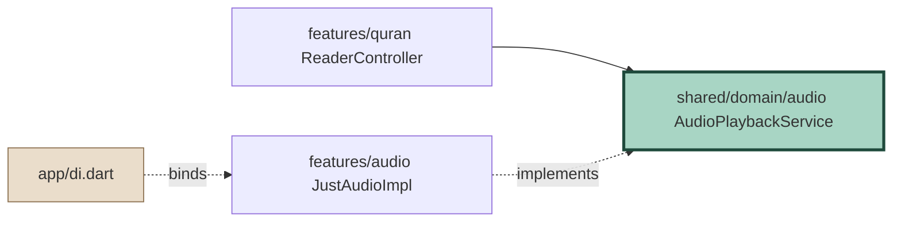
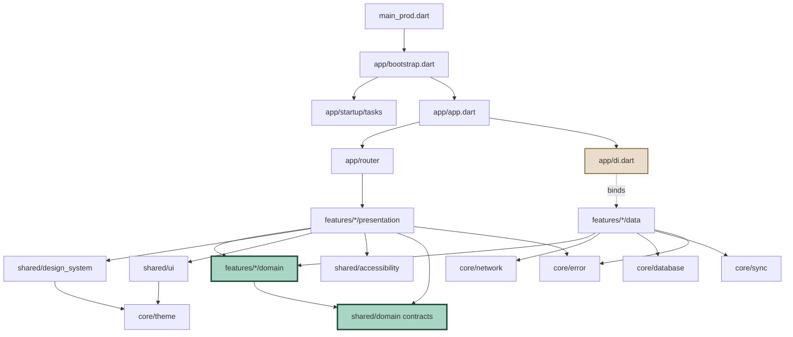

# Quran One - Definitive Folder Structure

Fifteen features - four foundation layers - every folder justified
Depends on: CLEAN_ARCHITECTURE.md, PROJECT_SETUP.md

Two features here were not in the twelve-module list from PROJECT_SETUP.md: **Ramadan** and **AI**. Both change the architecture in ways worth flagging - Ramadan because it is seasonal and Learning-adjacent, AI because it is the only feature in the product that cannot work offline.

---

## 0. Top level

```
quran_one/
|-- android/                    # Native Android host + 3 flavour manifests
|-- ios/                        # Native iOS host + 3 schemes
|-- web/                        # index.html, custom flutter_bootstrap.js, SW
|-- macos/  windows/  linux/    # Present, unclaimed. NOT in CI. See section 11.
|
|-- assets/                     # section 8
|-- config/                     # dart-define JSON per flavour. No secrets.
|-- lib/                        # sections 1-7
|-- test/                       # Mirrors lib/ exactly
|-- integration_test/           # Patrol, 5 critical journeys
|-- tool/                       # Dart scripts: codegen, icon font, asset audit
|-- docs/                       # Specification documents
|-- scripts/                    # Shell: release, golden update, licence audit
|-- .github/workflows/          # CI
|
|-- analysis_options.yaml
|-- pubspec.yaml
|-- l10n.yaml
|-- build.yaml                  # build_runner config, per-builder scoping
|-- dart_test.yaml              # test tags: unit, golden, slow
|-- .fvmrc  .tool-versions      # Pinned toolchain. CI fails on mismatch.
`-- flutter_native_splash.yaml
```

**Why `tool/` and `scripts/` are separate.** `tool/` is Dart, runs via `dart run`, is testable and cross-platform. `scripts/` is shell, runs in CI, is not. Mixing them means a Windows developer discovers on day one that half the tooling does not run.

**`config/` holds no secrets.** dart-define values are recoverable from the binary with `strings`. Anything sensitive is fetched post-authentication.

---

## 1. lib/ at a glance

```
lib/
|-- main_dev.dart
|-- main_staging.dart
|-- main_prod.dart
|
|-- app/                # Composition root. The only layer that knows everything.
|-- core/               # Domain-agnostic infrastructure.
|-- shared/             # Domain-aware, cross-feature.
|-- features/           # 15 vertical slices.
`-- l10n/               # 12 locales.
```

Five entries. If a sixth appears, something has gone wrong.

### 1.1 Three entry points, not one with a flag

```dart
// main_prod.dart
void main() => bootstrap(
      flavour: Flavour.prod,
      config: const AppConfig.fromEnvironment(),
    );
```

Each is four lines. A single `main.dart` with runtime branching means dev-only code paths ship inside the production binary. Three files is the cheapest possible isolation.

---

## 2. app/ - the composition root

```
app/
|-- bootstrap.dart          # The startup sequence
|-- app.dart                # QuranOneApp: MaterialApp.router + theme + l10n
|-- di.dart                 # THE ONLY place an interface meets an implementation
|-- router/
|   |-- router.dart         # GoRouter, StatefulShellRoute.indexedStack
|   |-- routes.dart         # go_router_builder typed route declarations
|   |-- guards.dart         # Onboarding gate. The ONLY gate in the app.
|   |-- deep_links.dart     # quranone:// and https://quranone.app parsing
|   `-- observers.dart      # QAnalyticsObserver, QSentryObserver
|-- flavour.dart            # enum Flavour + AppConfig
`-- startup/
    |-- startup_task.dart   # abstract: name, isBlocking, run()
    `-- tasks/              # One file per task, ordered, individually timed
        |-- sentry_task.dart
        |-- database_task.dart
        |-- timezone_task.dart       # REQUIRED before any athan scheduling
        |-- preferences_task.dart
        |-- content_pack_task.dart
        `-- audio_session_task.dart
```

**Why startup is a folder and not a function.** The 2.0s cold-start budget is a release gate. A monolithic `bootstrap()` can only be profiled as a single number. Modelling each step as a `StartupTask` with `isBlocking` gives per-task timing in the trace.

```dart
abstract interface class StartupTask {
  String get name;
  bool get isBlocking;      // false = fire-and-forget after first frame
  Future<void> run(StartupContext ctx);
}
```

Only three tasks are blocking: preferences, database open, timezone. Everything else runs after first paint.

`timezone_task.dart` is blocking and non-negotiable. Athan scheduling across a DST boundary without an initialised timezone database silently fires prayers an hour off. That is AR-2 territory and it is not recoverable at runtime.

---

## 3. core/ - infrastructure with no opinion about Islam

If a file here mentions an ayah, a prayer or a reciter, it is in the wrong layer.

```
core/
|-- theme/                  # FLUTTER_THEME_ARCHITECTURE.md
|   |-- theme.dart          # The single public barrel. Features import ONLY this.
|   |-- q_theme_input.dart  q_theme_builder.dart  q_theme_mode.dart
|   |-- color/              q_ref_colors.dart (imported by ONE file)
|   |                       q_color_schemes.dart  q_dynamic_color.dart
|   |-- typography/         q_font_face  q_style  q_text_theme  q_strut
|   |-- extensions/         q_semantic_colors  q_typography
|   |                       q_reading_theme  q_shape_motion
|   |-- components/         6 files of ThemeData component factories
|   `-- elevation/          q_elevation.dart (tonal vs AMOLED hairline)
|
|-- network/
|   |-- dio_client.dart             # Factory. Base URL from AppConfig.
|   |-- interceptors/
|   |   |-- auth_interceptor.dart       # Bearer + silent refresh, single-flight
|   |   |-- retry_interceptor.dart      # Exponential backoff + jitter
|   |   |-- version_interceptor.dart    # X-Content-Version: 2026.07.3
|   |   |-- idempotency_interceptor.dart# UUID key on every mutation
|   |   `-- logging_interceptor.dart    # Redacts tokens. Non-prod only.
|   |-- problem_details.dart        # RFC 9457 to ServerFailure
|   |-- cursor_page.dart            # Generic cursor pagination envelope
|   `-- connectivity_service.dart
|
|-- database/
|   |-- app_database.dart           # Drift entry, schemaVersion
|   |-- tables/                     # Table definitions ONLY, no queries
|   |-- daos/                       # Queries. One DAO per bounded area.
|   |-- migrations/
|   |   |-- migration_strategy.dart
|   |   `-- steps/                  # v1_to_v2.dart, v2_to_v3.dart ...
|   |-- converters/                 # TypeConverters (Duration, enums, JSON)
|   `-- fts/
|       |-- fts_schema.dart         # FTS5 virtual tables
|       `-- fts_tokenizer.dart      # Diacritic-insensitive Arabic tokenising
|
|-- sync/                           # Generic. Knows nothing about what it syncs.
|   |-- sync_engine.dart
|   |-- outbox.dart                 # Local change queue, survives kill
|   |-- delta_puller.dart
|   |-- conflict_resolver.dart      # Strategy supplied per registered type
|   |-- syncable.dart               # Interface features implement
|   `-- sync_registry.dart          # Features register their types here
|
|-- error/
|   |-- q_failure.dart              # sealed hierarchy
|   |-- result.dart                 # Result<T, QFailure>: Ok | Err
|   `-- error_reporter.dart         # Sentry, PII scrubbing
|
|-- storage/
|   |-- secure_storage.dart         # Tokens, receipts
|   |-- preferences.dart            # Typed wrapper. No raw string keys anywhere.
|   `-- file_storage.dart           # Content packs, audio, quota management
|
|-- logging/        logger.dart  log_sinks.dart
|-- analytics/      analytics_service.dart  events.dart  no_op_analytics.dart
|-- permissions/    permission_service.dart  rationale.dart
|-- platform/       # Thin wrappers over plugins. Everything mockable.
|   |-- device_info.dart  package_info.dart  wakelock.dart
|   |-- haptics.dart      share.dart         url_launcher.dart
|   `-- background_scheduler.dart   # WorkManager / BGTaskScheduler
`-- utils/
    |-- extensions/     # ONE file per extended type. No extensions.dart.
    |-- debouncer.dart  throttle.dart  result_extensions.dart
    `-- typedefs.dart
```

### 3.1 The two folders that repay their cost

**core/platform/.** Every plugin is wrapped in an interface. `HapticsService`, not `HapticFeedback.mediumImpact()`. This looks like ceremony until you write a widget test for the tasbih counter and discover that `HapticFeedback` requires a platform channel. Fifteen thin wrappers buy an entire test tier.

**core/sync/.** Generic by construction. Features register their syncable types. That is what makes AR-3 (sync corrupting Hifz history) testable once, with 10,000 generated scenarios, instead of eleven times over.

### 3.2 The rules that are lints, not conventions

- `core/**` may not import `features/**` or `shared/**`
- `q_ref_colors.dart` is imported by exactly one file
- No `utils.dart`, `helpers.dart`, `constants.dart`, `common.dart` - banned by name
- No `extensions.dart`; one file per extended type

Grab-bag files are where code goes to become unfindable, and in a 15-feature codebase they grow to 800 lines within a year.

---

## 4. shared/ - domain-aware, cross-feature

| | `core/` | `shared/` |
| --- | --- | --- |
| Knows about Islam | No | Yes |
| Example | `QFailure`, Dio setup | `QAyahCard`, `AudioPlaybackService` |
| Extractable to a generic package | Yes | No |

```
shared/
|-- design_system/              # COMPONENT_LIBRARY.md - 14 components
|   |-- design_system.dart      # Barrel. Features import ONLY this.
|   |-- primitives/             # QTapTarget, QIcon, QSkeleton, QDivider
|   |-- components/             # QButton QCard QDialog QBottomSheet QSnackbar
|   |                           # QChip QBadge QSwitch QCheckbox QRadioGroup
|   |                           # QProgress QSearchBar QSegmentedControl QDropdown
|   |-- domain/                 # QAyahCard QPrayerRow QReciterTile
|   |                           # QMasteryRing QStatusBadge
|   |-- feedback/               # QEmptyState QErrorState QLoadingState QOfflineState
|   `-- icons/                  # QuranOneIcons - 9 custom glyphs 0xe900-0xe908
|
|-- ui/                         # UI_KIT.md - six archetypes
|   |-- scaffolds/              # q_scaffold + 6 archetype scaffolds
|   |-- templates/              # 17 screen templates. Layout only, zero data.
|   |-- states/                 # QScreenState renderers
|   |-- layout/                 # QBreakpoints QAdaptive QGrid QSpacing
|   `-- motion/                 # MOTION_SYSTEM.md - QMotion QEasing
|                               # QMotionScope transitions/ heroes/
|
|-- domain/                     # Cross-feature CONTRACTS. Zero implementations.
|   |-- audio/          AudioPlaybackService  PlaybackState  ReciterId
|   |-- content/        ContentPackService  PackManifest  PackId
|   |-- entitlement/    EntitlementService  Tier  Entitlement
|   |-- location/       LocationService  Coordinates
|   |-- notification/   NotificationScheduler  ScheduledNotification
|   `-- calendar/       HijriCalendarService  HijriDate
|
|-- formatting/
|   |-- hijri_formatter.dart        ayah_ref_formatter.dart
|   |-- duration_formatter.dart     number_formatter.dart  # Arabic-Indic digits
|   `-- relative_time_formatter.dart
|
|-- validation/         email  password  arabic_text
`-- accessibility/      # ACCESSIBILITY.md helpers
    |-- semantics_helpers.dart      # LocaleStringAttribute wrappers
    |-- bidi_isolate.dart           # U+2068 ... U+2069
    |-- announcer.dart              # polite by default; assertive is allow-listed
    `-- focus_ring.dart
```

### 4.1 shared/domain/ is the anti-monolith mechanism

Six interfaces, no implementations. This is what prevents `features/quran` importing `features/audio`.



**Hard cap: 15 interfaces.** Past that, the boundary has failed and needs redrawing rather than extending.

### 4.2 shared/accessibility/ earns its place

It exists because ACCESSIBILITY.md commits to behaviour that cannot be achieved by convention alone: bidi isolation on every mixed-direction interpolation, `LocaleStringAttribute` on every opposite-language run, polite-by-default announcements with an allow-list for assertive. Putting these in `utils/` guarantees they get bypassed.

---

## 5. features/ - fifteen vertical slices

```
features/
|-- auth/           login, register, optional account, token lifecycle
|-- home/           the hub - countdown, continue, hifz summary, tool grid
|-- quran/          mushaf, index, reader, translations, tafsir
|-- prayer/         times, athan scheduling, calendar, method config
|-- qibla/          compass, magnetometer, manual heading fallback
|-- hadith/         collections, books, search, grading
|-- azkar/          six sets, counter sessions
|-- ramadan/        seasonal shell - see 5.2
|-- learning/       Hifz SRS, plans, review, progress
|-- ai/             assistant - see 5.3
|-- premium/        tiers, three billing stores, entitlement, waqf
|-- settings/       nine groups, no Save button
|-- notifications/  inbox, per-type preferences
|-- profile/        descriptive statistics, account management
`-- search/         cross-source FTS5 orchestration
```

### 5.1 The canonical feature shape

```
features/quran/
|-- domain/                         # Pure Dart. No Flutter, Dio, Drift, Riverpod.
|   |-- entities/       ayah  surah  juz  mushaf_page  translation  tafsir
|   |-- value_objects/  ayah_ref  ayah_range  mushaf_page_number
|   |-- repositories/   ayah_repository  surah_repository  tafsir_repository
|   |-- services/       ayah_range_resolver   # pure domain logic
|   |-- usecases/       get_ayah_range  get_surah_index  resolve_page_for_ayah
|   `-- failures/       content_pack_missing_failure
|
|-- data/
|   |-- models/         *_model.dart (+ .freezed.dart, .g.dart)
|   |-- mappers/        ayah_mapper  surah_mapper       # round-trip tested
|   |-- sources/
|   |   |-- local/      ayah_local_source  ayah_dao  mushaf_layout_source
|   |   `-- remote/     translation_remote_source  tafsir_remote_source
|   `-- repositories/   ayah_repository_impl  surah_repository_impl
|
`-- presentation/
    |-- providers/      reader_controller  surah_index_provider  reading_prefs
    |-- screens/        reader_screen  quran_index_screen  tafsir_screen
    |-- widgets/        mushaf_page_view  surah_list_tile  ayah_actions_sheet
    `-- mappers/        failure_to_ui.dart   # QFailure to QErrorState
```

`presentation/mappers/` is small and load-bearing: it is the one place a `QFailure` becomes user-visible copy, which is what makes the copy doctrine lintable across 12 locales.

### 5.2 ramadan/ - the seasonal feature

Ramadan is architecturally unlike the other fourteen. It is dormant for eleven months a year and it composes other features rather than owning data.

```
features/ramadan/
|-- domain/
|   |-- entities/       ramadan_day  fasting_record  taraweeh_session
|   |                   khatmah_plan  laylatul_qadr_night
|   |-- services/
|   |   |-- ramadan_window.dart      # Is it Ramadan? Which day? Pure.
|   |   `-- khatmah_pacer.dart       # Pages/day to finish by Eid. Pure.
|   |-- repositories/   fasting_repository  khatmah_repository
|   `-- usecases/       get_ramadan_dashboard  log_fast  advance_khatmah
|
|-- data/
|   `-- models/  mappers/  sources/local/  repositories/
|
`-- presentation/
    |-- providers/      ramadan_mode_provider   # THE seasonal switch
    |-- screens/        ramadan_dashboard  khatmah_screen  fasting_log_screen
    `-- widgets/        suhoor_countdown  iftar_countdown  khatmah_ring
```

**1. Ramadan does not own prayer times or Quran progress.** It reads them through `shared/domain/` contracts. Suhoor and iftar are Fajr and Maghrib with different labels. Duplicating the calculation would give two sources of truth for the moment a fast begins.

**2. `ramadan_mode_provider` is the entire seasonal surface.** One provider decides whether the Ramadan destination appears and whether Home shows Ramadan cards. Not fifteen scattered `if (isRamadan)` checks.

**3. `ramadan_window.dart` is pure and heavily tested.** Ramadan 1449 is approximately 8 Feb 2027; 1450 approximately 29 Jan 2028. Whether it starts on a given evening depends on local moon-sighting convention, which is a user preference, not a computed fact. The service takes the convention as an argument and never guesses.

Seasonal features rot. Eleven months of nobody opening `features/ramadan/`, then it must be flawless for thirty days under the highest traffic of the year. Mitigation: a CI job runs the full Ramadan test suite with a clock fixed to Ramadan day 1, day 15, day 29 and Eid, every night, all year.

### 5.3 ai/ - the only feature that cannot work offline

```
features/ai/
|-- domain/
|   |-- entities/       conversation  message  citation  ai_capability
|   |-- value_objects/  conversation_id  token_budget
|   |-- repositories/   conversation_repository  assistant_repository
|   |-- services/
|   |   `-- citation_validator.dart   # Pure. This is the feature.
|   |-- usecases/       send_message  stream_response  regenerate  cite_source
|   `-- failures/       ai_unavailable  ai_rate_limited  ai_uncited_claim
|
|-- data/
|   |-- models/         conversation_model  message_model  sse_chunk_model
|   |-- sources/
|   |   |-- remote/     assistant_sse_source   # server-sent events
|   |   `-- local/      conversation_dao       # history is local + synced
|   `-- repositories/
|
`-- presentation/
    |-- providers/      conversation_controller  streaming_state
    |-- screens/        assistant_screen  conversation_history_screen
    `-- widgets/        message_bubble  citation_chip  streaming_indicator
                        ai_disclosure_banner
```

`citation_validator.dart` is the most important file in this feature, and it lives in `domain/` as a pure function specifically so it can be exhaustively tested without a model in the loop.

This is AR-7: AI hadith hallucination. The mitigation is architectural, not prompt-engineering: every factual claim the assistant makes must carry a citation to a real ayah or a real graded hadith in the local database. The validator checks each citation against local content before the message renders. A claim with an unresolvable citation is not shown - it becomes `AiUncitedClaimFailure`.

Consequences:

- The AI feature is the only one in the product that is network-dependent, and it says so plainly rather than showing a generic error.
- It is unreachable from any worship path, same rule as premium, enforced by the same route-graph test.
- Conversation history is local-first and synced; prompts are not retained server-side beyond the request.

### 5.4 Feature weight varies enormously, and the structure does not

| Feature | Domain files | Notes |
| --- | --- | --- |
| `learning` | ~40 | Heaviest. SRS is the differentiator. F-100. |
| `quran` | ~35 | Mushaf renderer F-021 is 14 dev-weeks alone. |
| `ai` | ~20 | Small surface, high risk. |
| `prayer` | ~25 | Pure astronomical engine, 300 reference cases. |
| `ramadan` | ~15 | Mostly composition. |
| `qibla` | ~6 | One bearing calculation. |
| `settings` | ~2 | No domain layer. |

### 5.5 Where the structure is deliberately relaxed

- `settings/` has no domain layer. It reads and writes preferences.
- No use case class for trivial pass-throughs.
- Entities and DTOs are the same class for immutable scripture.

---

## 6. l10n/ - twelve locales

```
l10n/
|-- app_en.arb   # Template. Every key carries @description.
|-- app_ar.arb  app_fr.arb  app_id.arb  app_ur.arb  app_tr.arb
|-- app_ms.arb  app_bn.arb  app_es.arb  app_de.arb  app_ru.arb  app_fa.arb
`-- README.md    # Translator brief: copy doctrine + Islamic terminology
```

Generated output goes to `.dart_tool/`, never committed.

No string literal appears in a widget - lint enforced. Every ARB entry carries a `@description` with context, because "Review" is a noun in one screen and a verb in another and a translator cannot tell which.

The copy doctrine is linted across all twelve locales. A custom check scans every ARB for guilt language, streak-shaming and the fire emoji. "You missed 3 days" fails the build in Bengali exactly as it does in English. The RTL locales drive `buildTextTheme(isArabicLocale: true)` and swap the entire UI typeface.

---

## 7. test/ - mirrors lib/ exactly

```
test/
|-- features/<feature>/{domain,data,presentation}/   # Same shape as lib/
|-- core/
|-- shared/
|-- golden/
|   |-- components/     # 24 per component: 3 themes x 2 dirs x 4 scales
|   |-- templates/      # 17 screens x 5 states
|   `-- failures/       # gitignored. Written on mismatch.
|-- architecture/       # THE LAYER TESTS
|-- fixtures/           # Real Uthmani text, real hadith, real prayer tables
|-- helpers/            # pumpWithTheme, fake providers, clock control
`-- simulation/         # 1,000 synthetic learners x 180 days
```

```dart
test('domain layers import nothing forbidden', () { /* ... */ });
test('no feature imports another feature', () { /* ... */ });
test('every repository interface has exactly one binding in di.dart', () { /* ... */ });
test('shared/domain contains no implementations', () { /* ... */ });
test('shared/domain has at most 15 interfaces', () { /* ... */ });
test('premium and ai are unreachable from worship routes', () { /* ... */ });
test('no ad SDK in the transitive dependency tree', () { /* ... */ });   // AR-8
```

---

## 8. assets/

```
assets/
|-- fonts/          # ~580 KB bundled. Inter, IBM Plex Sans Arabic,
|                   # Literata, QuranOneIcons.
|                   # NOT here: Uthmanic Hafs (1.1 MB), Noto Naskh (340 KB)
|                   #           - content packs, downloaded on demand.
|-- icons/          # SVG sources for the 9 custom glyphs. Build input,
|                   # not runtime assets - fantasticon compiles the TTF.
|-- illustrations/
|   |-- onboarding/ # 4 static SVGs, ~330 KB total
|   |-- empty/      # 6 motifs: arch, open page, star polygon,
|   |               # light rays, orbital path, broken line
|   `-- error/      # 4 categories. No sad faces. No "Oops!".
|-- data/
|   |-- surah_index.json      # 114 entries. Bundled: needed at first paint.
|   |-- juz_index.json
|   |-- calculation_methods.json
|   `-- reciters.json         # Manifest only. Audio is downloaded.
|-- licences/       # Font and content licences. Legal requirement.
`-- branding/       # Splash marks, store assets, per theme incl. AMOLED
```

The single most consequential asset decision: scripture is not an asset. It is a signed, versioned content pack fetched at first run. That keeps the install under 80MB, lets us fix a text error without an app release (P7), and makes the verification chain auditable.

Everything in `assets/` is audited by `tool/asset_audit.dart` in CI: unreferenced files fail the build, and total bundled size has a hard ceiling.

---

## 9. Dependency graph



Note the absences: no arrow from `core` to anything above it, none between features, none from `domain` outward, and exactly one binding point.

---

## 10. Every rule, as a lint

```yaml
custom_lint:
  rules:
    - forbidden_imports:
        - path: "lib/features/*/domain/**"
          forbidden: ["package:flutter/**", "package:dio/**", "package:drift/**",
                      "package:riverpod/**", "package:firebase_**",
                      "lib/features/*/data/**", "lib/features/*/presentation/**",
                      "lib/core/**"]
        - path: "lib/features/*/data/**"
          forbidden: ["lib/features/*/presentation/**"]
        - path: "lib/features/*/presentation/**"
          forbidden: ["lib/features/*/data/**"]
        - path: "lib/core/**"
          forbidden: ["lib/features/**", "lib/shared/**"]
        - path: "lib/shared/**"
          forbidden: ["lib/features/*/data/**", "lib/features/*/presentation/**"]
        - path: "lib/features/**"
          forbidden: ["lib/core/theme/color/q_ref_colors.dart",
                      "package:flutter/material.dart"]   # design_system only

    - banned_filenames: ["utils.dart", "helpers.dart", "common.dart",
                         "constants.dart", "extensions.dart", "misc.dart"]

    - one_public_declaration_per_file: true
```

Cross-feature import bans are generated by `tool/gen_import_rules.dart` from the folder listing, so adding a sixteenth feature does not require hand-editing 15 rules.

---

## 11. Four positions worth arguing about

**1. macos/, windows/ and linux/ exist but are not in CI, and that is worse than deleting them.** They were created by `flutter create` and left in place "in case". They will not compile within four months. Either add them to the main build or delete them - a platform folder that nobody builds is a promise the repository makes and cannot keep. My recommendation is deletion; the counter-argument is that regenerating them later loses hand-edits, which is true but small.

**2. Fifteen feature folders with an identical five-part shape means qibla/ has six files where two would do.** Its `domain/repositories/` folder holds a single interface with a single implementation, which is textbook over-abstraction. I still want it, because "where does this live" should never be a question at 9 engineers - but the honest framing is that we are paying uniformity tax on the small features to avoid navigation cost on the large ones, and if the team is smaller than six people that trade goes the other way.

**3. shared/ will rot regardless of the 15-interface cap.** Every large Flutter codebase grows a `shared/` that becomes a dumping ground within eighteen months. The domain-agnostic versus domain-aware distinction will be argued about in every review, because plenty of things sit genuinely on the line - is `HijriCalendarService` infrastructure or domain? The cap turns a rot problem into a periodic redraw problem rather than solving it.

**4. Ramadan as a first-class feature folder is a bet that may not pay.** Most of what it does is compose prayer times, Quran progress and notifications behind seasonal labels. A reasonable architect would argue it should be a mode - a provider plus some conditional Home cards - rather than fifteen domain files. It is a feature here because Khatmah pacing and fasting records are genuinely its own data, and because a mode that touches eight features is harder to test in December than a folder is. If by M7 `features/ramadan/domain/` is still mostly delegation, that is evidence the mode advocates were right and it should be collapsed.
