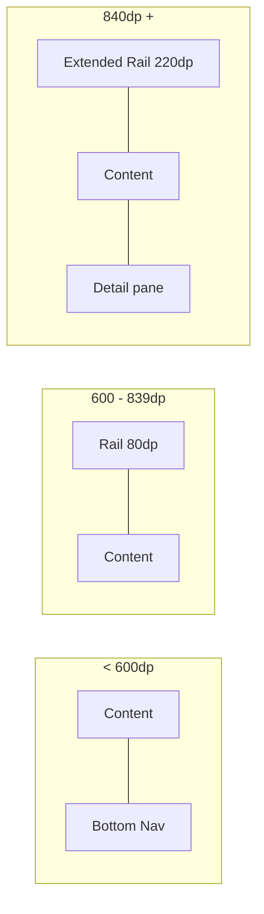
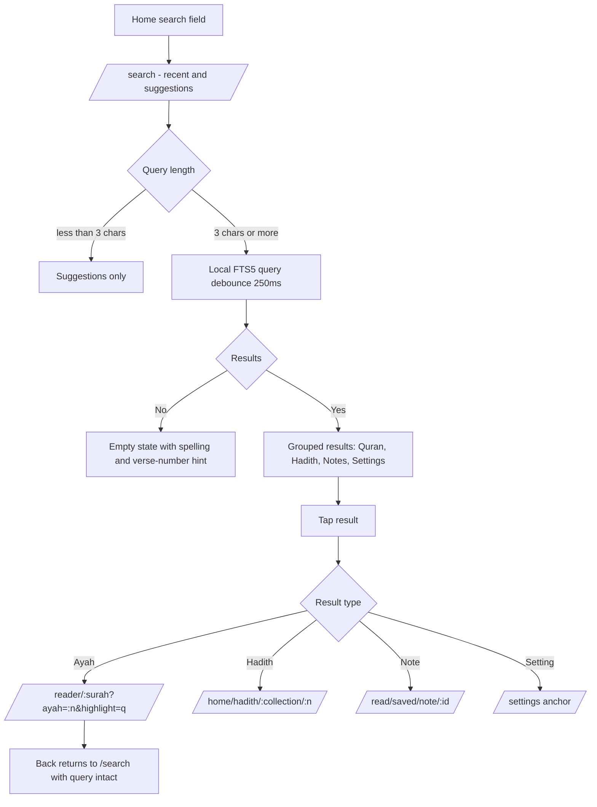
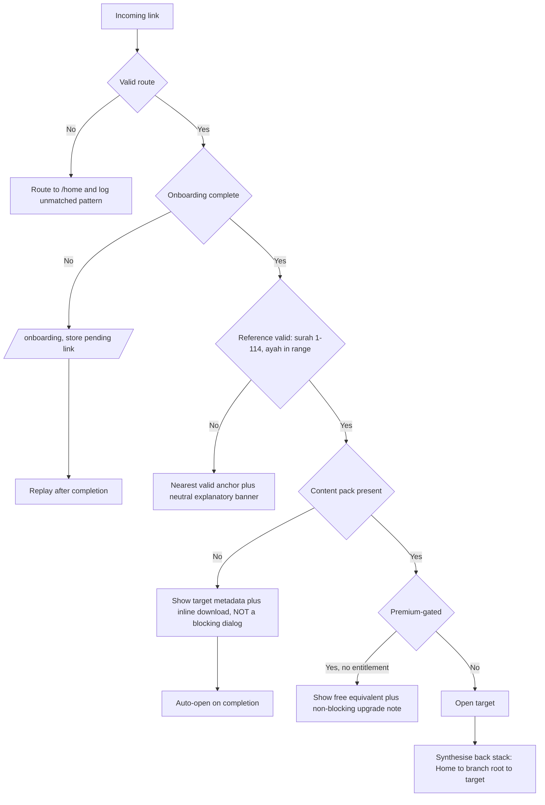
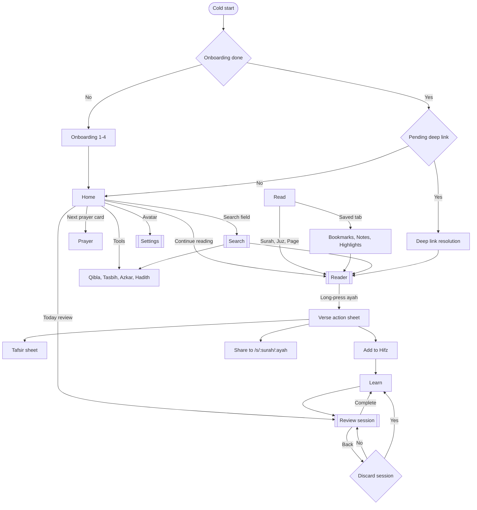

# Quran One - Navigation Architecture

Codename: Mizan. Flutter + GoRouter. Companion to DESIGN_SYSTEM.md, COMPONENT_LIBRARY.md and MOTION_SYSTEM.md.

---

## 0. Three decisions that determine everything downstream

**1. Four bottom destinations. There is no "More" tab.**
A More tab is where features go to die. It converts an information architecture problem into a scrolling list and lets the team defer every hard prioritisation decision indefinitely.

**2. No hamburger drawer on phones. At all.**
The drawer is the other place features go to die, plus it is unreachable one-handed on a 6.7 inch device and its discoverability is measurably poor. On large screens a permanent rail is fine - that is a different component with a different affordance.

**3. The reader is not a screen inside a tab. It is a full-screen route that covers navigation.**
Every competitor keeps the bottom bar visible while reading, which permanently costs about 80dp of reading canvas and puts a commerce-adjacent surface next to scripture. Reading is a mode, not a page.

---

## 1. Information architecture

```mermaid
graph TD
    Root[App Shell] --> Home[Home]
    Root --> Read[Read]
    Root --> Prayer[Prayer]
    Root --> Learn[Learn]

    Home --> H1[Next prayer card]
    Home --> H2[Continue reading]
    Home --> H3[Today review]
    Home --> H4[Tools: Qibla, Tasbih, Azkar, Hadith]
    Home --> H5[Profile and Settings]

    Read --> R1[Surah index]
    Read --> R2[Juz index]
    Read --> R3[Page index]
    Read --> R4[Saved: bookmarks, notes, highlights]

    Prayer --> P1[Today times]
    Prayer --> P2[Monthly calendar]
    Prayer --> P3[Athan settings]
    Prayer --> P4[Prayer log]

    Learn --> L1[Hifz plans]
    Learn --> L2[Today review queue]
    Learn --> L3[Progress and mastery]
    Learn --> L4[Reading plans and Khatmah]

    Read -.full screen.-> Reader[[Mushaf Reader]]
    Learn -.full screen.-> Review[[Review Session]]
    Root -.full screen.-> Search[[Search]]
    Root -.full screen.-> Qibla[[Qibla]]
```



### Why these four

| Destination | Serves | Persona anchor |
| --- | --- | --- |
| Home | Orientation, resumption, secondary tools | Amina - 40 seconds, needs the next thing |
| Read | Entry into the mushaf by any addressing scheme | Sara, Ibrahim |
| Prayer | Times, athan, qibla, logging | Everyone - highest-frequency non-reading surface |
| Learn | Hifz, review, plans, progress | Bilal, Zayd |

Home doubles as the hub for Qibla, Tasbih, Azkar, Hadith and Duas. That is the honest cost of refusing a More tab: those five features have no permanent bottom-bar presence and depend on the Home hub plus search for discovery. The trade is instrumented - if Azkar entry rate is under 8 percent of WAU by M5, the IA is wrong and we revisit before GA.

---

## 2. Bottom navigation

### 2.1 Specification

| Property | Value |
| --- | --- |
| Height | 80dp + safe area |
| Destinations | 4, fixed. Never 3, never 5. |
| Labels | Always visible. Never selected-only, never icon-only. |
| Icon | 24dp, outlined to filled on selection via the FILL axis |
| Indicator | Pill, secondaryContainer, 64 x 32dp |
| Surface | surfaceContainer; AMOLED gets a 1dp #161616 top hairline instead of elevation |
| Motion | Indicator morphs 250ms q.easing.standard. No page slide between branches. |
| RTL | Order mirrors. Home sits at the right edge in Arabic. |

### 2.2 Behavioural rules

| Event | Behaviour |
| --- | --- |
| Tap a different destination | Switch branch, restore that branch prior state |
| Tap the current destination | Pop that branch to its root |
| Tap the current destination at root | Scroll to top |
| Long-press | Nothing. No hidden shortcuts. |
| Android back at branch root (non-Home) | Return to Home, do not exit |
| Android back at Home root | Exit the app |

Icon-only navigation is banned. It tests acceptably with Bilal and catastrophically with Khadija and Musa. An unlabelled outlined book icon is not self-evidently "Read" to a 52-year-old imam using the app in French.

### 2.3 Where the bar is hidden

The bottom bar is absent, not translucent, on: the mushaf reader, review sessions, the Qibla compass, search, onboarding, and any full-screen sheet. These are all rootNavigatorKey routes that sit above the shell.

---

## 3. Navigation rail

### 3.1 Breakpoint adaptation

| Width | Component | Reading canvas |
| --- | --- | --- |
| < 600dp | Bottom navigation | Full width, 16dp gutters |
| 600-839dp | Collapsed rail, 80dp, icon + label | Capped 720dp, centred |
| 840-1199dp | Extended rail, 220dp | Capped 720dp, centred |
| >= 1200dp | Extended rail + optional secondary pane | Two-page spread at >= 1400dp |



### 3.2 Rules

- The rail is at the start edge, so it is on the right in RTL. NavigationRail handles this; the golden suite verifies it because a manually positioned rail is a classic mirroring failure.
- Rail destinations are identical to bottom nav destinations - same four, same order, same state. The mental model must survive a device rotation.
- Labels are always visible in the collapsed rail too: NavigationRailLabelType.all, not .selected.
- The rail never scrolls. If it needs to scroll, there are too many destinations.
- The reader still covers the rail. Reading is full-screen at every breakpoint. On a tablet the rail disappears and reappears, which is correct - a two-page mushaf spread needs every pixel.

---

## 4. Drawer

### 4.1 The position

**No modal drawer on compact. No hamburger icon in the app bar, anywhere.**

Reasons, in order of weight:

1. Discoverability. Content behind a hamburger gets a fraction of the engagement of content in a visible tab bar.
2. Reachability. The hamburger sits in the top-start corner - the least reachable point on a 6.7 inch phone, and worse in RTL where it moves to the top-right for right-handed users.
3. It enables IA cowardice. A drawer means never having to decide what matters.
4. It conflicts with the reader. An edge-swipe drawer gesture and a page-turn swipe cannot coexist. In an RTL reading app the drawer edge is the page-turn edge.

### 4.2 What replaces it

| Content usually in a drawer | Where it lives here |
| --- | --- |
| Profile and account | Home app bar, end-edge avatar, bottom sheet |
| Settings | Home app bar avatar, Settings route |
| Downloads and storage | Settings > Downloads |
| Theme and reading preferences | Reader app bar > display sheet (in context) |
| Help, about, feedback | Settings |
| Premium | Settings, and contextual upsells outside worship paths |

### 4.3 The one exception

At >= 1200dp the extended rail may render as a NavigationDrawer in permanent mode - always visible, never dismissible, no scrim, no hamburger. That is a permanent navigation panel that happens to use the drawer widget, which is a different UX object from a modal drawer.

---

## 5. AppBar

### 5.1 Four variants

| Variant | Height | Where | Content |
| --- | --- | --- | --- |
| QAppBar.small | 64dp | Most screens | Title title.large, up to 2 actions + overflow |
| QAppBar.large | 152dp collapsing to 64dp | Surah detail, Hifz plan | Large title collapsing on scroll |
| QAppBar.reading | 56dp, auto-hiding | Mushaf reader | Surah, juz, page; audio, display, bookmark |
| QAppBar.search | 64dp | Search route | QSearchBar inline, no title |

### 5.2 Rules

- Maximum two visible actions plus overflow. Three icons plus a title fails at 200 percent text scale and in German.
- Back is a chevron, never an X. X is reserved for full-screen modals (search, onboarding, review sessions).
- The reading app bar auto-hides on scroll down and returns on scroll up, 250ms fade. It is absent on first entry to a page - the user opened the mushaf to read, not to look at chrome.
- No app bar carries a search icon on Home. Search is a first-class element of the Home surface itself.
- Titles never truncate mid-Arabic-word. Long surah names wrap to the large variant rather than ellipsising.
- Overflow menus contain at most 5 items.

---

## 6. Top tabs

### 6.1 Where they are allowed

Exactly two places:

| Surface | Tabs |
| --- | --- |
| Read | Surah, Juz, Page, Saved |
| Learn | Plans, Review, Progress |

### 6.2 Rules

- Never nested. Top tabs inside a screen already reached via top tabs is a navigation model no user can hold in their head. Enforced by a lint on TabBar nesting depth.
- Tabs are scrollable: false. Four tabs maximum, all visible, equal width.
- Swipe between tabs is enabled in Read and Learn, and disabled in the reader, where horizontal swipe means page turn.
- Tab state persists per branch. Returning to Read reopens the tab you left.
- In RTL, tab order mirrors and swipe direction inverts. Verified in goldens at 3 themes x 2 directions.

---

## 7. Nested navigation

### 7.1 Structure

```mermaid
graph TD
    RootNav[Root Navigator rootNavigatorKey] --> Shell[StatefulShellRoute.indexedStack]
    RootNav --> FS1[[/reader/:surah/:ayah]]
    RootNav --> FS2[[/review/session]]
    RootNav --> FS3[[/search]]
    RootNav --> FS4[[/qibla]]
    RootNav --> FS5[[/onboarding]]
    RootNav --> FS6[[/settings]]

    Shell --> B0[Branch 0: Home]
    Shell --> B1[Branch 1: Read]
    Shell --> B2[Branch 2: Prayer]
    Shell --> B3[Branch 3: Learn]

    B0 --> B0a[/home]
    B0 --> B0b[/home/azkar]
    B0 --> B0c[/home/hadith]
    B0 --> B0d[/home/tasbih]

    B1 --> B1a[/read]
    B1 --> B1b[/read/surah/:id]
    B1 --> B1c[/read/juz/:id]
    B1 --> B1d[/read/saved]

    B2 --> B2a[/prayer]
    B2 --> B2b[/prayer/calendar]
    B2 --> B2c[/prayer/athan]

    B3 --> B3a[/learn]
    B3 --> B3b[/learn/plan/:id]
    B3 --> B3c[/learn/progress]
```

### 7.2 Why indexedStack and not navigator-per-tab-with-disposal

StatefulShellRoute.indexedStack keeps all four branches alive simultaneously. Memory cost is real - roughly 30-50MB with four live trees on a mid-range device, against our 350MB budget on a 3GB device.

We pay it because the alternative is worse for this product specifically: Amina session is 40 seconds long. Losing scroll position in the surah index because she checked the prayer time is the difference between a tool and a chore. Branch state preservation is the primary interaction pattern, not a nicety.

The mitigation is that the reader is deliberately outside the shell, so the single heaviest widget tree in the app is never one of the four retained branches.

### 7.3 The reader is a root route

```
/reader/:surahId?ayah=255&mode=translation
```

Full-screen, above the shell, with its own internal navigation for the verse sheet, tafsir sheet, and audio queue. Closing it returns to whichever branch launched it, with that branch state intact.

---

## 8. Search navigation

### 8.1 Search is a route, not an overlay

```
/search?q=mercy&scope=quran&translation=sahih
```

Four concrete reasons: the query survives process death and restoration; Android back behaves correctly; a search result is shareable as a link; analytics can attribute entries without special-casing a modal.

### 8.2 Two scopes

| Scope | Entry | Searches |
| --- | --- | --- |
| Global | Home search field | Quran, translations, hadith, azkar, duas, your notes, settings |
| Scoped | Reader app bar | Current surah only, with in-page match navigation |

### 8.3 Flow



Back from a search result returns to the results, not to Home. Search is exploratory; users check three or four verses before settling.

### 8.4 Rules

- Search never blocks on the network. FTS5 local index, sub-300ms for a 3-character query.
- Field direction follows typed content, not locale. Typing Arabic in an English UI flips the field to RTL live.
- Diacritic-insensitive. Unvocalised input matches vocalised text.
- Recent searches are local-only and clearable in one tap from the search screen itself.

---

## 9. Deep linking

### 9.1 URL scheme

Canonical HTTPS with a custom-scheme fallback. Both resolve through the same parser.

```
https://quranone.app/...     (App Links / Universal Links)
quranone://...               (custom scheme fallback)
```

| Route | Meaning |
| --- | --- |
| /s/2 | Surah 2, from the top |
| /s/2/255 | Surah 2, ayah 255 - the canonical share link |
| /s/2/255-260 | Verse range |
| /p/255 | Mushaf page 255 |
| /j/5 | Juz 5 |
| /prayer and /prayer/calendar | Prayer surfaces |
| /qibla | Qibla compass |
| /azkar/morning and /azkar/evening | Azkar sets |
| /hadith/:collection/:number | Hadith reference |
| /learn/plan/:id | Hifz plan |
| /search?q=... | Prefilled search |
| /settings/:section | Deep settings anchor |

Query parameters: ?t=sahih translation, ?r=alafasy reciter, ?mode=arabic|translation|both, ?highlight=...

### 9.2 Resolution



### 9.3 Rules

A deep link never lands the user on a screen with no back stack. GoRouter initialLocation handling synthesises a plausible parent chain, so back from a shared ayah goes to the surah, then to Read, then Home - not straight out of the app.

A missing content pack is not an error. The link resolves, the target metadata renders (surah name, ayah number, translation preview from the bundled minimal set), and download offers inline. Blocking a shared verse behind a 174MB download dialog is how you lose the person who was sent it.

A premium-gated deep link never shows a paywall as the first screen. It shows the free equivalent with a quiet note. A paywall as a stranger first impression, arriving from a shared verse, violates P4 and is bad business.

Prayer, Qibla and mushaf deep links work fully offline. They never call the server, so they never fail on a link opened in aeroplane mode.

---

## 10. GoRouter architecture

### 10.1 Router

```dart
final routerProvider = Provider<GoRouter>((ref) {
  final onboardingComplete = ref.watch(onboardingCompleteProvider);
  final pendingLink = ref.watch(pendingDeepLinkProvider);

  return GoRouter(
    navigatorKey: rootNavigatorKey,
    initialLocation: QRoutes.home,
    debugLogDiagnostics: kDebugMode,
    observers: [QAnalyticsObserver(ref), QSentryObserver()],
    restorationScopeId: 'q_router',

    redirect: (context, state) {
      final loc = state.matchedLocation;

      // Onboarding is the only hard gate. Auth is never a gate:
      // the entire worship surface works anonymously (P3).
      if (!onboardingComplete && !loc.startsWith(QRoutes.onboarding)) {
        ref.read(pendingDeepLinkProvider.notifier).store(state.uri);
        return QRoutes.onboarding;
      }
      if (onboardingComplete && loc.startsWith(QRoutes.onboarding)) {
        return pendingLink?.toString() ?? QRoutes.home;
      }
      return null;
    },

    errorBuilder: (context, state) => QErrorRoute(uri: state.uri),

    routes: [
      StatefulShellRoute.indexedStack(
        builder: (context, state, shell) => QAppShell(shell: shell),
        branches: [_homeBranch, _readBranch, _prayerBranch, _learnBranch],
      ),

      // Full-screen routes above the shell.
      GoRoute(
        path: '/reader/:surahId',
        name: QRoutes.reader,
        parentNavigatorKey: rootNavigatorKey,
        pageBuilder: (context, state) => CustomTransitionPage(
          key: state.pageKey,
          child: ReaderScreen(
            surahId: int.parse(state.pathParameters['surahId']!),
            ayah: int.tryParse(state.uri.queryParameters['ayah'] ?? ''),
            mode: ReaderMode.parse(state.uri.queryParameters['mode']),
          ),
          // Never a slide; lateral direction is ambiguous in RTL.
          transitionsBuilder: qFadeThrough,
          transitionDuration: QMotion.page,
        ),
      ),
      GoRoute(path: '/search', name: QRoutes.search, parentNavigatorKey: rootNavigatorKey, builder: _search),
      GoRoute(path: '/qibla', name: QRoutes.qibla, parentNavigatorKey: rootNavigatorKey, builder: _qibla),
      GoRoute(path: '/review', name: QRoutes.review, parentNavigatorKey: rootNavigatorKey, builder: _review),
      GoRoute(path: '/settings', name: QRoutes.settings, parentNavigatorKey: rootNavigatorKey, routes: _settings),

      // Canonical share aliases redirect into the real routes.
      GoRoute(path: '/s/:surahId/:ayah', redirect: _shareRedirect),
      GoRoute(path: '/p/:page', redirect: _pageRedirect),
      GoRoute(path: '/j/:juz', redirect: _juzRedirect),
    ],
  );
});
```

### 10.2 Branch definition

```dart
final _readBranch = StatefulShellBranch(
  navigatorKey: readNavigatorKey,
  initialLocation: QRoutes.read,
  routes: [
    GoRoute(
      path: '/read',
      name: QRoutes.read,
      builder: (context, state) => const ReadHubScreen(),
      routes: [
        GoRoute(path: 'surah/:id', name: QRoutes.surahDetail, builder: _surah),
        GoRoute(path: 'juz/:id', name: QRoutes.juzDetail, builder: _juz),
        GoRoute(path: 'saved', name: QRoutes.saved, builder: _saved),
      ],
    ),
  ],
);
```

### 10.3 The shell

```dart
class QAppShell extends ConsumerWidget {
  const QAppShell({super.key, required this.shell});
  final StatefulNavigationShell shell;

  void _onTap(int index) {
    // Re-tapping the active branch pops it to root.
    shell.goBranch(index, initialLocation: index == shell.currentIndex);
  }

  @override
  Widget build(BuildContext context, WidgetRef ref) {
    final width = MediaQuery.sizeOf(context).width;

    if (width >= 600) {
      return Scaffold(
        body: Row(children: [
          QNavigationRail(
            extended: width >= 840,
            selectedIndex: shell.currentIndex,
            onDestinationSelected: _onTap,
          ),
          Expanded(child: shell),
        ]),
      );
    }

    return Scaffold(
      body: shell,
      bottomNavigationBar: QBottomNav(
        selectedIndex: shell.currentIndex,
        onDestinationSelected: _onTap,
      ),
    );
  }
}
```

### 10.4 Typed routes

go_router_builder generates type-safe navigation. String paths appear only in the route table; a lint bans context.go with a string literal in feature code.

```dart
@TypedGoRoute<ReaderRoute>(path: '/reader/:surahId')
class ReaderRoute extends GoRouteData {
  const ReaderRoute({required this.surahId, this.ayah, this.mode});
  final int surahId;
  final int? ayah;
  final ReaderMode? mode;
}

// Call site
ReaderRoute(surahId: 2, ayah: 255).push(context);
```

### 10.5 Back stack semantics

| Context | Android back / predictive back |
| --- | --- |
| Nested route in a branch | Pop within the branch |
| Branch root, not Home | Switch to Home |
| Home root | Exit |
| Reader | Return to launching branch, restore state |
| Reader with an open sheet | Close the sheet only |
| Active review session | Confirm before discarding - the only navigation confirmation in the app |
| Search result | Return to results with the query intact |

Predictive back is enabled (android:enableOnBackInvokedCallback="true") and every full-screen route declares a PopScope with an accurate canPop, so the system preview never shows the wrong destination.

---

## 11. Complete navigation flow



---

## 12. Route inventory

| Route | Navigator | Chrome | Offline |
| --- | --- | --- | --- |
| /home | Branch 0 | Bottom nav + small bar | Yes |
| /home/azkar, /hadith, /tasbih | Branch 0 | Bottom nav + small bar | Yes |
| /read | Branch 1 | Bottom nav + tabs | Yes |
| /read/surah/:id, /juz/:id, /saved | Branch 1 | Bottom nav + large bar | Yes |
| /prayer, /calendar, /athan | Branch 2 | Bottom nav + small bar | Yes |
| /learn, /plan/:id, /progress | Branch 3 | Bottom nav + tabs | Yes |
| /reader/:surahId | Root | Auto-hiding bar only | Yes |
| /review | Root | Minimal, X to exit | Yes |
| /search | Root | Search bar | Yes |
| /qibla | Root | Minimal | Yes |
| /settings/** | Root | Small bar | Yes |
| /onboarding | Root | None | Yes |

Every route in this product works offline. There is no route whose first paint requires the network - that is P1 expressed as a routing constraint, asserted by a test that fails if any route initial build touches a network provider.

---

## 13. Instrumentation

| Metric | Purpose |
| --- | --- |
| Branch switch frequency, by pair | Validates the four-destination choice |
| Home hub tool entry rate | The kill-switch metric for the no-More-tab decision |
| Reader entry path (Home, Read, Search, Deep link) | Confirms Home is a genuine resumption surface |
| Deep link resolution outcome | Catches broken share links early |
| Search-then-reader conversion | Validates search as a navigation surface |
| Back-to-exit rate at Home | Detects users trapped in the wrong branch |

---

## 14. Four positions worth arguing about

**1. The no-More-tab decision is the riskiest thing here.** Azkar, Hadith, Duas, Tasbih and Qibla live in a Home hub with no permanent presence. If those features underperform, the diagnosis will be ambiguous - bad IA, or features nobody wanted? Hence the 8-percent-of-WAU threshold instrumented from M1.

**2. Keeping four branches alive costs 30-50MB.** The alternative loses scroll position and form state on every tab switch, which for a 40-second session is the difference between useful and irritating. The reader living outside the shell is what makes the budget work.

**3. Hiding the bottom bar in the reader will be challenged as inconsistent.** It is inconsistent, deliberately. Reading is a mode, and 80dp on a 6.1 inch phone is roughly two lines of vocalised Arabic.

**4. Refusing a paywall on premium deep links leaves money on the table.** A stranger opening a shared ayah and hitting a subscription wall is the worst possible first impression, it is precisely what users cite when they abandon Muslim Pro, and it violates P4 as written in the blueprint.
