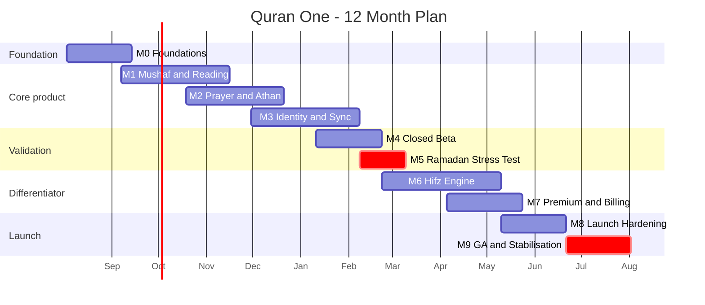

# Quran One - 12-Month Development Roadmap

**Plan window:** August 2026 - July 2027
**Team:** 9 engineers (3 Flutter, 2 Django, 1 platform/DevOps, 1 data/content, 1 QA automation, 1 mobile-platform specialist) plus PM, designer, and a part-time scholarly reviewer.
**Unit:** dev-weeks (1 engineer x 1 week).

---

## 0. The capacity reality, stated up front

| Item | Dev-weeks |
| --- | --- |
| Nominal capacity, 9 engineers x 52 weeks | 468 |
| Less holidays, leave, Eid, on-call, interviews, ramp | -94 (20%) |
| **Realistic delivery capacity** | **374** |
| Feature matrix: Must Have | 257 |
| Feature matrix: Should Have | 199 |
| Feature matrix: Could Have + Future | 257 |
| **Total scoped in FEATURE_MATRIX.md** | **713** |

**Must Have alone consumes 69% of realistic capacity.** That leaves roughly 117 dev-weeks for Should Have items, which is 59% of them. The remaining 82 Should-Have weeks, and all 257 Could/Future weeks, do not fit in 12 months and are not scheduled here.

This roadmap therefore delivers **Must Have in full, plus a named subset of Should Have**, and explicitly defers the rest. Any new scope added mid-plan displaces something on this list. There is no slack to absorb it.

---

## 1. The Ramadan question, and my recommendation

Ramadan 1449 begins approximately **8 February 2027**, which lands in month 7 of this plan. Ramadan is the single largest acquisition window in this category - competitor installs run 3-5x baseline.

Three options were considered:

| Option | Assessment |
| --- | --- |
| **A. Rush GA for February 2027** | Requires cutting the Hifz engine, sync hardening, and the notification reliability work. Ships an app that is worse than Muslim Pro at the exact moment scrutiny is highest. **Rejected.** |
| **B. Skip Ramadan 2027 entirely, quiet build** | Wastes a free real-world load test with genuinely motivated users. **Rejected.** |
| **C. Closed beta through Ramadan 2027, GA in May 2027** | Uses Ramadan as a stress test with 3,000 invited users and zero marketing spend. GA lands 9 months before Ramadan 1450 (approx. 29 January 2028), giving three quarters of stability, App Store ranking, and word of mouth ahead of the window that actually matters. **Recommended and adopted.** |

The hard consequence to accept: **there will be no public launch in the first Ramadan of this project.** That will feel like a missed quarter to anyone reading the calendar. It is the right call, because the first Ramadan a user spends with this app determines whether they are still here for the second, and we will not get a second chance at that first impression.

---

## 2. Milestone map

| ID | Milestone | Weeks | Calendar | Budget |
| --- | --- | --- | --- | --- |
| M0 | Foundations | 1-6 | Aug - mid Sep 2026 | 48 dw |
| M1 | Mushaf and Reading Core | 6-16 | Sep - mid Nov 2026 | 78 dw |
| M2 | Prayer, Qibla, Athan | 12-21 | Oct - Dec 2026 | 54 dw |
| M3 | Identity, Sync, Offline | 18-28 | Dec 2026 - Feb 2027 | 70 dw |
| M4 | Closed Beta | 24-30 | Jan - Feb 2027 | 30 dw |
| M5 | Ramadan Stress Test | 28-32 | Feb - Mar 2027 | 18 dw |
| M6 | Hifz Engine | 30-41 | Feb - May 2027 | 62 dw |
| M7 | Premium and Billing | 36-43 | Apr - May 2027 | 34 dw |
| M8 | Launch Hardening | 41-47 | May - Jun 2027 | 30 dw |
| M9 | GA and Stabilisation | 46-52 | Jun - Jul 2027 | 20 dw |

Milestones overlap. The gantt shows calendar span; the budget column shows engineer effort.

---

## M0 - Foundations (Weeks 1-6, Aug - mid Sep 2026)

### Objectives

Make it impossible to build the wrong thing cheaply. Every architectural boundary from `TECHNICAL_ARCHITECTURE.md` becomes compiler-enforced or CI-enforced before feature work starts.

### Tasks

| Task | Owner | dw |
| --- | --- | --- |
| Monorepo scaffold, all 9 packages, pubspec dependency rules | Flutter x2 | 6 |
| Django project skeleton, 12 app modules, DRF base, `/api/v1/` versioning | Django x2 | 6 |
| Docker Compose local stack: Postgres 16, Redis 7, Celery, MinIO | Platform | 4 |
| Terraform: staging cluster, RDS, ElastiCache, GCS bucket, CDN | Platform | 6 |
| GitHub Actions: lint, analyse, unit, build matrix, artefact signing | Platform + QA | 5 |
| **Layering enforcement test** - `domain` cannot import Flutter/Riverpod/Dio/Drift | Flutter | 2 |
| Riverpod DI conventions, `clockProvider`, `geolocatorProvider` abstractions | Flutter | 3 |
| Postgres schema migration 0001 - content and identity schemas | Django + Data | 6 |
| Content ingestion pipeline, checksum verification, pack signing | Data | 6 |
| Firebase project setup, Auth, Crashlytics, Remote Config | Mobile-platform | 3 |
| Observability: structured logs, OpenTelemetry traces, Sentry | Platform | 3 |
| Design system tokens, typography scale, RTL primitives, 200% text scaling | Flutter | 4 |

**Budget: 48 dw** (allowing 6 dw ramp-up).

### Dependencies

None upstream. Blocks everything.

### Deliverables

- Green CI on an empty app that builds signed artefacts for iOS, Android, and web.
- Staging environment reachable, `/api/v1/health` returning 200.
- Quran text, 3 translations, and 1 reciter ingested with verified checksums.
- ADR log started; the seven architectural principles committed as `PRINCIPLES.md`.

### Risks

| Risk | Severity | Mitigation |
| --- | --- | --- |
| Content licensing not closed for launch translations | **High** | Start legal negotiation week 1, not week 20. Launch with public-domain fallbacks identified per language. |
| Monorepo tooling friction slows every later task | Medium | Timebox to 6 dw; if package-per-layer proves painful, fall back to folder layering plus a lint rule. Decide by week 4. |
| Team ramp on Riverpod code generation | Medium | Two-day internal workshop in week 1, paired work through week 3. |

### Testing

CI itself is the deliverable. Layering test, dependency-cycle test, and content checksum test must all fail loudly on a deliberate violation - **verified by committing a violation and confirming red, then reverting.**

### Deployment

Staging only, continuous deploy on merge to `main`. No production environment exists yet.

---

## M1 - Mushaf and Reading Core (Weeks 6-16, Sep - mid Nov 2026)

### Objectives

Render all 604 pages of the Madani mushaf at 60fps with verifiable page-break fidelity. This is the feature the entire product is judged on, and it is the highest-complexity item in the matrix (F-021, 14 weeks).

### Tasks

| Task | Owner | dw |
| --- | --- | --- |
| Glyph-based page renderer, line composition from `page_line` data | Flutter x2 | 16 |
| **Golden-file harness, all 604 pages x 4 device classes** | QA + Flutter | 8 |
| Verse-list reading mode, translation and transliteration display | Flutter | 6 |
| Drift schema, `quran_content.db` and `user_data.db` separation | Flutter | 5 |
| SQLite FTS5 search, diacritic-stripped shadow column, <300ms target | Flutter + Data | 7 |
| Content pack download, resume, signature verification, storage UI | Flutter | 8 |
| Audio playback, just_audio, audio_service, lock-screen controls | Mobile-platform | 8 |
| Verse-synchronised highlighting from `recitation_segment` timings | Mobile-platform | 5 |
| Content API endpoints, CDN caching, `layout_hash` contract | Django | 6 |
| Bookmarks, highlights, notes - local-only at this stage | Flutter | 6 |
| Accessibility pass: screen reader, 200% text, contrast | Flutter | 3 |

**Budget: 78 dw.**

### Dependencies

M0 complete. Mushaf layout data ingested and verified. **Blocks M6** - Hifz cannot be built on an unstable renderer.

### Deliverables

- Reading a full juz offline, with audio, on a 4GB Android device at 60fps.
- 604/604 golden files passing on all 4 device classes.
- Search returning results in under 300ms for a 3-character Arabic query.

### Risks

| Risk | Severity | Mitigation |
| --- | --- | --- |
| **AR-1 mushaf page-break drift** | **Critical** | The golden-file harness is scheduled *before* renderer completion, not after. No renderer change merges without a green golden run. Any intentional diff requires scholarly sign-off recorded in the PR. |
| Renderer misses 60fps on low-end Android | High | Performance budget enforced in CI from week 8, on a physical Pixel 4a and a Galaxy A14 in the device farm. Fail the build above 1% dropped frames. |
| Audio licensing per reciter incomplete | Medium | Launch reciter list locked by week 10; ship with 3 if 5 are not cleared. |

### Testing

- Golden-file: 2,416 image comparisons per run (604 x 4).
- Property tests on search normalisation across all 6,236 verses.
- Manual review of 30 sampled pages by the scholarly reviewer before M1 exit.
- Performance regression suite on physical devices, nightly.

### Deployment

Internal TestFlight and Play internal track from week 10. Team dogfooding daily from week 12.

---

## M2 - Prayer, Qibla, Athan (Weeks 12-21, Oct - Dec 2026)

### Objectives

Deliver prayer times and Athan that work with zero connectivity and survive Android OEM battery management. Target: **99.5% of Athan notifications delivered within 30 seconds.**

### Tasks

| Task | Owner | dw |
| --- | --- | --- |
| Pure Dart astronomical engine, 13 methods, high-latitude rules | Flutter | 8 |
| **300-case prayer calculation test suite** across latitudes, solstices, DST | QA | 4 |
| Local Athan scheduler, exact alarms, BGTaskScheduler, 7-day horizon | Mobile-platform | 10 |
| **OEM hardening matrix** - MIUI, EMUI, ColorOS, One UI, Doze | Mobile-platform | 6 |
| Athan self-diagnostic, 6 OS probes plus real test notification | Mobile-platform | 4 |
| Qibla compass, sensor fusion, calibration UI, declination model | Flutter | 5 |
| Prayer config UI, offsets, method selection, city search | Flutter | 5 |
| Prayer log with `exempt` and `paused` states | Flutter + Django | 4 |
| Reference data APIs: methods, cities, mosques, iqamah | Django | 4 |
| Delivery telemetry pipeline and OEM reliability materialised view | Django + Platform | 4 |

**Budget: 54 dw.**

### Dependencies

M0. Independent of M1 - runs in parallel, different engineers.

### Deliverables

- Prayer times correct to within 1 minute of reference tables for 40 test cities.
- Athan firing reliably on a 10-device OEM rig, measured over 14 consecutive days.
- Self-diagnostic returning an accurate `expected_reliability_pct` per OEM.

### Risks

| Risk | Severity | Mitigation |
| --- | --- | --- |
| **AR-2 Android OEM notification suppression** | **Critical** | Physical device rig of 10 handsets running continuously from week 14. This risk cannot be tested in an emulator and cannot be discovered post-launch without reputational damage. |
| High-latitude prayer times contested by users | Medium | Ship all three standard rules, let the user choose, document the basis in-app. Do not pick one silently. |
| iOS 64-notification limit truncates the schedule | Medium | Rolling 7-day window with background refresh; verified by a 14-day soak test with the app never opened. |

### Testing

- 300 unit cases, no device, no network, running in under 10 seconds.
- 14-day soak on the OEM rig with the app backgrounded and never opened.
- Airplane-mode test: 7 days offline, all 35 notifications must fire.

### Deployment

Staging plus internal tracks. Delivery telemetry live to the OEM dashboard from week 18.

---

## M3 - Identity, Sync, Offline (Weeks 18-28, Dec 2026 - Feb 2027)

### Objectives

Multi-device sync that never loses data, and anonymous-first onboarding that never loses data on upgrade. This is F-006, 12 weeks, and **it must be stable before M6 starts.**

### Tasks

| Task | Owner | dw |
| --- | --- | --- |
| Firebase Auth integration, anonymous-first, provider linking | Django + Flutter | 6 |
| `POST /v1/auth/link` transactional re-parenting | Django | 4 |
| Outbox pattern, offline write queue, retry with backoff | Flutter | 8 |
| Delta sync engine, revision cursors, `change_log` | Django | 10 |
| Conflict resolution: LWW scalars, note conflict copies, CRDT counters | Flutter + Django | 8 |
| **Sync property tests** on concurrent mutation scenarios | QA | 6 |
| Profiles, family plan, child mode, parent PIN | Flutter + Django | 6 |
| Note encryption, key management, rotation support | Django + Flutter | 5 |
| Data export and deletion pipelines (GDPR) | Django | 5 |
| RLS policies across engagement, learning, ai schemas | Django | 4 |
| Biometric app lock | Mobile-platform | 2 |

**Budget: 70 dw.**

### Dependencies

M0, plus M1 local persistence. **Hard blocker for M6.**

### Deliverables

- Two devices, both offline for 72 hours, both editing, converging with zero data loss.
- Anonymous user with 200 bookmarks upgrading to a permanent account, losing nothing.
- Verified export containing every row a user owns.

### Risks

| Risk | Severity | Mitigation |
| --- | --- | --- |
| **AR-3 sync conflict corrupting Hifz history** | **Critical** | Append-only attempt log with derived mastery removes the conflict surface entirely. Property tests assert no attempt row is ever lost across 10,000 randomised concurrent-mutation scenarios. |
| Sync engine slips and delays M6 | **High** | This is the single most likely schedule failure in the plan. M6 is deliberately not started until M3 exits, and the 2-week gap between them is buffer, not slack. |
| Encryption key loss locks users out of their own notes | High | Key escrow tied to the account with an explicit recovery flow; tested by a full device-loss simulation. |

### Testing

- 10,000-scenario property test suite on concurrent mutations, run nightly.
- Chaos test: kill the app mid-push, mid-pull, mid-migration.
- Restore-from-export test: wipe, reinstall, restore, byte-compare.

### Deployment

Staging with production-shaped data volumes. Sync API load-tested to 10x expected beta traffic.

---

## M4 - Closed Beta (Weeks 24-30, Jan - Feb 2027)

### Objectives

Put a real, incomplete product in front of 500 real users and find out what we got wrong about the personas, before the Ramadan cohort arrives.

### Tasks

| Task | Owner | dw |
| --- | --- | --- |
| Beta recruitment, 500 users across the 8 personas | PM + QA | 4 |
| In-app feedback capture with trace IDs | Flutter | 3 |
| Crash triage rotation, SLA under 24 hours | All | 6 |
| Onboarding flow, progressive disclosure by `learning_level` | Flutter | 5 |
| **40 persona interviews** (5 per persona) - the Phase 1 exit gate | PM + designer | 4 |
| Localisation: 12 UI languages, RTL audit | Flutter | 6 |
| Bug burn-down | All | 2 |

**Budget: 30 dw.**

### Dependencies

M1, M2, M3 feature-complete. Not necessarily polished.

### Deliverables

- 500 active beta users, at least 40 from each primary persona.
- Interview findings document; persona confidence upgraded, particularly for Zayd (child), flagged as lowest-confidence in `UX_PERSONAS.md`.
- Crash-free session rate above 99.5%.

### Risks

| Risk | Severity | Mitigation |
| --- | --- | --- |
| Beta feedback demands a fundamental redesign | Medium | Better now than post-launch. 2 weeks of M6 buffer is reserved for beta-driven rework. |
| Recruitment skews to technical early adopters | Medium | Recruit through mosques and Islamic schools, not only social media. Explicitly source Khadija and Musa personas offline. |

### Testing

Real usage is the test. Instrumented against the success metrics in `PRD.md`, with analytics strictly opt-in.

### Deployment

TestFlight and Play closed track. **Production environment goes live in week 25** - real infrastructure, real monitoring, real on-call rotation begins.

---

## M5 - Ramadan Stress Test (Weeks 28-32, Feb - Mar 2027)

### Objectives

Expand to 3,000 beta users through Ramadan 1449. **No marketing, no App Store presence, no press.** The goal is load data and behavioural truth, not growth.

### Tasks

| Task | Owner | dw |
| --- | --- | --- |
| Ramadan features: fasting log, khatmah plan, taraweeh tracking | Flutter + Django | 8 |
| Load testing to 5x baseline, autoscaling validation | Platform | 4 |
| 24/7 on-call through the 30 days | All, rotating | 4 |
| Daily metrics review and rapid-response fixes | All | 2 |

**Budget: 18 dw.**

### Dependencies

M4. Calendar-locked - this window cannot move.

### Deliverables

- Verified behaviour under genuine Ramadan usage patterns: the 3-5x traffic multiplier, the pre-Fajr and post-Maghrib spikes, the Laylatul Qadr surge.
- Athan reliability measured against the 99.5% target under real conditions across real OEMs.
- A prioritised defect list for M8.

### Risks

| Risk | Severity | Mitigation |
| --- | --- | --- |
| A serious defect harms 3,000 users during their most important month | **High** | Staged rollout inside the beta; Remote Config kill switches on every non-worship feature. Worship paths have no kill switch because they have no server dependency. |
| Team burnout from a 30-day on-call stretch | **High** | Two-week recovery period built into M6's start. This is scheduled, not hoped for. Eid week is protected leave for the whole team. |

### Testing

Production observation with elevated sampling. Post-Ramadan retrospective is a formal M6 entry gate.

### Deployment

Production, closed cohort. Full incident process active.

---

## M6 - Hifz Engine (Weeks 30-41, Feb - May 2027)

### Objectives

Build the differentiator. F-100, 14 weeks, the highest-value item in the matrix and the reason a hafiz would choose this app over any competitor.

### Tasks

| Task | Owner | dw |
| --- | --- | --- |
| Append-only attempt log, client and server, idempotent batch push | Flutter + Django | 8 |
| Pure scheduler function, spaced repetition, sabaq/sabqi/manzil stages | Django + Flutter | 12 |
| Derived mastery recomputation, `POST /v1/hifz/recompute` as Celery job | Django | 6 |
| Review session UI: recall, recognition, audio, written prompts | Flutter | 10 |
| Hifz plans, load balancing, missed-day redistribution | Flutter | 6 |
| Progress visualisation, retention curve, weak-verse surfacing | Flutter | 6 |
| Achievements, append-only awards, no punitive states | Flutter + Django | 5 |
| Streak integrity service (F-121) | Django | 4 |
| Scholarly review of the memorisation methodology | Reviewer + PM | 3 |
| Beta-driven rework buffer from M4/M5 | All | 2 |

**Budget: 62 dw.**

### Dependencies

**M3 must be complete and stable.** This is the one dependency in the plan that must not be compromised. The Hifz engine consumes sync conflict semantics; starting it before those semantics are settled embeds assumptions that later break, and there is no recovery path from a corrupted memorisation history.

### Deliverables

- A hafiz can memorise, revise, and track a full juz across two devices with no data loss.
- Scheduler validated against 6 months of simulated attempt histories.
- Recompute completing for a 2-million-attempt profile in under 5 minutes.

### Risks

| Risk | Severity | Mitigation |
| --- | --- | --- |
| Scheduling algorithm is subtly wrong and users lose trust | **High** | Validate against published spaced-repetition research and against the hifz practice of three qualified huffaz. Ship `derived_model_version` so the model can be corrected retroactively without data loss. |
| Scope pressure to start M6 early | **High** | Explicitly forbidden by the dependency above. Escalate to me, not around me. |
| Recompute is too slow for large profiles | Medium | Benchmarked at week 34 against a synthetic 5-million-attempt profile. |

### Testing

- Property test: replaying any attempt log twice yields identical derived state.
- Simulation harness: 1,000 synthetic learners over 180 simulated days.
- Immutability test: attempt UPDATE and DELETE must fail at the database level.

### Deployment

Progressive rollout to the beta cohort at 10%, 50%, 100% across three weeks.

---

## M7 - Premium and Billing (Weeks 36-43, Apr - May 2027)

### Objectives

A revenue model that funds the product without compromising it. **No advertising, ever, and no worship feature behind a paywall.**

### Tasks

| Task | Owner | dw |
| --- | --- | --- |
| StoreKit 2, Play Billing 6, Stripe for web | Django + Mobile-platform | 10 |
| Receipt verification, immutable ledger, webhook idempotency | Django | 6 |
| Entitlement service, 30-day offline grace | Django + Flutter | 4 |
| Regional PPP pricing, 3 tiers | Django | 3 |
| **Premium invariant test suite (F-075)** | QA | 3 |
| Waqf sponsorship: request, sponsor, anonymous matching | Django + Flutter | 6 |
| Paywall surfaces - never under `/quran`, `/prayer`, `/qibla`, `/azkar` | Flutter | 2 |

**Budget: 34 dw.**

### Dependencies

M3 (identity). Independent of M6.

### Deliverables

- Purchase, restore, refund, and cancellation working on all three stores.
- Ad SDK transitive-dependency scan green.
- Free-tier reachability test passing: every worship feature usable with entitlement stubbed to `none`.

### Risks

| Risk | Severity | Mitigation |
| --- | --- | --- |
| **AR-8 ad SDK arriving via a transitive dependency** | **High** | CI dependency scan against a blocklist, failing the build on any match. Runs on every PR, not nightly. |
| Revenue pressure erodes the free tier post-launch | **High** | The invariant suite is the structural defence. It walks every OpenAPI route with entitlement stubbed to none and fails the build on any payment rejection under a worship path. This is the highest-leverage 3 dev-weeks in the plan. |
| Store review rejects the waqf model | Medium | Pre-submission review with Apple and Google in week 38. |

### Testing

Sandbox purchase flows on all three stores, including edge cases: refund, family sharing, subscription upgrade mid-period, grace period expiry offline.

### Deployment

Billing enabled for the beta cohort in week 42 with real money at a nominal price.

---

## M8 - Launch Hardening (Weeks 41-47, May - Jun 2027)

### Objectives

Close the 12 release gates. No new features.

### Tasks

| Task | Owner | dw |
| --- | --- | --- |
| Defect burn-down from M5 and M6 | All | 8 |
| Security audit, external penetration test | Platform + external | 5 |
| Performance: cold start under 2s, memory ceilings on 3GB devices | Flutter | 5 |
| Copy doctrine lint across 12 locales | QA + PM | 3 |
| Store listings, screenshots, privacy nutrition labels | PM + designer | 3 |
| Support runbooks, on-call escalation, status page | Platform | 3 |
| Disaster recovery drill: full restore from backup | Platform | 3 |

**Budget: 30 dw.**

### Dependencies

M6 and M7 code-complete.

### Deliverables

- All 12 release gates green.
- External security report with no high or critical findings open.
- Verified restore of production data into a clean environment.

### Risks

| Risk | Severity | Mitigation |
| --- | --- | --- |
| Feature creep during hardening | **High** | Code freeze on features from week 41. Exceptions require my sign-off and displace a gate. |
| Security findings force architectural change | Medium | Pen test booked for week 42, not week 46, so there is time to respond. |

### Testing

Full regression: 2,416 golden files, 300 prayer cases, 10,000 sync scenarios, the premium invariant suite, and a 14-day OEM soak. All must be green simultaneously on the release candidate.

### Deployment

Release candidate to open beta at 10,000 users, two weeks before GA.

---

## M9 - GA and Stabilisation (Weeks 46-52, Jun - Jul 2027)

### Objectives

Public launch, then resist the urge to ship anything for four weeks.

### Tasks

| Task | Owner | dw |
| --- | --- | --- |
| Phased rollout: 1%, 5%, 25%, 100% over 3 weeks | Platform | 4 |
| Launch monitoring, elevated on-call | All | 6 |
| Rapid-response defect fixes | All | 6 |
| Post-launch retrospective and 2028 planning | All | 4 |

**Budget: 20 dw.**

### Deliverables

- Public availability on the App Store, Play Store, and web.
- Crash-free sessions above 99.7%; Athan delivery above 99.5%.
- Nine months of runway before Ramadan 1450.

### Risks

| Risk | Severity | Mitigation |
| --- | --- | --- |
| Launch traffic exceeds capacity projections | Medium | Phased rollout with hard gates. Worship features have no server dependency, so the worst case degrades sync and AI, not prayer. |
| Negative early reviews on notification reliability | **High** | The self-diagnostic ships prominently in onboarding. This is the defect category that sinks every competitor's rating. |

### Deployment

Production, phased. Rollback plan rehearsed in week 45.

---

## 3. Explicitly deferred to 2028

Named here so nobody assumes they are in scope:

| Item | Matrix ID | Weeks | Reason |
| --- | --- | --- | --- |
| Flutter web client | F-122 | 14 | Mushaf performance on web will not match native; needs a distinct rendering strategy and a dedicated cycle. |
| On-device recitation error detection | F-304 | 24 | XL complexity. The Hifz engine must prove itself first. |
| Institution and madrasah features | - | ~30 | Different buyer, different sales motion, no validated demand yet. |
| AI assistant beyond the P2 baseline | - | ~20 | Deliberately all-P2 in the backlog. Ships when citation validation is proven, not before. |
| Tajweed colouring and advanced scripts | - | ~12 | Should Have, cut for capacity. |

---

## 4. Three things I want on record

1. **M3 to M6 is the critical path, and it is the only one that matters.** If sync slips two weeks, Hifz slips two weeks and GA slips two weeks. Every other milestone has some absorption. This one has none, and I would rather cut scope from M6 than start it on an unstable sync foundation.

2. **Skipping the Ramadan 2027 launch window is the most contentious decision here and the one I am most confident in.** The pressure to reverse it will peak around December when M1 and M2 look finished. The answer is the same then: a rushed Ramadan launch buys one month of installs and costs the reputation that the following four Ramadans depend on.

3. **Total Must-Have scope consumes 69% of realistic capacity, which means this plan has roughly 12 weeks of true buffer across 12 months.** That is thin. I have placed it deliberately - two weeks after Ramadan for recovery, two weeks before M6 for sync overrun, and eight weeks distributed through M8. If we spend it before March, we will not make GA in May, and I will say so at the time rather than at the end.
