# Quran One - Technical Architecture

**Status:** Baseline architecture, v1.0
**Audience:** Engineering, DevOps, security review, technical due diligence
**Related:** `docs/PRD.md`, `docs/FEATURE_MATRIX.md`, `docs/USER_STORIES.md`, `docs/UX_PERSONAS.md`

---

## 0. Architectural principles

These principles are binding. Any decision that conflicts with one requires an ADR that explicitly argues the exception.

| # | Principle | Consequence |
| --- | --- | --- |
| P1 | **Offline is the default, not a degraded mode** | Every worship-critical path (mushaf, prayer times, Qibla, duas, Hifz) computes locally. The network is an enhancement. |
| P2 | **Sacred content is immutable and verified** | Quranic text ships as signed, checksummed content packs. The client refuses to render unverified text. |
| P3 | **User religious data is private by default** | Prayer logs, recitation recordings and AI conversations stay on-device unless the user explicitly enables sync. |
| P4 | **Worship paths never carry commerce** | The reader and prayer surfaces are architecturally incapable of hosting a paywall or an ad. Enforced by CI, not policy. |
| P5 | **The server is stateless and disposable** | All request state lives in Postgres or Redis. Any pod can be killed at any time. |
| P6 | **Client-authoritative for worship, server-authoritative for money** | Prayer times and Hifz scheduling compute client-side. Entitlements validate server-side. |
| P7 | **Content changes must not require an app release** | Corrections to translations, tafsir or hadith gradings ship as content pack updates. |

---

## 1. System context

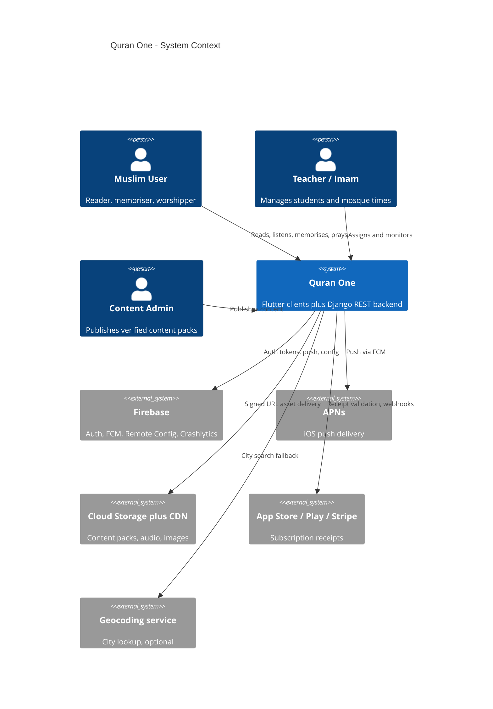

---

## 2. Container architecture

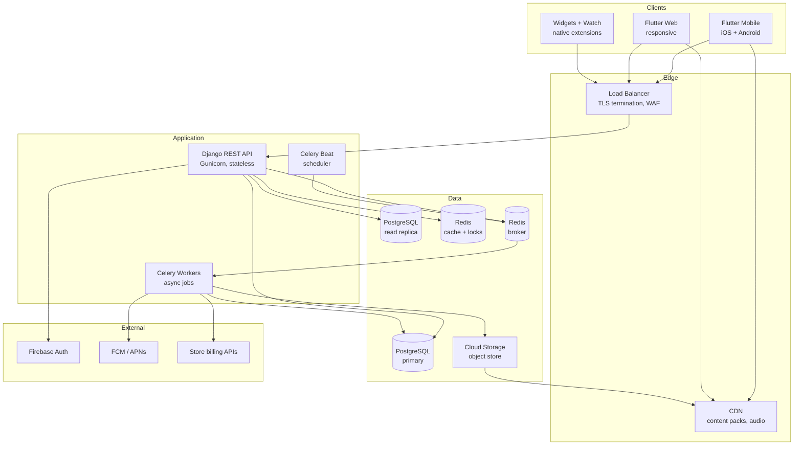

| Container | Technology | Responsibility | Scaling |
| --- | --- | --- | --- |
| Flutter Mobile | Flutter 3.x, Dart | All worship features, local computation, offline store | Client-side |
| Flutter Web | Flutter web, CanvasKit | Reader and prayer parity, admin surfaces | CDN-hosted static |
| Native extensions | Swift, Kotlin | Widgets, watch complications, notification channels | Client-side |
| REST API | Django 5, DRF, Gunicorn | Sync, entitlements, content manifests, teacher features | Horizontal, stateless |
| Celery Workers | Celery 5 | Receipt validation, push fan-out, exports, content pipeline | Horizontal by queue |
| Celery Beat | Celery Beat with Redis lock | Scheduled jobs, digests, cleanup, reconciliation | Single leader |
| PostgreSQL | Postgres 16 | System of record | Vertical primary plus read replicas |
| Redis | Redis 7 | Cache, rate limits, distributed locks, broker | Cluster mode |
| Cloud Storage | GCS or S3 | Content packs, audio, generated PDFs | Managed |

---

## 3. Flutter client architecture

### 3.1 Layering

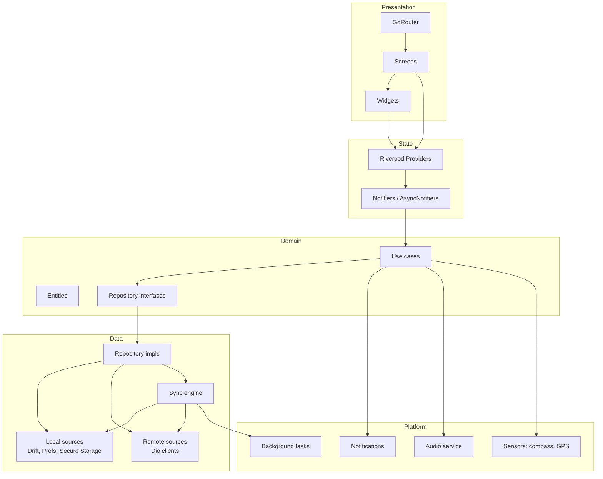

**Rule:** dependencies point inward only. The domain layer imports nothing from Flutter, Riverpod, Dio or Drift. That is what makes the prayer time engine and the Hifz scheduler unit-testable as pure Dart and portable to the web target unchanged.

### 3.2 Folder structure

```
quran_one/
  apps/
    mobile/                     # iOS + Android entry point
      lib/main.dart
      ios/                      # Widgets, watch app, notification categories
      android/                  # Glance widgets, exact alarm perms, boot receiver
    web/
      lib/main.dart

  packages/
    core/                       # Zero-dependency foundations
      lib/error/  lib/result/  lib/extensions/  lib/utils/  lib/constants/

    domain/                     # Pure Dart. No Flutter import allowed.
      lib/entities/
        quran/                  # Surah, Ayah, Page, Juz, Word
        prayer/                 # PrayerTimes, CalculationConfig, Athan
        hifz/                   # MemorisationUnit, ReviewAttempt, Mastery
        dua/  hadith/  user/  entitlement/
      lib/repositories/         # Abstract interfaces only
      lib/usecases/
        quran/                  # GetPage, SearchQuran, BookmarkAyah
        prayer/                 # CalculatePrayerTimes, ScheduleAthan
        hifz/                   # GetDueRevisions, RecordAttempt, ComputeMastery
      lib/services/             # Abstract: Clock, Geolocator, Notifier

    data/
      lib/local/database/       # Drift schema, DAOs, migrations
      lib/local/preferences/  lib/local/secure/  lib/local/cache/
      lib/remote/api/           # Dio client, interceptors, endpoints
      lib/remote/dto/           # Wire models plus mappers to entities
      lib/remote/content/       # Content pack downloader and verifier
      lib/repositories/         # Concrete implementations
      lib/sync/
        sync_engine.dart  outbox.dart  conflict_resolver.dart  delta_puller.dart

    features/                   # One package per bounded feature
      quran_reader/
        lib/presentation/       # Screens, widgets
        lib/application/        # Riverpod providers and notifiers
        lib/rendering/          # Mushaf layout engine, glyph positioning
      quran_audio/  prayer_times/  qibla/  hifz/  duas/  hadith/
      learning/  ramadan/  dashboard/  premium/  settings/
      onboarding/  ai_assistant/

    design_system/
      lib/theme/                # 4 themes, colour tokens, elevation
      lib/typography/           # Uthmani, IndoPak, Latin scales
      lib/components/  lib/icons/  lib/a11y/

    platform/
      notifications/            # Channel setup, exact alarms, OEM shims
      audio/                    # just_audio + audio_service integration
      location/  sensors/  background/  storage_manager/

    l10n/lib/arb/               # 12 locales, RTL metadata
    testing/lib/                # Fakes, fixtures, golden test harness

  tools/
    content_pipeline/           # Text ingestion, checksums, pack builder
    golden_runner/              # 604-page mushaf golden diff runner
    scripts/

  backend/
  infra/docker/  infra/k8s/  infra/terraform/
  .github/workflows/
```

**Why a monorepo of packages rather than folders:** the compiler enforces the layering. `domain` cannot import Flutter because its `pubspec.yaml` does not declare it. A feature package cannot reach into another unless the dependency is declared explicitly, which surfaces coupling in code review instead of hiding it.

### 3.3 Routing with GoRouter

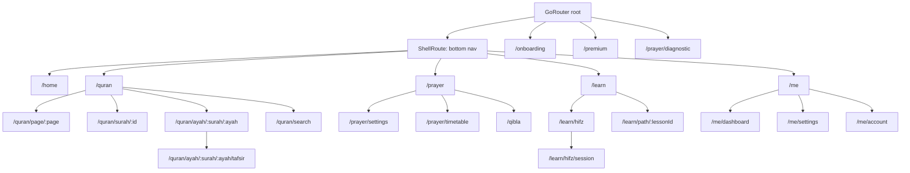

Routing rules that matter architecturally:

- **Deep links are canonical addresses.** `/quran/ayah/2/255` is resolvable from a notification, a share link, a widget tap and the web URL bar with identical behaviour. Verse addressing is never screen-local state.
- **Redirect guards are declarative.** A single `redirect` callback handles onboarding completion, child-mode lockdown and biometric lock. Guard logic never lives in widget `initState`.
- **The paywall is a top-level route, never nested under `/quran` or `/prayer`.** This makes principle P4 structurally true: a widget test asserts that no route under those subtrees can push the paywall.
- **StatefulShellRoute preserves per-tab navigation stacks**, so leaving the reader mid-page and returning restores position without a data round-trip.

---

## 4. Backend architecture

### 4.1 Folder structure

```
backend/
  config/
    settings/base.py  local.py  staging.py  production.py
    urls.py  asgi.py  wsgi.py  celery.py

  apps/
    accounts/                   # Users, devices, profiles, deletion
    auth_firebase/              # Firebase token verification backend
    content/                    # Quran, translations, tafsir, hadith, duas
      services/pack_builder.py  services/checksum.py
      management/commands/ingest_quran.py
    sync/                       # Delta sync endpoints and conflict rules
      models.py                 # SyncCursor, ChangeLog
      services/delta.py  services/merge.py
    hifz/                       # Server mirror of memorisation state
    prayer/                     # Mosque times, method registry, timetables
    entitlements/
      services/apple.py  services/google.py  services/stripe.py
      services/waqf.py          # Sponsored access pool
    notifications/              # Device tokens, campaign fan-out
    institutions/               # Mosques, schools, rosters, assignments
    analytics/                  # Privacy-safe aggregate events
    moderation/                 # Content error reports, review queue
    ai/                         # Retrieval, citation validation, guardrails

  common/
    permissions.py  pagination.py  throttling.py
    exceptions.py  middleware.py  idempotency.py  cache.py  locks.py

  tests/unit/  tests/integration/  tests/contract/
  Dockerfile
  requirements/base.txt  requirements/prod.txt
```

### 4.2 Request flow

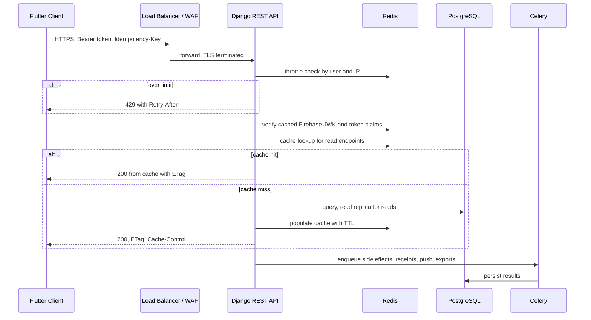

### 4.3 Data model

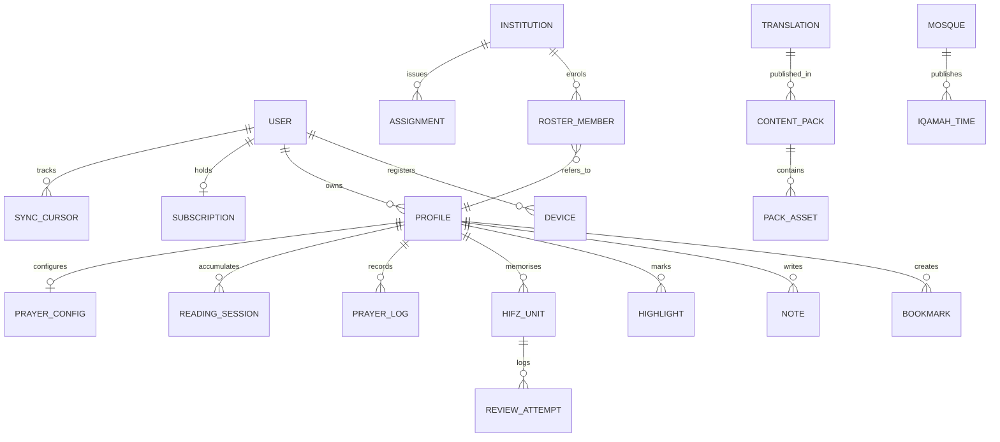

| Decision | Rationale |
| --- | --- |
| `REVIEW_ATTEMPT` is append-only, `HIFZ_UNIT.mastery` is derived | Mastery can always be recomputed from the log. A sync bug can never destroy memorisation history. Mitigates risk AR-3. |
| Content tables live in a separate logical schema from user tables | Content is replaceable and versioned; user data is precious. Different backup, migration and access policies. |
| `PRAYER_LOG` is nullable server-side and off by default | Principle P3. Users who never enable sync leave no prayer log on our servers at all. |
| Every synced row carries `updated_at`, `device_id`, `revision` | Required for last-writer-wins with tie-breaking and for conflict debugging. |

---

## 5. Dependency injection

### 5.1 Strategy

Riverpod is the sole DI mechanism on the client. No service locator, no `GetIt`, no global singletons. Every dependency is a provider, therefore every dependency is overridable in tests and on the web target.

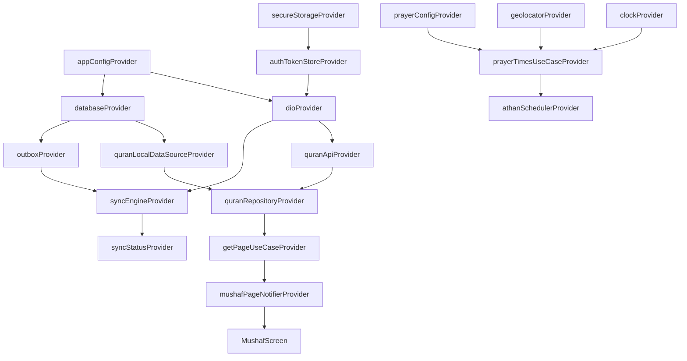

### 5.2 Conventions

| Concern | Convention | Reason |
| --- | --- | --- |
| Infrastructure singletons | `Provider`, kept alive | Database and HTTP client are expensive, created once |
| Repositories | `Provider` | Stateless facades over data sources |
| Screen state | `AsyncNotifierProvider` | Loading, error and data states handled uniformly |
| Parameterised reads | `family`, e.g. `pageProvider(pageNumber)` | Cache per argument, no manual cache keys |
| Expensive derived state | `select` on watch | Prevents whole-screen rebuilds on one field change |
| Ephemeral screen state | `autoDispose` | Frees memory when the route pops |
| Time, location, sensors | Abstract provider in `domain`, concrete override in app | Deterministic tests; `clockProvider` overridden to a fixed instant |
| Code generation | `riverpod_generator` throughout | Compile-time safety on provider types and families |

### 5.3 Testing consequence

The prayer time engine is tested by overriding three providers, with no device, no network and no plugin channel:

```dart
final container = ProviderContainer(
  overrides: [
    clockProvider.overrideWithValue(FixedClock(DateTime.utc(2026, 6, 21, 3, 0))),
    geolocatorProvider.overrideWithValue(FakeGeolocator(lat: 51.5, lng: -0.12)),
    prayerConfigProvider.overrideWith((ref) => PrayerConfig.mwlHanafi()),
  ],
);
```

This is why P1 and P6 are affordable. A 300-case regression suite covering methods, latitudes and solstices runs in seconds in CI.

### 5.4 Backend DI

Django uses constructor-injected service classes rather than logic in views or models.

- Views are thin: validate, delegate to a service, serialise.
- Services take collaborators as constructor arguments (`AppleReceiptClient`, `EntitlementRepository`).
- External clients resolve through a small factory registry configured per settings module, so staging uses sandbox billing endpoints without a code change.
- Celery tasks instantiate services the same way. A task is a thin wrapper around a service call, which keeps tasks testable synchronously.

---

## 6. Caching

### 6.1 Hierarchy

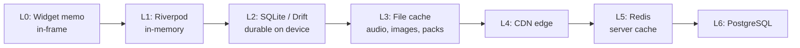

### 6.2 Policy per data class

| Data | Layer | TTL / invalidation | Notes |
| --- | --- | --- | --- |
| Quran Arabic text | L2 permanent | Never expires, replaced only by a signed pack version bump | Verified by checksum on every launch |
| Translations, tafsir | L2 permanent | Pack version change | Removable if a licence lapses (AR-4) |
| Rendered mushaf page layout | L1 plus L2 | Invalidated on font, size or spacing change | Layout computation is the expensive part, not rendering |
| Prayer times | L2, computed | Recomputed on location, date or config change | Never fetched from the network |
| Audio files | L3 | User-managed, LRU eviction only with consent | Never auto-delete a download the user chose |
| Bookmarks, notes, Hifz | L2 authoritative | Reconciled by sync, never invalidated by the server | Client is the working copy |
| Content manifest | L5 Redis 1 h, L2 24 h | Version-keyed | ETag plus If-None-Match |
| Entitlement state | L2 encrypted, 30 days | Refreshed on reconnect, hard expiry after 30 days offline | Principle P6 balance |
| Mosque iqamah times | L5 Redis 15 min, L2 6 h | Publisher write invalidates | Opt-in layer only |
| Aggregate dashboards | L5 Redis 5 min | Time-bucketed keys | Server-side only for teacher rosters |

### 6.3 Server keying and stampede control

- Keys are namespaced and version-prefixed: `v3:content:manifest:{locale}:{packVersion}`. A deploy that changes serialisation bumps the prefix, so no stale-shape cache is ever read.
- Read-through with a Redis `SETNX` lock guards expensive rebuilds. A miss on a hot key elects one rebuilder; others serve slightly stale data for up to two seconds rather than stampeding Postgres.
- Negative results are cached briefly (30 s) to blunt enumeration probing on lookup endpoints.
- Per-user caches are keyed by `profile_id` and `revision`, never by URL alone, which structurally prevents cross-user cache bleed.

---

## 7. Offline support

### 7.1 What works with zero connectivity

| Capability | Offline | Mechanism |
| --- | --- | --- |
| Full 604-page mushaf | Always | Bundled and pack-delivered text, local rendering |
| All installed translations and transliteration | Yes | Content packs in SQLite |
| Search across Arabic, translations, notes | Yes | SQLite FTS5 with a diacritic-stripped shadow column |
| Prayer times, 7 or more days forward | Yes | Pure Dart astronomical engine, no network |
| Athan notifications | Yes | Pre-scheduled OS-level alarms, 7-day rolling horizon |
| Qibla | Yes | Great-circle bearing from coordinates plus magnetometer |
| Duas and adhkar | Yes | Bundled library plus optional audio packs |
| Hifz revision sessions | Yes | Scheduler and mastery model run entirely on-device |
| Downloaded recitations | Yes | File cache with verse timing index |
| Dashboard and statistics | Yes | Aggregations computed from the local Drift database |
| Entitlement | Yes, 30 days | Encrypted cached entitlement with hard expiry |
| Content pack updates, teacher rosters, AI, mosque times | No | Genuinely network-dependent, degrade explicitly |

### 7.2 Local storage layout

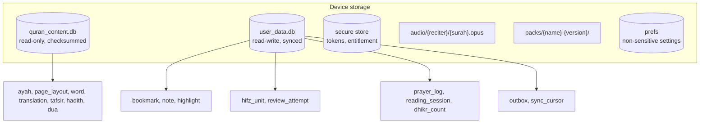

**Two databases, deliberately.** Content is read-only and disposable: it can be deleted and re-downloaded at any time, and it is verified by checksum. User data is precious and never overwritten by a content update. This separation means a corrupt content pack can be discarded without risking a single memorisation record, and a content migration never runs inside the same transaction as user data.

### 7.3 Offline write path

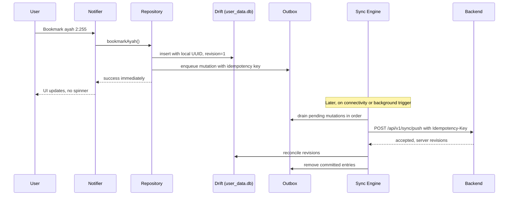

The UI never waits on the network for a write. Every mutation is committed locally first and enqueued in a durable outbox with a client-generated UUID and idempotency key. That UUID is the permanent identity of the record, so a retry after a crash can never create a duplicate bookmark.

### 7.4 Content pack lifecycle

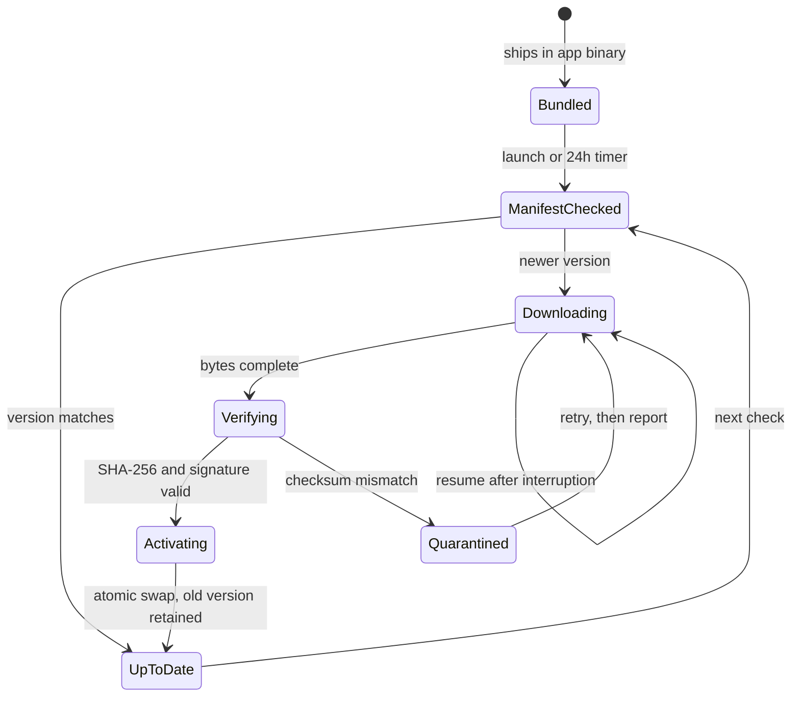

Activation is an atomic pointer swap after verification, and the previous version is retained until the next successful launch. A bad pack therefore cannot brick the reader: the client falls back to the last known-good version and reports the failure. This is the mechanism that makes P7 safe rather than reckless.

---

## 8. Authentication

### 8.1 Model

Authentication is optional by design. The app is fully functional anonymously, which is a product requirement (AUTH-01) and a privacy position, not a convenience.

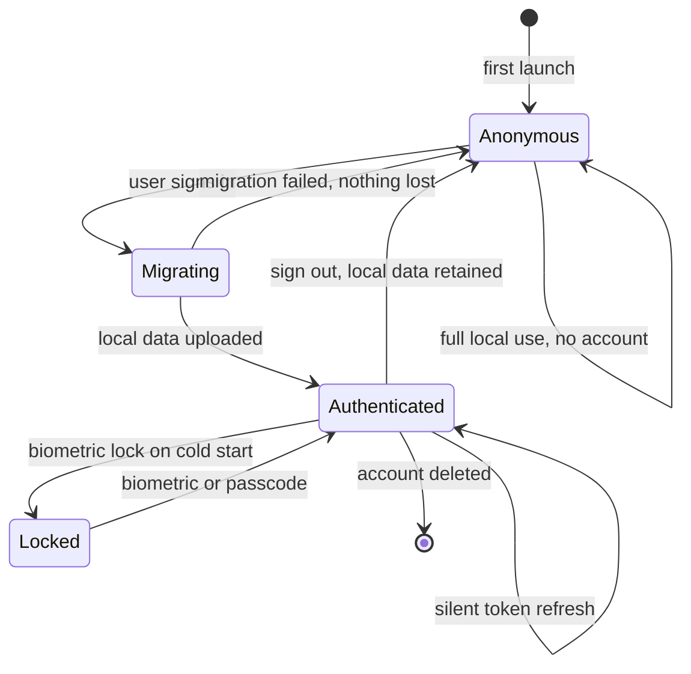

### 8.2 Token flow

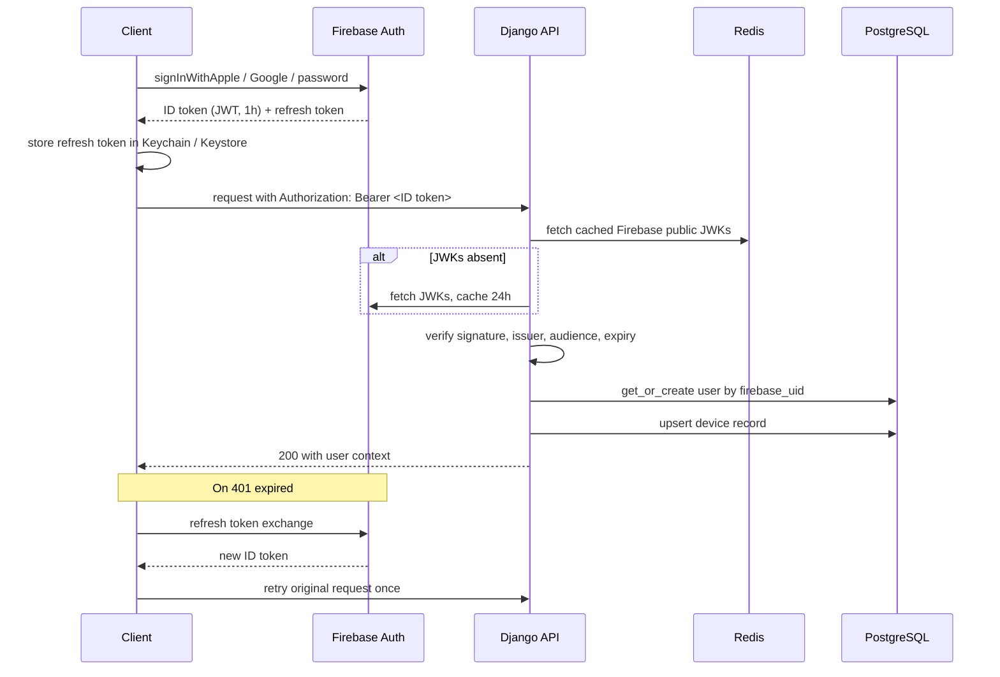

### 8.3 Design decisions

| Decision | Rationale |
| --- | --- |
| Firebase issues tokens, Django verifies them | No password storage, no session table, no reset-flow surface of our own. Django stays stateless (P5). |
| JWKs cached in Redis for 24 h | Removes a Firebase network call from the hot path; a cold cache costs one fetch per pod lifetime. |
| Refresh tokens only in Keychain or Keystore, never in shared preferences | Prevents extraction on a rooted device via world-readable storage. |
| Local data migration is idempotent and resumable | AUTH-05. A user with 3 years of Hifz history must never risk it to sign in. Migration writes with client UUIDs, so a retry is a no-op. |
| Anonymous users get no server record at all | Principle P3. We cannot leak data we never received. |
| Sign-out retains local data and downloaded audio by prompt | Signing out is not a punishment; a shared-device user should not lose 4 GB of recitations. |
| Biometric lock gates the app shell, not the API | The API cannot trust a client-side lock, so it is a privacy feature for the device owner, not an authorisation boundary. |
| Account deletion is self-service and purges within 30 days | AUTH-09. Deletion via a support email is a dark pattern. |

---

## 9. Synchronisation

This is the highest-risk subsystem in the product. Corrupting a hafiz's revision history is the one failure from which reputation does not recover (risk AR-3).

### 9.1 Sync cycle

```mermaid
sequenceDiagram
  participant SE as Sync Engine
  participant DB as Local DB
  participant API as Sync API
  participant PG as PostgreSQL

  Note over SE: Triggered by: app foreground, connectivity regain,<br/>mutation debounce (5s), background task (15min), pull-to-refresh

  SE->>DB: read sync_cursor + outbox
  SE->>API: POST /sync/push {mutations[], cursor}
  API->>PG: BEGIN; apply mutations with conflict rules
  API->>PG: append to change_log
  API->>PG: COMMIT
  API-->>SE: {applied[], rejected[], newCursor}

  SE->>API: GET /sync/pull?cursor=<newCursor>
  API->>PG: SELECT changes WHERE revision > cursor
  API-->>SE: {changes[], nextCursor, hasMore}
  SE->>DB: BEGIN; merge changes; update cursor; COMMIT
  alt hasMore
    SE->>API: GET /sync/pull?cursor=<nextCursor>
  end
  SE->>DB: clear committed outbox entries
```

### 9.2 Conflict resolution by data type

| Entity | Strategy | Reason |
| --- | --- | --- |
| Bookmark | Union of sets, delete wins with tombstone | Losing a bookmark is worse than keeping an extra one |
| Note body | Last-writer-wins by `updated_at`, loser preserved as a conflict copy | Never silently destroy written reflection; surface both |
| Highlight | LWW per verse and colour | Trivially replaceable, no conflict copy needed |
| Reading position | LWW by timestamp, `device_id` breaks ties | The most recent device is the one in the user's hand |
| **Review attempt** | **Append-only union, never merged, never overwritten** | The immutable audit log from which all mastery derives |
| **Hifz mastery** | **Recomputed server-side and client-side from attempts, never synced as a value** | Derived state cannot conflict. This is the core AR-3 mitigation. |
| Dhikr counters | Grow-only counter CRDT per device, summed on read | Two devices counting concurrently must add, not overwrite |
| Prayer log | Union, per prayer-instance LWW on state | Logging the same prayer twice must be idempotent |
| Settings | LWW per field, not per object | Changing the theme on one device must not revert the reciter on another |
| Reading streak | Derived from `reading_session` union, never stored as a value | Structurally prevents the spurious streak reset that competitors ship |

### 9.3 Why mastery is derived, not synced

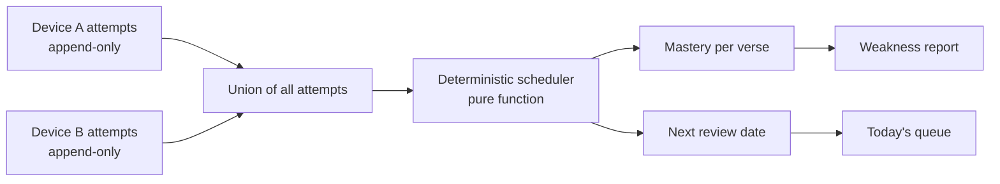

The scheduler is a pure function of the attempt log. Two devices with the same attempts always compute identical mastery, so there is nothing to conflict over. If we later improve the decay model, historical mastery recomputes correctly from the existing log with no migration. And if a sync bug ever ships, the worst case is a duplicated attempt row, not a destroyed memorisation record.

### 9.4 Durability guarantees

| Guarantee | Mechanism |
| --- | --- |
| No mutation lost on crash | Durable outbox written in the same transaction as the local mutation |
| No duplicate on retry | Client UUID plus `Idempotency-Key`, deduplicated server-side for 24 h |
| No partial merge | Pull batches are applied in a single local transaction |
| Recoverable from corruption | Attempt log replay plus 30-day server-side point-in-time backup |
| Cursor never regresses | Monotonic server revision counter; a stale cursor is safe, only over-fetching |
| Bounded payloads | Pull is paginated by revision with `hasMore`; push batches capped at 500 mutations |

---

## 10. Notifications

Athan delivery is the single most reviewed failure across every competitor analysed. It is treated here as a reliability engineering problem, not a feature.

### 10.1 Local-first scheduling

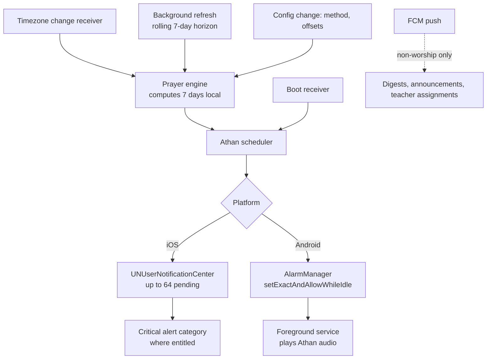

**Athan never depends on push.** It is scheduled locally from locally computed times. FCM carries only non-worship messages. A user in airplane mode for a week still receives all 35 prayer notifications.

### 10.2 OEM hardening matrix

| Platform | Failure mode | Mitigation |
| --- | --- | --- |
| iOS | 64 pending notification limit | Rolling 7-day window (35 Athan plus reminders), topped up on every foreground and by background refresh |
| iOS | Focus mode suppression | Time-sensitive interruption level; critical alert entitlement where granted, with explicit user consent |
| Android 12+ | `SCHEDULE_EXACT_ALARM` permission | Requested with an in-context explanation; diagnostic detects denial and instructs the user |
| Android Doze | Alarms deferred | `setExactAndAllowWhileIdle` plus foreground service for audio playback |
| Xiaomi / MIUI | Autostart disabled by default | Device-specific guided instructions with a deep link to the exact settings page |
| Huawei / EMUI | Aggressive app freezing | Protected-app guidance; battery optimisation exemption request |
| Oppo / Vivo / OnePlus | Background restriction | Guided allowlist flow, verified by the diagnostic |
| Samsung | Sleeping apps list | Detection plus removal instructions |
| All Android | Reboot clears alarms | `BOOT_COMPLETED` receiver reschedules the full horizon |
| All | Timezone or DST change | Broadcast receiver recomputes and reschedules atomically |

### 10.3 The self-diagnostic

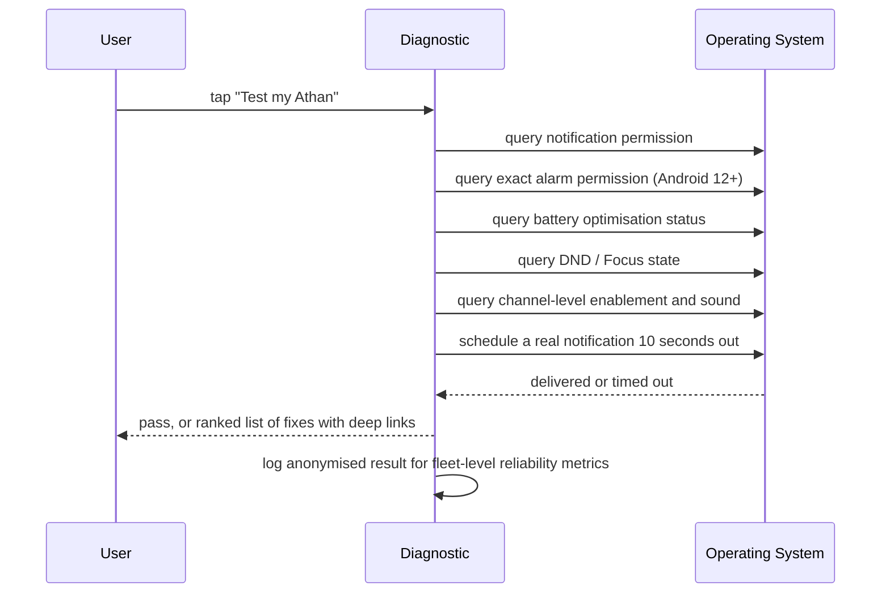

This converts the category's worst support burden into a self-service flow, and it emits the telemetry needed to measure the 99.5 percent delivery target as a real fleet metric rather than an aspiration.

### 10.4 Channel taxonomy

| Channel | Importance | Sound | User control |
| --- | --- | --- | --- |
| Athan | Max, time-sensitive | Selected muadhin | Per-prayer audible, vibrate, silent |
| Pre-prayer reminder | High | Distinct chime | Per-prayer, 5 to 60 min |
| Iqamah | Default | Distinct chime | Per-prayer delay |
| Hifz revision due | Default | Silent by default | On or off, scheduled time |
| Reading and adhkar reminders | Low | Silent | On or off, quiet hours apply |
| Suhoor and iftar | High | Distinct | Ramadan only |
| Teacher assignments | Default | Silent | On or off |
| Product announcements | Min | Silent | Opt-in only, never for commerce |

Quiet hours suppress everything except Athan. Suppressing Athan itself requires a separate, explicitly confirmed action, because a silently missed prayer is the worst possible outcome of a well-meaning default.

---

## 11. CI/CD

### 11.1 Pipeline

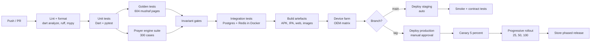

### 11.2 Release-blocking gates

These are the tests that make architectural principles enforceable rather than aspirational.

| Gate | Asserts | Blocks on |
| --- | --- | --- |
| **Mushaf golden diff** | All 604 pages byte-identical to approved goldens, per device class | Any pixel diff (P2, AR-1) |
| **Quran text checksum** | Content pack SHA-256 matches the signed manifest | Any mismatch (P2) |
| **Ad SDK scan** | No advertising or data-broker package anywhere in the transitive dependency tree | Any match (P4, AR-8) |
| **Paywall containment** | No route under `/quran` or `/prayer` can present the paywall | Any violation (P4) |
| **Free-tier reachability** | Arabic text and five prayer times reachable with entitlement stubbed to none | Any gating (PRM-01) |
| **Copy doctrine lint** | Denylist of guilt, obligation and religious-failure phrasings across all 12 locales | Any match (PRM-09) |
| **Prayer engine regression** | 300 fixtures across methods, latitudes, solstices, DST boundaries | Any deviation over 1 minute |
| **Athan delivery** | Scheduled notification delivered on every device in the OEM matrix | Any device failure (AR-2) |
| **Sync property tests** | Randomised concurrent mutation sequences converge and lose no attempt rows | Any divergence (AR-3) |
| **Accessibility** | Screen reader labels present, 200 percent scaling without overflow, contrast ratios | Any failure |
| **Migration safety** | Drift and Django migrations applied forwards and backwards against a production-shaped snapshot | Any data loss |
| **Performance budget** | Cold start under 2 s, page turn 60fps, search under 300 ms on the reference 4 GB device | Any regression over 10 percent |

### 11.3 Docker and environments

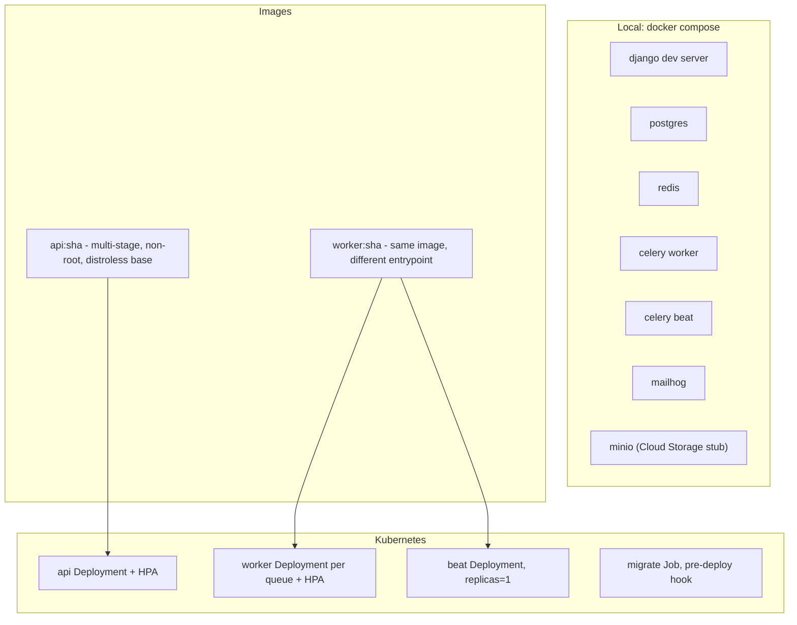

| Environment | Purpose | Data | Deploy |
| --- | --- | --- | --- |
| Local | Development | Seeded fixtures | `docker compose up` |
| CI | Automated verification | Ephemeral containers | Per commit |
| Staging | Pre-production, sandbox billing | Anonymised subset | Auto on `main` |
| Production | Live | Live | Manual approval on tag, canary then progressive |

One image serves API, worker and beat, differentiated only by entrypoint. This guarantees the code that ran in tests is the code that processes receipts, and eliminates the classic drift between an API image and a worker image built from different commits.

---

## 12. Scalability

### 12.1 Load shape

The traffic profile is unusual and drives most of the design. Load is **globally synchronised to prayer times** and **seasonally spiked by Ramadan**.

| Characteristic | Implication |
| --- | --- |
| Five daily spikes that sweep across time zones | Load is a moving wave, not a smooth curve. HPA must react in seconds. |
| Ramadan traffic is roughly 3 to 5x baseline for 30 days | Provision the floor for Ramadan, autoscale the ceiling. |
| Fajr and Isha produce the sharpest bursts | Pre-warm capacity 15 minutes before the wave enters a major region. |
| Reads dominate writes roughly 20:1 | Read replicas and aggressive caching carry most of the load. |
| Worship features do not call the server at all | The spike is sync and manifest traffic, not prayer times. This is the single largest scalability advantage of P1. |

### 12.2 Scaling strategy

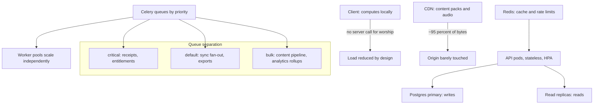

### 12.3 Scaling levers in order of application

| Stage | Lever | Trigger |
| --- | --- | --- |
| 1 | Do not call the server (local computation) | Architectural, always |
| 2 | CDN for all static and content bytes | Architectural, always |
| 3 | Redis read-through cache | Architectural, always |
| 4 | API horizontal autoscale, HPA on p95 latency and CPU | Latency over 200 ms p95, or CPU over 60 percent |
| 5 | Read replica routing for all read endpoints | Architectural, always |
| 6 | Worker pool autoscale per queue depth | Queue depth over 1000 or age over 60 s |
| 7 | Postgres vertical scale plus connection pooling (PgBouncer) | Connection saturation |
| 8 | Partition high-volume tables by month (`review_attempt`, `reading_session`) | Table over 100 M rows |
| 9 | Shard by `user_id` range | Only if a single primary is genuinely exhausted |

### 12.4 Capacity targets

| Metric | Target |
| --- | --- |
| API p95 latency | Under 200 ms |
| API p99 latency | Under 500 ms |
| Sync push, 100 mutations | Under 1 s |
| Content manifest, cached | Under 50 ms |
| Availability | 99.9 percent monthly for the API |
| Athan delivery | 99.5 percent or better, fleet-measured |
| Worship features availability | 100 percent, independent of the API |
| Peak concurrent sync sessions | 50,000 at launch scale, headroom to 500,000 |

### 12.5 Graceful degradation ladder

| Failure | Behaviour |
| --- | --- |
| API fully unavailable | Everything except sync, teacher features and AI continues to work. The user may not notice. |
| Postgres primary down | Reads continue from replicas; writes queue in client outboxes and drain on recovery. |
| Redis down | Cache misses fall through to Postgres; rate limiting fails open with a conservative static limit. |
| CDN degraded | Existing downloads unaffected; new downloads retry with backoff. |
| Firebase Auth down | Existing sessions continue on cached JWKs; new sign-ins fail with a clear message; anonymous use unaffected. |
| Store billing API down | Cached entitlements continue for up to 30 days; validation retries asynchronously. |

The ladder exists because of principle P1. A total backend outage must never stop a Muslim from praying on time or reading the Quran.

---

## 13. Security

### 13.1 Defence in depth

```mermaid
graph TB
  subgraph "Client"
    A1["Certificate pinning"]
    A2["Keychain / Keystore for tokens"]
    A3["SQLCipher for sensitive tables"]
    A4["Root and jailbreak signal, warn not block"]
    A5["No secrets in the binary"]
    A6["Biometric app lock"]
  end

  subgraph "Transport"
    B1["TLS 1.3 only"]
    B2["HSTS with preload"]
    B3["Signed URLs for assets, short expiry"]
  end

  subgraph "Edge"
    C1["WAF: OWASP ruleset"]
    C2["DDoS protection"]
    C3["Per-IP and per-user rate limits"]
    C4["Bot and scraping heuristics"]
  end

  subgraph "Application"
    D1["Token verification on every request"]
    D2["Object-level permissions, never trust client IDs"]
    D3["DRF serializer validation, allowlist fields"]
    D4["ORM only, no raw SQL with interpolation"]
    D5["Idempotency keys on all mutations"]
    D6["Audit log for privileged actions"]
  end

  subgraph "Data"
    E1["Encryption at rest"]
    E2["Column encryption for notes and recordings"]
    E3["Secrets in a managed vault, rotated"]
    E4["PII minimisation by default"]
    E5["Backups encrypted, restore tested quarterly"]
  end

  A1 --> B1 --> C1 --> D1 --> E1
```

### 13.2 Threat model, prioritised

| # | Threat | Impact | Control |
| --- | --- | --- | --- |
| T1 | **Tampering with Quranic text** in transit or in a content pack | Catastrophic and unrecoverable in trust terms | Signed manifests, SHA-256 per asset, launch-time verification, client refuses unverified text (P2) |
| T2 | **Exposure of religious practice data** (prayer logs, recitations, AI questions) | Severe. Potentially dangerous for users in hostile jurisdictions. | On-device by default (P3), column encryption, no third-party sharing, no ad SDKs, published SDK inventory |
| T3 | **Loss or corruption of Hifz history** | Severe. Years of worship destroyed. | Append-only attempt log, derived mastery, 30-day PITR backup, sync property tests (AR-3) |
| T4 | Account takeover | High | Firebase Auth hardening, device list and revocation, refresh token rotation, anomalous-login alerting |
| T5 | Entitlement forgery or receipt replay | Moderate financial | Server-side receipt validation only, replay detection, signed webhooks, never trust a client-asserted entitlement |
| T6 | Content scraping of licensed translations and tafsir | Moderate legal and commercial | Signed short-lived URLs, per-account rate limits, watermarked audio manifests, anomaly detection |
| T7 | Injection or IDOR in sync endpoints | High | ORM-only queries, object-level permission checks on every row, IDs scoped to the authenticated profile |
| T8 | Supply-chain compromise via a dependency | High | Pinned lockfiles, SBOM generation, Dependabot, provenance-checked base images, CI dependency scan |
| T9 | Malicious content in a teacher assignment or mosque submission | Moderate | Verified publisher accounts, moderation queue, no HTML rendering of user-supplied text |
| T10 | Insider access to user religious data | Severe | Least-privilege IAM, no direct production DB access, break-glass with audit logging and mandatory review |

### 13.3 Privacy architecture

Privacy here is a structural property, not a policy document.

| Commitment | How the architecture enforces it |
| --- | --- |
| No advertising SDKs | CI dependency scan blocks the release (AR-8) |
| No data brokers, ever | Same gate, plus a published SDK inventory in-app and in this repository |
| Prayer logs stay on-device unless the user opts in | Server table is nullable and never populated without an explicit sync flag |
| Recitation recordings never leave the device | No upload endpoint exists for them |
| AI conversations excluded from training | Stored on-device; training opt-in defaults off; no logging pipeline receives them |
| Analytics opt-out costs the user nothing | Analytics is a leaf dependency; no feature reads from it |
| Full data export | JSON export covering every user-owned entity |
| Self-service deletion | Purge job with a 30-day completion SLA and confirmation email |
| Anonymous use leaves no server trace | Anonymous clients create no user record at all |

### 13.4 Compliance posture

| Regime | Position |
| --- | --- |
| GDPR | Lawful basis documented per data category; DSAR fulfilled by in-app export and deletion; EU data residency option |
| CCPA / CPRA | No sale or sharing of personal information; opt-out is structurally unnecessary because the practice does not exist |
| COPPA and child safety | Child profiles hold no direct identifiers; parental consent required; no external links or purchases reachable in child mode; no behavioural profiling of minors |
| App Store and Play privacy labels | Derived mechanically from the SDK inventory and data map, so the label cannot drift from reality |
| Security assurance | Annual third-party penetration test; quarterly restore drill; published disclosure policy and security contact |

---

## 14. Architect notes

Three decisions in this document carry more weight than the rest.

1. **Local computation is a scalability strategy, not only a UX one.** Because prayer times, Qibla and Hifz scheduling never call the server, the five daily global worship spikes do not translate into five daily API spikes. Competitors that compute times server-side pay for that architecture every single day, in every time zone, forever. We do not.

2. **Deriving Hifz mastery from an append-only attempt log is the most important data decision in the product.** It makes the highest-severity risk in the register structurally unreachable rather than merely mitigated. Conflicts cannot occur in derived state, the scheduling model can be improved retroactively without migration, and the worst possible sync bug produces a duplicate row rather than a destroyed memorisation history.

3. **The invariant gates in section 11.2 are the load-bearing element of the whole trust proposition.** Ad-free, no-guilt, and never-paywall-scripture are not cultural commitments in this architecture; they are failing builds. Culture erodes under commercial pressure over a five-year horizon. Continuous integration does not.
