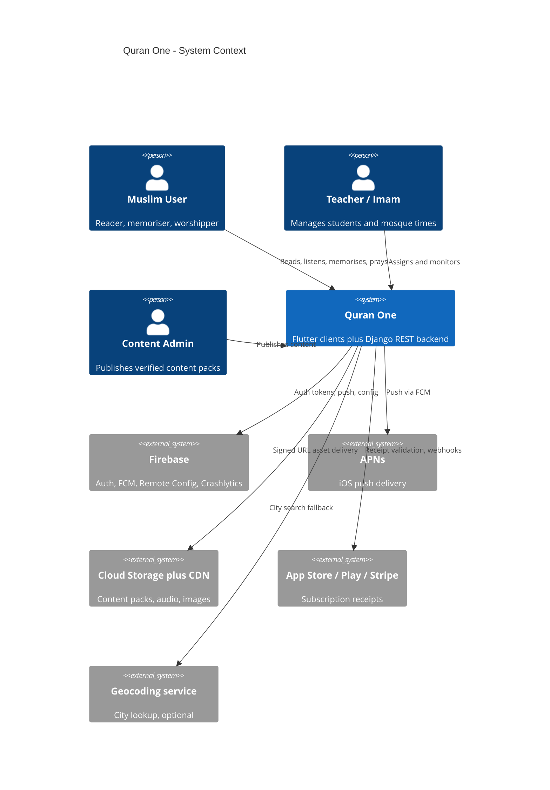
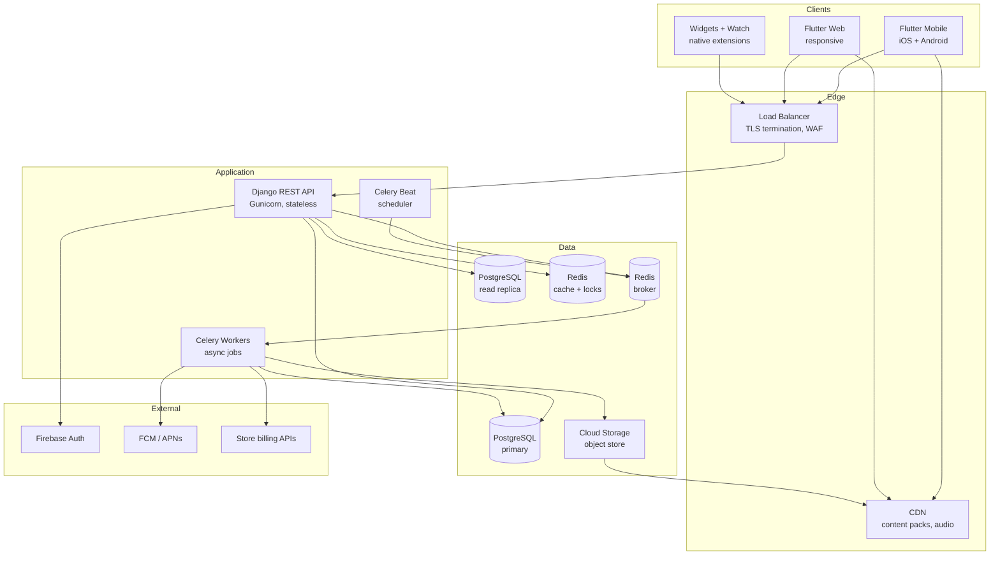
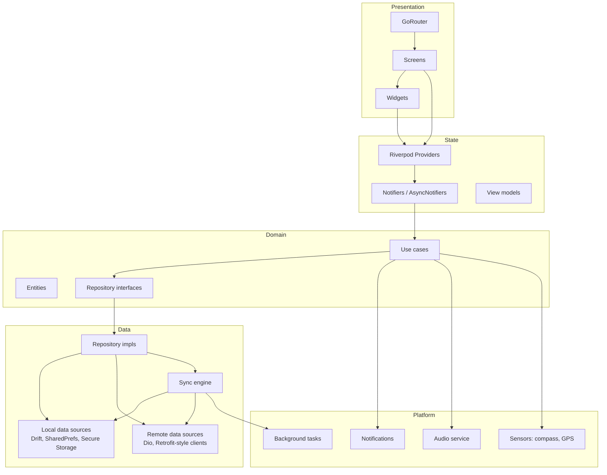
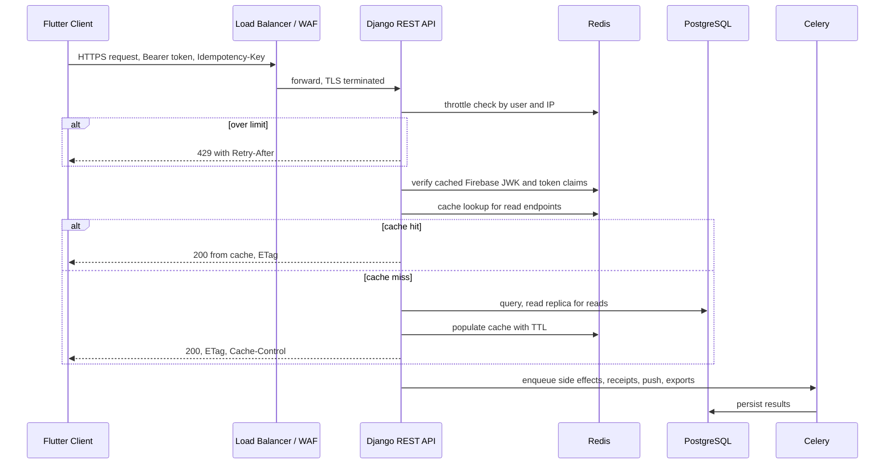
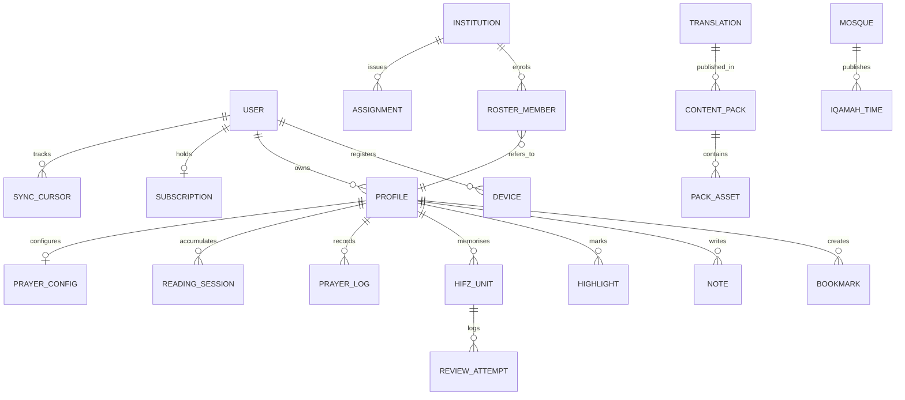
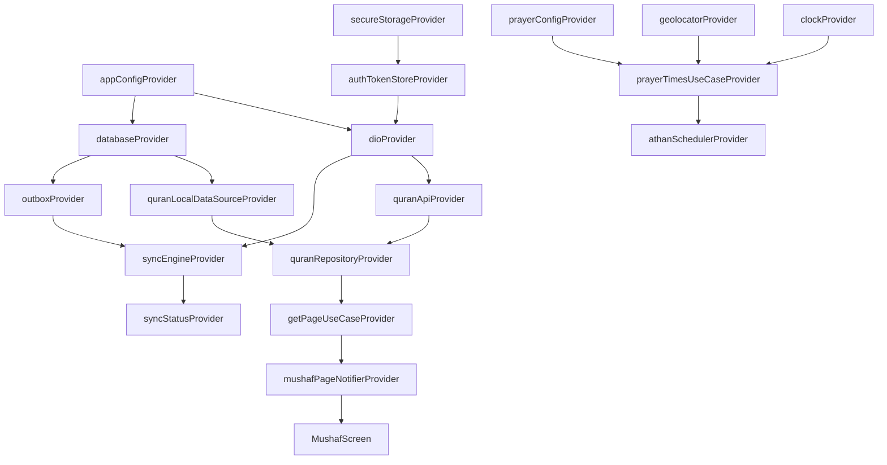
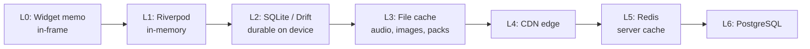

# Quran One - Technical Architecture

**Status:** Baseline architecture, v1.0
**Audience:** Engineering, DevOps, security review, and technical due diligence
**Related documents:** `docs/PRD.md`, `docs/FEATURE_MATRIX.md`, `docs/USER_STORIES.md`, `docs/UX_PERSONAS.md`

---

## 0. Architectural principles

These principles are binding. Any design decision that conflicts with one of them requires an ADR that explicitly argues the exception.

| # | Principle | Consequence |
| --- | --- | --- |
| P1 | **Offline is the default, not a degraded mode** | Every worship-critical path (mushaf, prayer times, Qibla, duas, Hifz) computes locally. The network is an enhancement. |
| P2 | **Sacred content is immutable and verified** | Quranic text ships as signed, checksummed content packs. The client refuses to render unverified text. |
| P3 | **User religious data is private by default** | Prayer logs, recitation recordings, and AI conversations stay on-device unless the user explicitly enables sync. |
| P4 | **Worship paths never carry commerce** | The reader and prayer surfaces are architecturally incapable of hosting a paywall or an ad. Enforced by CI, not policy. |
| P5 | **The server is stateless and disposable** | All request state lives in Postgres or Redis. Any pod can be killed at any time. |
| P6 | **Client-authoritative for worship, server-authoritative for money** | Prayer times and Hifz scheduling are computed client-side. Entitlements are validated server-side. |
| P7 | **Content changes must not require an app release** | Corrections to translations, tafsir, or hadith gradings ship as content pack updates. |

---

## 1. System context



---

## 2. Container architecture



### Container responsibilities

| Container | Technology | Responsibility | Scaling |
| --- | --- | --- | --- |
| Flutter Mobile | Flutter 3.x, Dart | All worship features, local computation, offline store | Client-side |
| Flutter Web | Flutter web, CanvasKit | Reader and prayer parity, admin surfaces | CDN-hosted static |
| Native extensions | Swift, Kotlin | Widgets, watch complications, notification channels | Client-side |
| REST API | Django 5, DRF, Gunicorn | Sync, entitlements, content manifests, teacher features | Horizontal, stateless |
| Celery Workers | Celery 5 | Receipt validation, push fan-out, exports, content pipeline | Horizontal by queue |
| Celery Beat | Celery Beat, single leader | Scheduled jobs (digests, cleanup, reconciliation) | Single instance with Redis lock |
| PostgreSQL | Postgres 16 | System of record | Vertical primary plus read replicas |
| Redis | Redis 7 | Cache, rate limits, distributed locks, broker | Cluster mode |
| Cloud Storage | GCS or S3 | Content packs, audio, generated PDFs | Managed |

---

## 3. Flutter client architecture

### 3.1 Layering



**Rule:** dependencies point inward only. The domain layer imports nothing from Flutter, Riverpod, Dio, or Drift. This is what makes the prayer time engine and the Hifz scheduler unit-testable as pure Dart and portable to the web target unchanged.

### 3.2 Folder structure

```
quran_one/
  apps/
    mobile/                     # iOS + Android entry point
      lib/main.dart
      ios/                      # Widgets, watch app, notification categories
      android/                  # Glance widgets, exact alarm perms, boot receiver
    web/                        # Web entry point and web-specific shell
      lib/main.dart

  packages/
    core/                       # Zero-dependency foundations
      lib/
        error/                  # Failure hierarchy, Result type
        result/
        extensions/
        utils/
        constants/

    domain/                     # Pure Dart. No Flutter import allowed.
      lib/
        entities/
          quran/                # Surah, Ayah, Page, Juz, Word
          prayer/               # PrayerTimes, CalculationConfig, Athan
          hifz/                 # MemorisationUnit, ReviewAttempt, Mastery
          dua/  hadith/  user/  entitlement/
        repositories/           # Abstract interfaces only
        usecases/
          quran/                # GetPage, SearchQuran, BookmarkAyah
          prayer/               # CalculatePrayerTimes, ScheduleAthan
          hifz/                 # GetDueRevisions, RecordAttempt, ComputeMastery
        services/               # Abstract: Clock, Geolocator, Notifier

    data/
      lib/
        local/
          database/             # Drift schema, DAOs, migrations
          preferences/
          secure/               # flutter_secure_storage wrapper
          cache/                # LRU + TTL policies
        remote/
          api/                  # Dio client, interceptors, endpoints
          dto/                  # Wire models plus mappers to entities
          content/              # Content pack downloader and verifier
        repositories/           # Concrete implementations
        sync/
          sync_engine.dart
          outbox.dart
          conflict_resolver.dart
          delta_puller.dart

    features/                   # One package per bounded feature
      quran_reader/
        lib/
          presentation/         # Screens, widgets
          application/          # Riverpod providers and notifiers
          rendering/            # Mushaf layout engine, glyph positioning
      quran_audio/
      prayer_times/
      qibla/
      hifz/
      duas/
      hadith/
      learning/
      ramadan/
      dashboard/
      premium/
      settings/
      onboarding/
      ai_assistant/

    design_system/
      lib/
        theme/                  # 4 themes, colour tokens, elevation
        typography/             # Uthmani, IndoPak, Latin scales
        components/             # Buttons, sheets, cards, counters
        icons/
        a11y/                   # Semantics helpers, contrast checks

    platform/
      notifications/            # Channel setup, exact alarms, OEM shims
      audio/                    # just_audio + audio_service integration
      location/
      sensors/                  # Magnetometer, calibration state machine
      background/               # WorkManager / BGTaskScheduler wrappers
      storage_manager/

    l10n/
      lib/arb/                  # 12 locales, RTL metadata

    testing/
      lib/                      # Fakes, fixtures, golden test harness

  tools/
    content_pipeline/           # Text ingestion, checksums, pack builder
    golden_runner/              # 604-page mushaf golden diff runner
    scripts/

  backend/                      # See section 4
  infra/
    docker/
    k8s/
    terraform/
  .github/workflows/
```

**Why a monorepo of packages rather than folders:** the compiler enforces the layering. `domain` cannot import Flutter because its `pubspec.yaml` does not declare it. A feature package cannot reach into another feature package unless the dependency is declared explicitly, which surfaces coupling in code review instead of hiding it.

---

## 4. Backend architecture

### 4.1 Folder structure

```
backend/
  config/
    settings/
      base.py  local.py  staging.py  production.py
    urls.py  asgi.py  wsgi.py  celery.py

  apps/
    accounts/                   # Users, devices, profiles, deletion
      models.py  serializers.py  views.py  services.py  tasks.py
    auth_firebase/              # Firebase token verification backend
    content/                    # Quran, translations, tafsir, hadith, duas
      models.py
      services/pack_builder.py
      services/checksum.py
      management/commands/ingest_quran.py
    sync/                       # Delta sync endpoints and conflict rules
      models.py                 # SyncCursor, ChangeLog
      services/delta.py
      services/merge.py
    hifz/                       # Server mirror of memorisation state
    prayer/                     # Mosque times, method registry, timetables
    entitlements/               # Plans, subscriptions, receipt validation
      services/apple.py  services/google.py  services/stripe.py
      services/waqf.py          # Sponsored access pool
    notifications/              # Device tokens, campaign fan-out
    institutions/               # Mosques, schools, rosters, assignments
    analytics/                  # Privacy-safe aggregate events
    moderation/                 # Content error reports, review queue
    ai/                         # Retrieval, citation validation, guardrails

  common/
    permissions.py  pagination.py  throttling.py
    exceptions.py  middleware.py  idempotency.py
    cache.py  locks.py

  tests/
    unit/  integration/  contract/

  Dockerfile
  requirements/base.txt  requirements/prod.txt
```

### 4.2 Request flow



### 4.3 Data model, principal tables



**Key modelling decisions:**

| Decision | Rationale |
| --- | --- |
| `REVIEW_ATTEMPT` is append-only, `HIFZ_UNIT.mastery` is derived | Mastery can always be recomputed from the log. A sync bug can never destroy memorisation history. This directly mitigates risk AR-3. |
| Content tables are in a separate logical schema from user tables | Content is replaceable and versioned; user data is precious. Different backup, migration, and access policies. |
| `PRAYER_LOG` is nullable server-side and off by default | Principle P3. Users who never enable sync leave no prayer log on our servers at all. |
| Every synced row carries `updated_at`, `device_id`, and `revision` | Required for last-writer-wins with tie-breaking and for debugging conflicts. |

---

## 5. Dependency injection

### 5.1 Strategy

Riverpod is the sole DI mechanism on the client. There is no service locator, no `GetIt`, and no global singletons. Every dependency is a provider, which means every dependency is overridable in tests and in the web target.



### 5.2 Provider conventions

| Concern | Convention | Reason |
| --- | --- | --- |
| Infrastructure singletons | `Provider`, kept alive | Database and HTTP client are expensive; created once |
| Repositories | `Provider` | Stateless facades over data sources |
| Screen state | `AsyncNotifierProvider` | Async loading, error, and data states handled uniformly |
| Parameterised reads | `family` providers, e.g. `pageProvider(pageNumber)` | Cache per argument; avoids manual cache keys |
| Expensive derived state | `select` on watch | Prevents whole-screen rebuilds when one field changes |
| Ephemeral screen state | `autoDispose` | Frees memory when the route pops |
| Time, location, sensors | Abstract provider in `domain`, concrete override in app | Deterministic tests; `clockProvider` is overridden to a fixed instant |
| Code generation | `riverpod_generator` throughout | Compile-time safety on provider types and families |

### 5.3 Testing consequence

The prayer time engine is tested by overriding three providers, with no device, no network, and no plugin channel:

```dart
final container = ProviderContainer(
  overrides: [
    clockProvider.overrideWithValue(FixedClock(DateTime.utc(2026, 6, 21, 3, 0))),
    geolocatorProvider.overrideWithValue(FakeGeolocator(lat: 51.5, lng: -0.12)),
    prayerConfigProvider.overrideWith((ref) => PrayerConfig.mwlHanafi()),
  ],
);
```

This is why P1 and P6 are affordable. A 300-case regression suite covering methods, latitudes, and solstices runs in seconds in CI.

### 5.4 Backend DI

Django uses constructor-injected service classes rather than logic in views or models.

- Views are thin: validate, delegate to a service, serialise.
- Services take their collaborators as constructor arguments (`AppleReceiptClient`, `EntitlementRepository`).
- External clients are resolved through a small factory registry configured per settings module, so staging uses sandbox billing endpoints without a code change.
- Celery tasks instantiate services the same way; a task is a thin wrapper around a service call, which keeps tasks testable synchronously.

---

## 6. Caching

### 6.1 Cache hierarchy



### 6.2 Policy per data class

| Data | Layer | TTL / invalidation | Notes |
| --- | --- | --- | --- |
| Quran Arabic text | L2 permanent | Never expires; replaced only by a signed pack version bump | Verified by checksum on every launch |
| Translations, tafsir | L2 permanent | Pack version change | Removable if a licence lapses (AR-4) |
| Rendered mushaf page layout | L1 plus L2 | Invalidated on font, size, or spacing change | Layout computation is the expensive part, not rendering |
| Prayer times | L2, computed | Recomputed on location, date, or config change | Never fetched from the network |
| Audio files | L3 | User-managed, LRU eviction only with consent | Never auto-delete a download the user chose |
| User content: bookmarks, notes, Hifz | L2 authoritative | Reconciled by sync, never invalidated by the server | Client is the working copy |
| Content manifest | L5 Redis 1 h, L2 24 h | Version-keyed | ETag plus `If-None-Match` |
| Entitlement state | L2 encrypted, 30 days | Refreshed on reconnect; hard expiry after 30 days offline | Principle P6 balance |
| Mosque iqamah times | L5 Redis 15 min, L2 6 h | Publisher write invalidates | Opt-in layer only |
| Aggregate dashboards | L5 Redis 5 min | Time-bucketed keys | Server-side only for teacher rosters |

### 6.3 Server cache keying and stampede control

- Keys are namespaced and version-prefixed: `v3:content:manifest:{locale}:{packVersion}`. A deploy that changes serialisation bumps the prefix, so no stale-shape cache is ever read.
- Read-through with a Redis `SETNX` lock guards expensive rebuilds. A cache miss on a hot key elects one rebuilder; others serve slightly stale data for up to two seconds rather than stampeding Postgres.
- Negative results are cached briefly (30 s) to blunt enumeration probing on lookup endpoints.
- Per-user caches are keyed by `profile_id` and `revision`, never by URL alone, which structurally prevents cross-user cache bleed.

---

## 7. Offline support

### 7.1 What works with zero connectivity

| Capability | Offline | Mechanism |
| --- | --- | --- |
| Full 604-page mushaf | Yes, always | Bundled and pack-delivered text, local rendering |
| All installed translations and transliteration | Yes | Content packs in SQLite |
| Search across Arabic, translations, notes | Yes | SQLite FTS5 with a diacritic-stripped shadow column |
| Prayer times, 7 days forward or more | Yes | Pure Dart astronomical engine